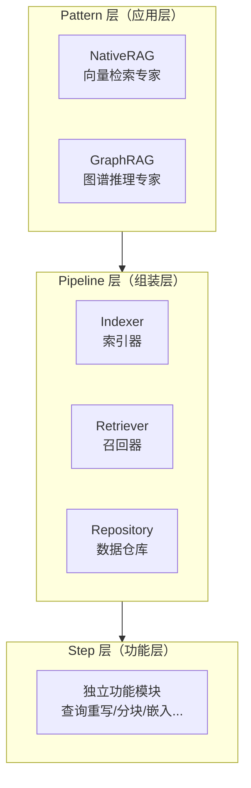

<div align="center">
  <h1>🦖 GoRAG</h1>
  <p><b>工业级、高性能、模块化的 Go 语言 RAG 框架</b></p>
  
  [](https://goreportcard.com/report/github.com/DotNetAge/gorag)
  [](https://pkg.go.dev/github.com/DotNetAge/gorag)
  [](https://opensource.org/licenses/MIT)
  [](https://golang.org)
  [](https://gorag.rayainfo.cn)

  [**English**](./README.md) | [**中文文档**](./README-zh.md)
</div>

---

**GoRAG** 是一个生产就绪的检索增强生成（RAG）框架，采用**三层架构**设计，满足不同层次开发者的需求。

## 🏗️ 三层架构



| 层次 | 谁使用 | 职责 |
|------|--------|------|
| **Pattern 层** | 一般开发者 | 选择 RAG 模式，配置 Options |
| **Pipeline 层** | 高级开发者 | 组装 Indexer/Retriever/Repository |
| **Step 层** | 底层开发者 | 扩展独立功能模块 |

---

## ✨ 核心特性

- 🚀 **性能优先**：并发处理和流式解析，O(1) 内存效率
- 🏗️ **Pipeline 架构**：每个步骤明确、可追踪、可插拔
- 🧠 **三阶段增强**：查询增强 → 检索 → 结果增强
- 🕸️ **高级 GraphRAG**：原生支持 Neo4j、SQLite、BoltDB
- 🔭 **内置可观测性**：全面的分布式追踪
- 📦 **零依赖**：纯 Go 实现，模型自动下载

---

## 🚀 快速开始

### NativeRAG（向量检索）

适合文档问答和语义搜索：

```go
import "github.com/DotNetAge/gorag/pkg/pattern"

// 创建 NativeRAG（自动配置）
rag, _ := pattern.NativeRAG("my-app",
    pattern.WithBGE("bge-small-zh-v1.5"),
)

// 索引文档
rag.IndexDirectory(ctx, "./docs", true)

// 检索
results, _ := rag.Retrieve(ctx, []string{"GoRAG 是什么？"}, 5)
```

### GraphRAG（知识图谱）

适合复杂关系推理：

```go
rag, _ := pattern.GraphRAG("knowledge-graph",
    pattern.WithBGE("bge-small-zh-v1.5"),
    pattern.WithNeoGraph("neo4j://localhost:7687", "neo4j", "password", "neo4j"),
)

// 添加节点和边
rag.AddNode(ctx, &core.Node{ID: "person-1", Type: "Person", ...})
rag.AddEdge(ctx, &core.Edge{Source: "person-1", Target: "company-1", ...})

// 查询邻居
neighbors, edges, _ := rag.GetNeighbors(ctx, "person-1", 1, 10)
```

---

## 📚 文档

### 入门指南

- [快速入门](./QUICKSTART.md) - 15 分钟掌握 Pattern 层
- [NativeRAG 详解](./docs/pattern/native-rag.md) - 三阶段增强架构
- [GraphRAG 详解](./docs/pattern/graph-rag.md) - 知识图谱推理
- [配置选项手册](./docs/pattern/options.md) - 所有配置选项

### 进阶主题

- [开发指南](./DEVELOPMENT.md) - Pipeline 层开发
- [Indexer 开发](./docs/pipeline/indexer.md) - 构建自定义索引器
- [Retriever 开发](./docs/pipeline/retriever.md) - 构建自定义检索器

### Step 层

- [Step 开发指南](./docs/steps/creating-steps.md) - 创建新步骤

---

## 🔭 内置可观测性

```go
idx, _ := indexer.DefaultAdvancedIndexer(
    indexer.WithZapLogger("./logs/rag.log", 100, 30, 7, true),
    indexer.WithPrometheusMetrics(":8080"),
    indexer.WithOpenTelemetryTracer(ctx, "jaeger:4317", "RAG"),
)
```

---

## ⚡ 技术标准

- **Go 1.24+**：最新语言特性
- **Zero-CGO SQLite**：无痛交叉编译
- **清晰架构**：接口与实现严格分离
- **模块化 Steps**：可在任何自定义 Pipeline 中复用

---

## 🤝 贡献

我们致力于为 Go 生态系统构建最强大的 AI 基础设施。

- 查看 [贡献指南](CONTRIBUTING.md)

## 📄 许可证

GoRAG 基于 [MIT 许可证](LICENSE) 发布。
