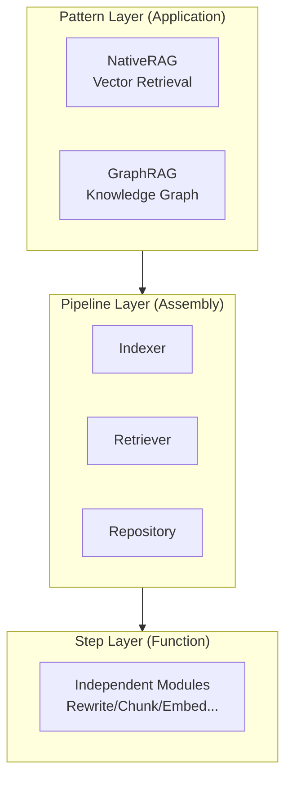

<div align="center">
  <h1>🦖 GoRAG</h1>
  <p><b>The Expert-Grade, High-Performance Modular RAG Framework for Go</b></p>
  
  [](https://goreportcard.com/report/github.com/DotNetAge/gorag)
  [](https://pkg.go.dev/github.com/DotNetAge/gorag)
  [](https://opensource.org/licenses/MIT)
  [](https://golang.org)
  [](https://gorag.rayainfo.cn)

  [**English**](./README.md) | [**中文文档**](./README-zh.md)
</div>

---

**GoRAG** is a production-ready Retrieval-Augmented Generation (RAG) framework built for high-scale AI engineering. It features a **three-layer architecture** that serves developers at all skill levels.

## 🏗️ Three-Layer Architecture



| Layer | Who Uses | Responsibility |
|-------|----------|----------------|
| **Pattern** | Application Developers | Choose RAG mode, configure Options |
| **Pipeline** | Advanced Developers | Assemble Indexer/Retriever/Repository |
| **Step** | Framework Developers | Extend independent modules |

---

## ✨ Key Features

- 🚀 **Performance First**: Concurrent workers and streaming parsers with `O(1)` memory efficiency
- 🏗️ **Pipeline-Based Architecture**: Every step is explicit, traceable, and pluggable
- 🧠 **Three-Phase Enhancement**: Query enhancement → Retrieval → Result enhancement
- 🕸️ **Advanced GraphRAG**: Native support for Neo4j, SQLite, and BoltDB
- 🔭 **Built-in Observability**: Comprehensive distributed tracing
- 📦 **Zero Dependencies**: Pure Go implementation with auto-download models

---

## 🚀 Quick Start

### NativeRAG (Vector Retrieval)

Best for document QA and semantic search:

```go
import "github.com/DotNetAge/gorag/pkg/pattern"

// Create a NativeRAG with auto-configuration
rag, _ := pattern.NativeRAG("my-app",
    pattern.WithBGE("bge-small-zh-v1.5"),
)

// Index documents
rag.IndexDirectory(ctx, "./docs", true)

// Retrieve
results, _ := rag.Retrieve(ctx, []string{"What is GoRAG?"}, 5)
```

### GraphRAG (Knowledge Graph)

Best for complex relationship reasoning:

```go
rag, _ := pattern.GraphRAG("knowledge-graph",
    pattern.WithBGE("bge-small-zh-v1.5"),
    pattern.WithNeoGraph("neo4j://localhost:7687", "neo4j", "password", "neo4j"),
)

// Add nodes and edges
rag.AddNode(ctx, &core.Node{ID: "person-1", Type: "Person", ...})
rag.AddEdge(ctx, &core.Edge{Source: "person-1", Target: "company-1", ...})

// Query neighbors
neighbors, edges, _ := rag.GetNeighbors(ctx, "person-1", 1, 10)
```

---

## 📚 Documentation

### Getting Started

- [Quick Start Guide](./QUICKSTART.md) - Pattern layer in 15 minutes
- [NativeRAG Details](./docs/pattern/native-rag.md) - Three-phase enhancement
- [GraphRAG Details](./docs/pattern/graph-rag.md) - Knowledge graph reasoning
- [Options Reference](./docs/pattern/options.md) - All configuration options

### Advanced Topics

- [Development Guide](./DEVELOPMENT.md) - Pipeline layer development
- [Indexer Development](./docs/pipeline/indexer.md) - Build custom indexers
- [Retriever Development](./docs/pipeline/retriever.md) - Build custom retrievers

### Step Layer

- [Step Development Guide](./docs/steps/creating-steps.md) - Create new steps

---

## 🔭 Built-in Observability

```go
idx, _ := indexer.DefaultAdvancedIndexer(
    indexer.WithZapLogger("./logs/rag.log", 100, 30, 7, true),
    indexer.WithPrometheusMetrics(":8080"),
    indexer.WithOpenTelemetryTracer(ctx, "jaeger:4317", "RAG"),
)
```

---

## ⚡ Technical Standards

- **Go 1.24+**: Latest language features
- **Zero-CGO SQLite**: Painless cross-compilation
- **Clean Architecture**: Strict separation of interfaces and implementations
- **Modular Steps**: Reuse steps in any custom pipeline

---

## 🤝 Contributing

We aim to build the most robust AI infrastructure for the Go ecosystem.

- Check our [Contributing Guidelines](CONTRIBUTING.md)

## 📄 License

GoRAG is licensed under the [MIT License](LICENSE).
