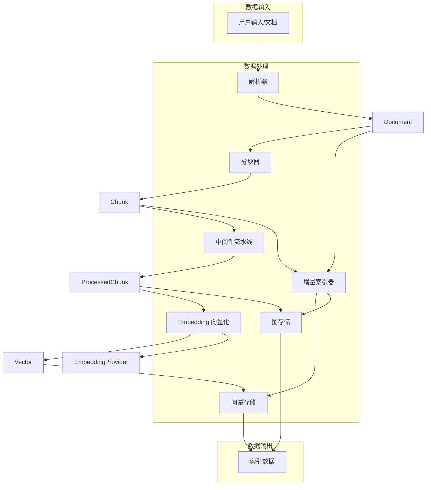
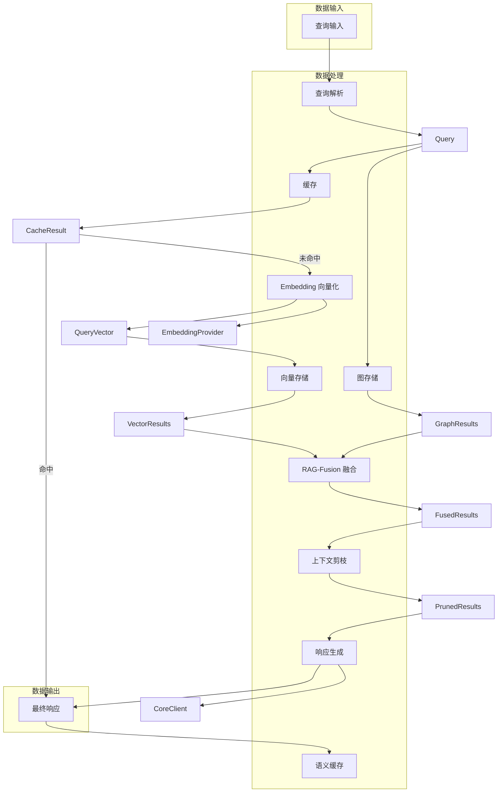
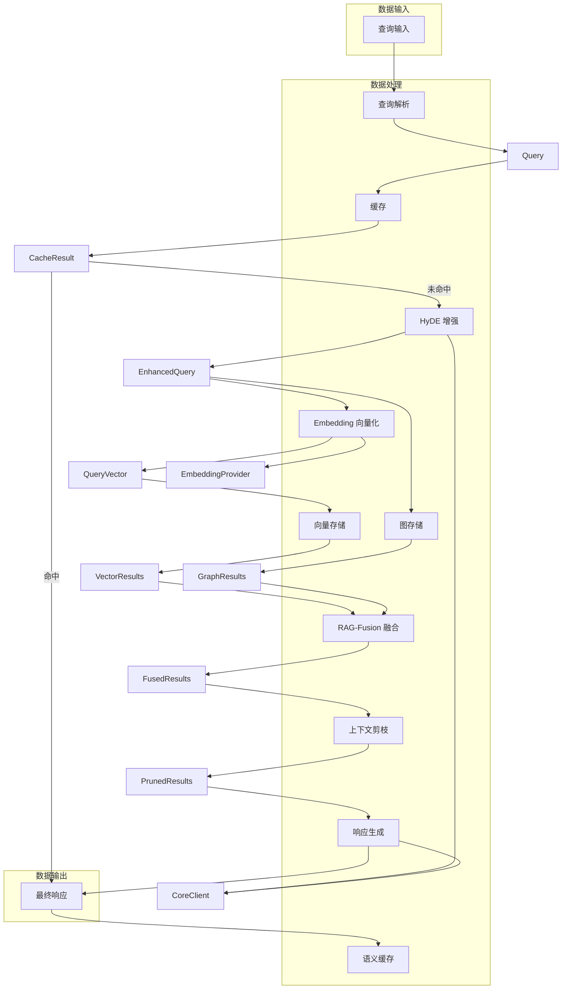
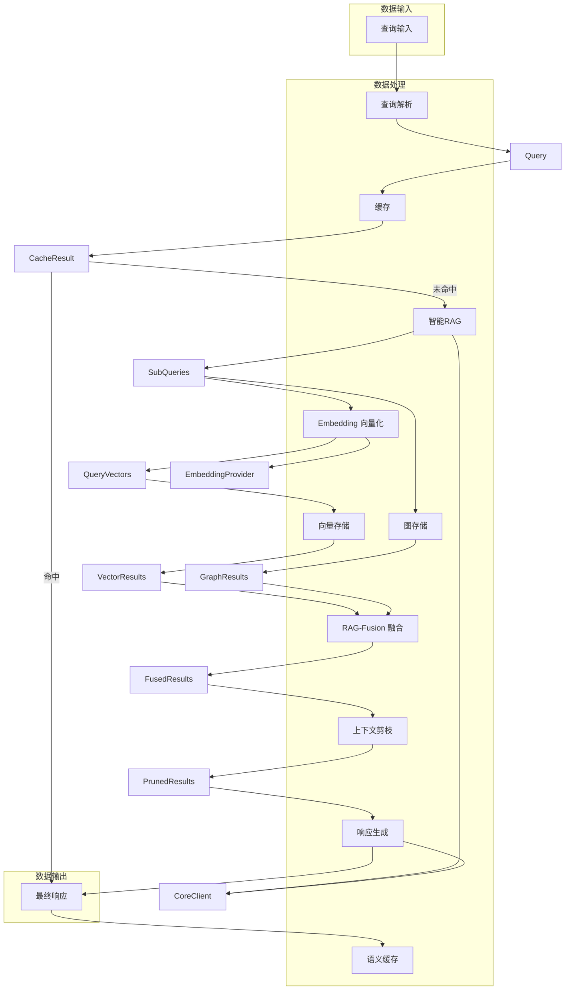
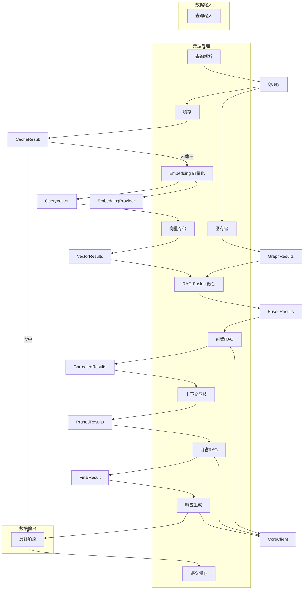

# goRAG 架构关系图

## 核心类关系图

```mermaid
graph TD
    subgraph 核心实体层
        Document["Document 文档实体"]
        Chunk["Chunk 文档分块"]
        Vector["Vector 向量表示"]
        Query["Query 查询实体"]
        RetrievalResult["RetrievalResult 检索结果"]
    end

    subgraph 存储抽象层
        VectorStore["VectorStore 向量存储接口"]
        GraphStore["GraphStore 图存储接口"]
    end

    subgraph 数据准备用例
        Parser["Parser 解析器接口"]
        Chunker["Chunker 分块引擎接口"]
        Middleware["Middleware 中间件接口"]
        MiddlewarePipeline["MiddlewarePipeline 中间件流水线接口"]
        IncrementalIndexer["IncrementalIndexer 增量索引接口"]
    end

    subgraph 检索用例
        HyDE["HyDE 召回增强接口"]
        Fusion["Fusion 融合接口"]
        ContextPruning["ContextPruning 上下文剪枝接口"]
        Agentic["Agentic 智能RAG接口"]
        SelfRAG["SelfRAG 自省RAG接口"]
        CorrectiveRAG["CorrectiveRAG 纠错RAG接口"]
        ResponseGenerator["ResponseGenerator 响应生成接口"]
        StepBackPrompting["StepBackPrompting 退步提示接口"]
    end

    subgraph 评估用例
        Evaluation["Evaluation 评估接口"]
    end

    subgraph 优化用例
        Cache["Cache 缓存接口"]
        SemanticCache["SemanticCache 语义缓存接口"]
        PerformanceOptimizer["PerformanceOptimizer 性能优化接口"]
    end

    subgraph 基础设施用例
        AccessControl["AccessControl 访问控制接口"]
        Observability["Observability 可观察性接口"]
        CostManagement["CostManagement 成本管理接口"]
    end

    subgraph 接口适配器
        DocumentController["DocumentController 文档控制器"]
        QueryController["QueryController 查询控制器"]
        EvaluationController["EvaluationController 评估控制器"]
        VectorStoreGateway["VectorStoreGateway 向量存储网关"]
        GraphStoreGateway["GraphStoreGateway 图存储网关"]
        DocumentPresenter["DocumentPresenter 文档呈现器"]
        QueryPresenter["QueryPresenter 查询呈现器"]
        EvaluationPresenter["EvaluationPresenter 评估呈现器"]
    end

    subgraph goChat依赖
        CoreClient["core.Client LLM客户端"]
        EmbeddingProvider["embedding.Provider 嵌入提供者"]
    end

    %% 数据流转关系
    Document --> Chunk
    Chunk --> Vector
    Query --> HyDE
    HyDE --> Query
    Vector --> VectorStore
    VectorStore --> RetrievalResult
    RetrievalResult --> Fusion
    Fusion --> RetrievalResult
    RetrievalResult --> ContextPruning
    ContextPruning --> RetrievalResult
    RetrievalResult --> ResponseGenerator
    Query --> Agentic
    Agentic --> Query
    Agentic --> RetrievalResult
    Query --> SelfRAG
    SelfRAG --> RetrievalResult
    RetrievalResult --> CorrectiveRAG
    CorrectiveRAG --> RetrievalResult
    Query --> StepBackPrompting
    StepBackPrompting --> Query

    %% 用例与依赖关系
    Parser --> Document
    Chunker --> Chunk
    Middleware --> Chunk
    MiddlewarePipeline --> Middleware
    IncrementalIndexer --> Document
    IncrementalIndexer --> Chunk
    HyDE --> CoreClient
    Agentic --> CoreClient
    SelfRAG --> CoreClient
    CorrectiveRAG --> CoreClient
    ResponseGenerator --> CoreClient
    StepBackPrompting --> CoreClient
    VectorStoreGateway --> VectorStore
    GraphStoreGateway --> GraphStore

    %% 控制器与用例关系
    DocumentController --> Parser
    DocumentController --> Chunker
    DocumentController --> MiddlewarePipeline
    DocumentController --> IncrementalIndexer
    QueryController --> HyDE
    QueryController --> Fusion
    QueryController --> ContextPruning
    QueryController --> Agentic
    QueryController --> SelfRAG
    QueryController --> CorrectiveRAG
    QueryController --> ResponseGenerator
    QueryController --> StepBackPrompting
    QueryController --> VectorStoreGateway
    EvaluationController --> Evaluation

    %% 呈现器与实体关系
    DocumentPresenter --> Document
    QueryPresenter --> Query
    QueryPresenter --> RetrievalResult
    EvaluationPresenter --> Evaluation

    %% 优化与基础设施关系
    QueryController --> Cache
    QueryController --> SemanticCache
    QueryController --> PerformanceOptimizer
    DocumentController --> AccessControl
    QueryController --> AccessControl
    DocumentController --> Observability
    QueryController --> Observability
    DocumentController --> CostManagement
    QueryController --> CostManagement
```



## 数据流转流程图

### 1. 写入通路 (Indexing)



### 2. 读取通路 (Query) - 标准检索线路



### 3. 读取通路 (Query) - HyDE增强线路



### 4. 读取通路 (Query) - 智能RAG线路



### 5. 读取通路 (Query) - 退步提示线路


### 6. 读取通路 (Query) - 自省与纠错RAG线路



## 接口定义

### 核心实体

```go
// Document 文档实体
type Document struct {
    ID          string                 `json:"id"`
    Content     string                 `json:"content"`
    Metadata    map[string]any         `json:"metadata"`
    CreatedAt   time.Time              `json:"created_at"`
    UpdatedAt   time.Time              `json:"updated_at"`
    Source      string                 `json:"source"`
    ContentType string                 `json:"content_type"`
}

// Chunk 文档分块
type Chunk struct {
    ID          string                 `json:"id"`
    DocumentID  string                 `json:"document_id"`
    Content     string                 `json:"content"`
    Metadata    map[string]any         `json:"metadata"`
    CreatedAt   time.Time              `json:"created_at"`
    StartIndex  int                    `json:"start_index"`
    EndIndex    int                    `json:"end_index"`
    VectorID    string                 `json:"vector_id,omitempty"`
}

// Vector 向量表示
type Vector struct {
    ID        string                 `json:"id"`
    Values    []float32              `json:"values"`
    ChunkID   string                 `json:"chunk_id"`
    Metadata  map[string]any         `json:"metadata"`
}

// Query 查询实体
type Query struct {
    ID        string                 `json:"id"`
    Text      string                 `json:"text"`
    Metadata  map[string]any         `json:"metadata"`
    CreatedAt time.Time              `json:"created_at"`
}

// RetrievalResult 检索结果
type RetrievalResult struct {
    ID       string                 `json:"id"`
    QueryID  string                 `json:"query_id"`
    Chunks   []*Chunk               `json:"chunks"`
    Scores   []float32              `json:"scores"`
    Metadata map[string]any         `json:"metadata"`
}
```

### 存储抽象

```go
// VectorStore 向量存储接口
type VectorStore interface {
    // Add 添加向量
    Add(ctx context.Context, vector *Vector) error
    
    // AddBatch 批量添加向量
    AddBatch(ctx context.Context, vectors []*Vector) error
    
    // Search 搜索向量
    Search(ctx context.Context, query []float32, topK int, filter map[string]any) ([]*Vector, []float32, error)
    
    // Delete 删除向量
    Delete(ctx context.Context, id string) error
    
    // DeleteBatch 批量删除向量
    DeleteBatch(ctx context.Context, ids []string) error
    
    // Close 关闭存储
    Close(ctx context.Context) error
}

// Node 图节点
type Node struct {
    ID         string                 `json:"id"`
    Type       string                 `json:"type"`
    Properties map[string]any         `json:"properties"`
}

// Edge 图边
type Edge struct {
    ID         string                 `json:"id"`
    Type       string                 `json:"type"`
    Source     string                 `json:"source"`
    Target     string                 `json:"target"`
    Properties map[string]any         `json:"properties"`
}

// GraphStore 图存储接口
type GraphStore interface {
    // CreateNode 创建节点
    CreateNode(ctx context.Context, node *Node) error
    
    // CreateEdge 创建边
    CreateEdge(ctx context.Context, edge *Edge) error
    
    // GetNode 根据ID获取节点
    GetNode(ctx context.Context, id string) (*Node, error)
    
    // GetEdge 根据ID获取边
    GetEdge(ctx context.Context, id string) (*Edge, error)
    
    // DeleteNode 删除节点
    DeleteNode(ctx context.Context, id string) error
    
    // DeleteEdge 删除边
    DeleteEdge(ctx context.Context, id string) error
    
    // Query 执行图查询
    Query(ctx context.Context, query string, params map[string]any) ([]map[string]any, error)
    
    // Close 关闭存储
    Close(ctx context.Context) error
}
```

### 数据准备用例

```go
// Parser 解析器接口
type Parser interface {
    // Parse 解析文档
    Parse(ctx context.Context, input []byte, metadata map[string]any) (*Document, error)
    
    // ParseStream 流式解析文档
    ParseStream(ctx context.Context, input io.Reader, metadata map[string]any) (*Document, error)
    
    // GetSupportedTypes 获取支持的文件类型
    GetSupportedTypes() []string
}

// Chunker 分块引擎接口
type Chunker interface {
    // Chunk 分块文档
    Chunk(ctx context.Context, document *Document, options map[string]any) ([]*Chunk, error)
    
    // GetSupportedStrategies 获取支持的分块策略
    GetSupportedStrategies() []string
}

// Middleware 中间件接口
type Middleware interface {
    // Process 处理数据
    Process(ctx context.Context, chunk *Chunk) (*Chunk, error)
    
    // Name 获取中间件名称
    Name() string
}

// MiddlewarePipeline 中间件流水线接口
type MiddlewarePipeline interface {
    // AddMiddleware 添加中间件
    AddMiddleware(middleware Middleware)
    
    // Process 处理分块
    Process(ctx context.Context, chunk *Chunk) (*Chunk, error)
    
    // ProcessBatch 批量处理分块
    ProcessBatch(ctx context.Context, chunks []*Chunk) ([]*Chunk, error)
    
    // GetMiddlewares 获取中间件列表
    GetMiddlewares() []Middleware
}

// IncrementalIndexer 增量索引接口
type IncrementalIndexer interface {
    // IndexDocument 增量索引文档
    IndexDocument(ctx context.Context, document *Document) error
    
    // IndexChunk 增量索引分块
    IndexChunk(ctx context.Context, chunk *Chunk) error
    
    // DeleteDocument 删除文档索引
    DeleteDocument(ctx context.Context, documentID string) error
    
    // DeleteChunk 删除分块索引
    DeleteChunk(ctx context.Context, chunkID string) error
    
    // Commit 提交索引变更
    Commit(ctx context.Context) error
}
```

### 检索用例

```go
// HyDE HyDE召回增强接口
type HyDE interface {
    // Enhance 增强查询
    Enhance(ctx context.Context, query *Query, llm core.Client) (*Query, error)
    
    // GenerateHypotheticalDocument 生成假设性文档
    GenerateHypotheticalDocument(ctx context.Context, query string, llm core.Client) (string, error)
}

// Fusion RAG-Fusion融合接口
type Fusion interface {
    // Fuse 融合多个检索结果
    Fuse(ctx context.Context, results []*RetrievalResult) (*RetrievalResult, error)
    
    // FuseWithStrategy 使用特定策略融合
    FuseWithStrategy(ctx context.Context, results []*RetrievalResult, strategy string) (*RetrievalResult, error)
}

// ContextPruning 上下文剪枝/压缩接口
type ContextPruning interface {
    // Prune 剪枝上下文
    Prune(ctx context.Context, result *RetrievalResult, maxTokens int) (*RetrievalResult, error)
    
    // Compress 压缩上下文
    Compress(ctx context.Context, result *RetrievalResult) (*RetrievalResult, error)
}

// Agentic 智能RAG接口
type Agentic interface {
    // DecomposeQuery 分解查询
    DecomposeQuery(ctx context.Context, query *Query, llm core.Client) ([]*Query, error)
    
    // PlanExecution 规划执行
    PlanExecution(ctx context.Context, query *Query, llm core.Client) ([]string, error)
    
    // ExecutePlan 执行规划
    ExecutePlan(ctx context.Context, query *Query, plan []string, llm core.Client) (*RetrievalResult, error)
}

// SelfRAG 自省RAG接口
type SelfRAG interface {
    // ShouldRetrieve 判断是否需要检索
    ShouldRetrieve(ctx context.Context, query *Query, llm core.Client) (bool, error)
    
    // CritiqueResult 评估检索结果
    CritiqueResult(ctx context.Context, query *Query, result *RetrievalResult, llm core.Client) (bool, string, error)
    
    // GenerateWithCritique 基于评估生成响应
    GenerateWithCritique(ctx context.Context, query *Query, result *RetrievalResult, critique string, llm core.Client) (string, error)
}

// CorrectiveRAG 纠错RAG接口
type CorrectiveRAG interface {
    // DetectErrors 检测错误
    DetectErrors(ctx context.Context, query *Query, result *RetrievalResult, llm core.Client) ([]string, error)
    
    // CorrectResult 纠正错误
    CorrectResult(ctx context.Context, query *Query, result *RetrievalResult, errors []string, llm core.Client) (*RetrievalResult, error)
}

// ResponseGenerator 响应生成接口
type ResponseGenerator interface {
    // Generate 生成响应
    Generate(ctx context.Context, query *Query, result *RetrievalResult, llm core.Client) (string, error)
    
    // GenerateStream 流式生成响应
    GenerateStream(ctx context.Context, query *Query, result *RetrievalResult, llm core.Client) (<-chan string, error)
    
    // GenerateWithCitations 生成带引用的响应
    GenerateWithCitations(ctx context.Context, query *Query, result *RetrievalResult, llm core.Client) (string, map[string]string, error)
}

// StepBackPrompting 退步提示接口
type StepBackPrompting interface {
    // StepBack 生成抽象查询
    StepBack(ctx context.Context, query *Query, llm core.Client) (*Query, error)
    
    // StepForward 基于抽象知识生成具体响应
    StepForward(ctx context.Context, query *Query, abstractQuery *Query, result *RetrievalResult, llm core.Client) (string, error)
}
```

### 评估用例

```go
// EvaluationResult 评估结果
type EvaluationResult struct {
    Metric    string                 `json:"metric"`
    Score     float64                `json:"score"`
    Details   map[string]any         `json:"details"`
}

// Evaluation 评估接口
type Evaluation interface {
    // Evaluate 评估检索结果
    Evaluate(ctx context.Context, query string, result any) (*EvaluationResult, error)
    
    // EvaluateBatch 批量评估
    EvaluateBatch(ctx context.Context, queries []string, results []any) ([]*EvaluationResult, error)
    
    // GetSupportedMetrics 获取支持的评估指标
    GetSupportedMetrics() []string
}
```

### 优化用例

```go
// Cache 缓存接口
type Cache interface {
    // Get 获取缓存
    Get(ctx context.Context, key string) (any, error)
    
    // Set 设置缓存
    Set(ctx context.Context, key string, value any, ttl int) error
    
    // Delete 删除缓存
    Delete(ctx context.Context, key string) error
    
    // Clear 清空缓存
    Clear(ctx context.Context) error
}

// SemanticCache 语义缓存接口
type SemanticCache interface {
    // Get 基于语义相似度获取缓存
    Get(ctx context.Context, query string, threshold float32) (any, float32, error)
    
    // Set 设置语义缓存
    Set(ctx context.Context, query string, value any, ttl int) error
    
    // Delete 删除语义缓存
    Delete(ctx context.Context, query string) error
}

// PerformanceOptimizer 性能优化接口
type PerformanceOptimizer interface {
    // OptimizeLatency 优化延迟
    OptimizeLatency(ctx context.Context, query *Query) (*Query, error)
    
    // OptimizeThroughput 优化吞吐量
    OptimizeThroughput(ctx context.Context, queries []*Query) ([]*Query, error)
    
    // GetMetrics 获取性能指标
    GetMetrics(ctx context.Context) (map[string]any, error)
}
```

### 基础设施用例

```go
// AccessControl 访问控制接口
type AccessControl interface {
    // CheckAccess 检查访问权限
    CheckAccess(ctx context.Context, userID, resourceID, action string) (bool, error)
    
    // GrantAccess 授予访问权限
    GrantAccess(ctx context.Context, userID, resourceID, action string) error
    
    // RevokeAccess 撤销访问权限
    RevokeAccess(ctx context.Context, userID, resourceID, action string) error
}

// Observability 可观察性接口
type Observability interface {
    // Log 记录日志
    Log(ctx context.Context, level, message string, fields map[string]any) error
    
    // Metrics 记录指标
    Metrics(ctx context.Context, name string, value float64, tags map[string]any) error
    
    // Trace 开始追踪
    Trace(ctx context.Context, name string) (context.Context, func())
}

// CostManagement 成本管理接口
type CostManagement interface {
    // TrackCost 追踪成本
    TrackCost(ctx context.Context, service, operation string, cost float64) error
    
    // GetCosts 获取成本信息
    GetCosts(ctx context.Context, service string, start, end int64) (map[string]float64, error)
    
    // OptimizeCost 优化成本
    OptimizeCost(ctx context.Context, operation string, params map[string]any) (map[string]any, error)
}
```

### 接口适配器

```go
// DocumentController 文档控制器接口
type DocumentController interface {
    // CreateDocument 创建文档
    CreateDocument(ctx context.Context, content, source, contentType string, metadata map[string]any) (*Document, error)
    
    // GetDocument 获取文档
    GetDocument(ctx context.Context, id string) (*Document, error)
    
    // UpdateDocument 更新文档
    UpdateDocument(ctx context.Context, id, content string, metadata map[string]any) (*Document, error)
    
    // DeleteDocument 删除文档
    DeleteDocument(ctx context.Context, id string) error
    
    // ListDocuments 列出文档
    ListDocuments(ctx context.Context, limit, offset int) ([]*Document, error)
    
    // IndexDocument 索引文档
    IndexDocument(ctx context.Context, document *Document) error
}

// QueryController 查询控制器接口
type QueryController interface {
    // CreateQuery 创建查询
    CreateQuery(ctx context.Context, text string, metadata map[string]any) (*Query, error)
    
    // Retrieve 检索
    Retrieve(ctx context.Context, query *Query, topK int, filter map[string]any) (*RetrievalResult, error)
    
    // RetrieveWithStrategy 使用特定策略检索
    RetrieveWithStrategy(ctx context.Context, query *Query, strategy string, options map[string]any) (*RetrievalResult, error)
    
    // GenerateResponse 生成响应
    GenerateResponse(ctx context.Context, query *Query, result *RetrievalResult) (string, error)
}

// EvaluationController 评估控制器接口
type EvaluationController interface {
    // Evaluate 评估检索结果
    Evaluate(ctx context.Context, query string, result any) (*EvaluationResult, error)
    
    // EvaluateBatch 批量评估
    EvaluateBatch(ctx context.Context, queries []string, results []any) ([]*EvaluationResult, error)
}

// VectorStoreGateway 向量存储网关接口
type VectorStoreGateway interface {
    // GetVectorStore 获取向量存储
    GetVectorStore() VectorStore
    
    // AddVector 添加向量
    AddVector(ctx context.Context, vector *Vector) error
    
    // AddVectors 批量添加向量
    AddVectors(ctx context.Context, vectors []*Vector) error
    
    // SearchVectors 搜索向量
    SearchVectors(ctx context.Context, query []float32, topK int, filter map[string]any) ([]*Vector, []float32, error)
    
    // DeleteVector 删除向量
    DeleteVector(ctx context.Context, id string) error
    
    // DeleteVectors 批量删除向量
    DeleteVectors(ctx context.Context, ids []string) error
}

// GraphStoreGateway 图存储网关接口
type GraphStoreGateway interface {
    // GetGraphStore 获取图存储
    GetGraphStore() GraphStore
    
    // CreateNode 创建节点
    CreateNode(ctx context.Context, node *Node) error
    
    // CreateEdge 创建边
    CreateEdge(ctx context.Context, edge *Edge) error
    
    // GetNode 获取节点
    GetNode(ctx context.Context, id string) (*Node, error)
    
    // GetEdge 获取边
    GetEdge(ctx context.Context, id string) (*Edge, error)
    
    // DeleteNode 删除节点
    DeleteNode(ctx context.Context, id string) error
    
    // DeleteEdge 删除边
    DeleteEdge(ctx context.Context, id string) error
    
    // Query 执行图查询
    Query(ctx context.Context, query string, params map[string]any) ([]map[string]any, error)
}

// DocumentPresenter 文档呈现器接口
type DocumentPresenter interface {
    // Present 呈现文档
    Present(document *Document) map[string]any
    
    // PresentList 呈现文档列表
    PresentList(documents []*Document) []map[string]any
}

// QueryPresenter 查询呈现器接口
type QueryPresenter interface {
    // Present 呈现查询
    Present(query *Query) map[string]any
    
    // PresentResult 呈现检索结果
    PresentResult(result *RetrievalResult) map[string]any
}

// EvaluationPresenter 评估呈现器接口
type EvaluationPresenter interface {
    // Present 呈现评估结果
    Present(result *EvaluationResult) map[string]any
    
    // PresentList 呈现评估结果列表
    PresentList(results []*EvaluationResult) []*map[string]any
}
```