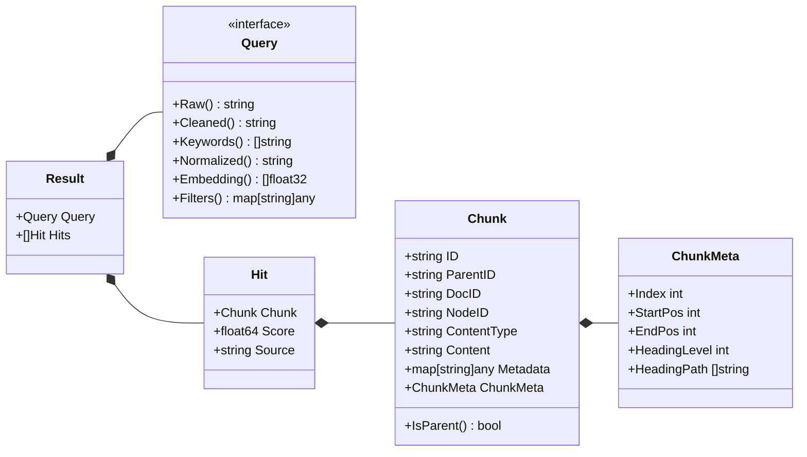
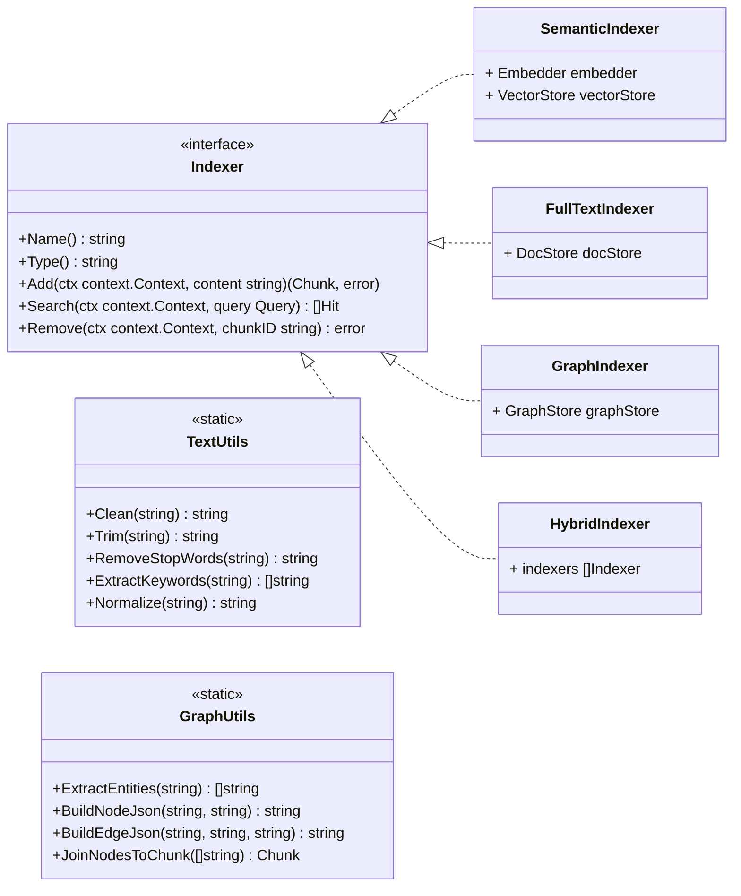

# 核心对象

GoRAG的核心对象：



GoRAG 的核心接口:



---


```go
package utils

import (
	"regexp"
	"strings"
)


// Clean 基础清洗：去特殊符号、多余空格、统一格式
func Clean(s string) string {
	// 去特殊字符
	re := regexp.MustCompile(`[^\p{Han}\w\s]`)
	s = re.ReplaceAllString(s, " ")
	// 合并空格
	s = regexp.MustCompile(`\s+`).ReplaceAllString(s, " ")
	return strings.TrimSpace(s)
}

// Normalize 归一化：小写+清理
func Normalize(s string) string {
	s = strings.ToLower(s)
	return Clean(s)
}

// ExtractKeywords 提取关键词（去停用词）
func ExtractKeywords(s string) []string {
	words := strings.Fields(Clean(s))
	stop := stopWords()
	var kw []string
	for _, w := range words {
		if !stop[w] && len(w) > 1 {
			kw = append(kw, w)
		}
	}
	return kw
}

// RemoveStopWords 去除停用词
func RemoveStopWords(s string) string {
	words := strings.Fields(s)
	stop := stopWords()
	var res []string
	for _, w := range words {
		if !stop[w] {
			res = append(res, w)
		}
	}
	return strings.Join(res, " ")
}

// 中文停用词（内置）
func stopWords() map[string]bool {
	return map[string]bool{
		"我": true, "的": true, "了": true, "是": true, "在": true,
		"你": true, "他": true, "她": true, "它": true, "有": true,
		"这个": true, "那个": true, "一个": true, "吗": true, "呢": true,
	}
}
```


```go
package utils

// ExtractEntities 简单规则实体提取（可替换为 LLM / 正则 / 模型）
func ExtractEntities(text string) []string {
	// 实际项目可替换为：
	// - 正则抽取
	// - LLM 抽取
	// - 实体链接模型
	// 这里给一个最简可运行版本
	return words
}

// BuildNodeJson 构建图节点 JSON string（存入 Chunk.Content）
func BuildNodeJson(nodeID string, label string) string {
	m := map[string]any{
		"id":    nodeID,
		"label": label,
	}
	j, _ := json.Marshal(m)
	return string(j)
}

// BuildEdgeJson 构建图关系边 JSON string
func BuildEdgeJson(fromID string, relation string, toID string) string {
	m := map[string]any{
		"from":     fromID,
		"relation": relation,
		"to":       toID,
	}
	j, _ := json.Marshal(m)
	return string(j)
}

// JoinNodesToChunk 将多个节点合并为一个结构化 Chunk
func JoinNodesToChunk(nodeIDs []string) Chunk {
	return Chunk{
		ID:          uuid.NewString(),
		ContentType: "graph_nodes",
		Content:     `{"nodes": [` + strings.Join(nodeIDs, ",") + `]}`,
	}
}
```