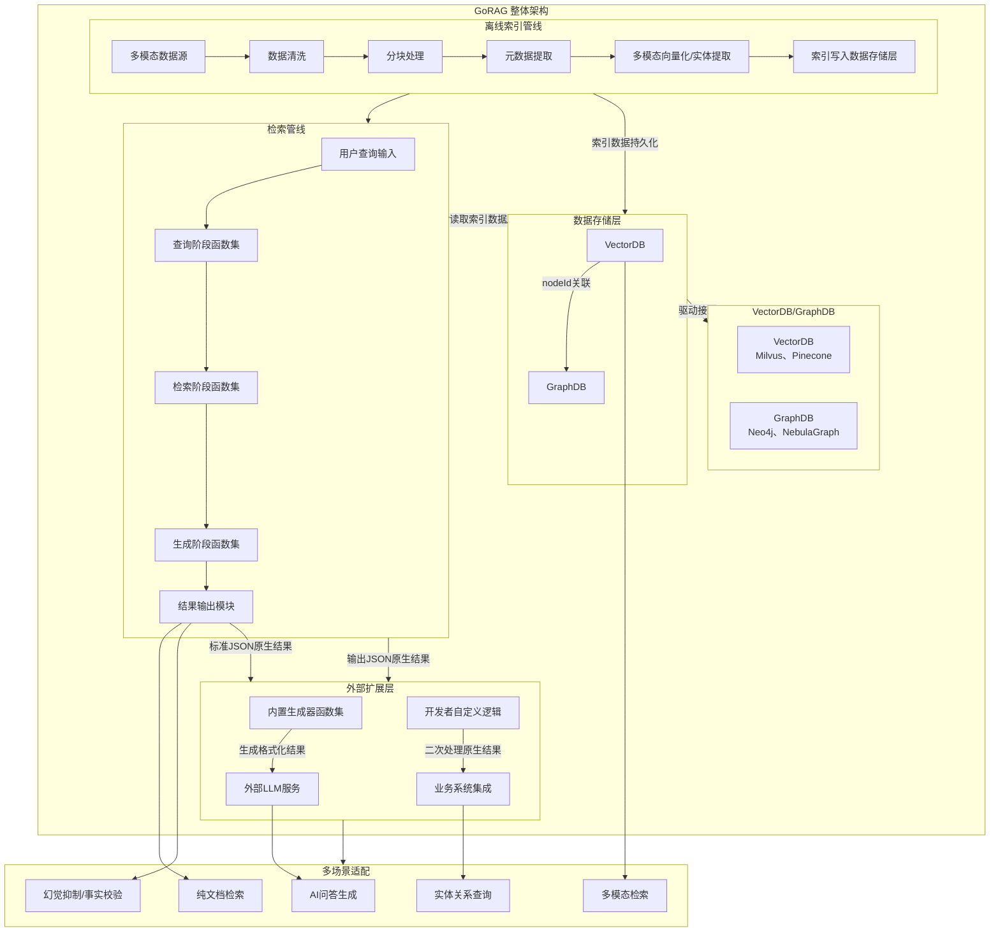
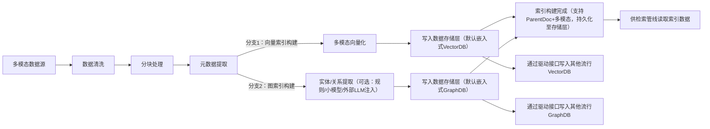
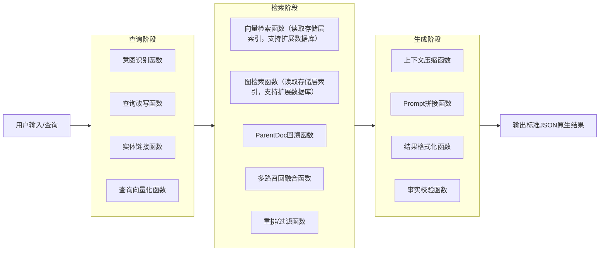

# 架构概述

## 核心定位

GoRAG 是一款 **极简、高性能、可扩展、可商用** 的新一代 RAG 引擎，核心定位为「检索索引层 + 可编排函数管道」，不绑定任何外部服务、不内置生成逻辑，以轻量存储底座为基础（默认嵌入式纯Go VectorDB+GraphDB，用于降低架构复杂度），函数式编程为核心，标准化JSON为输出载体，适配从纯文档检索到AI幻觉抑制的所有RAG应用场景。框架内置驱动接口，可灵活对接其他流行的VectorDB与GraphDB，兼顾极简部署与灵活扩展需求。

核心设计理念：

1. 底座轻量：默认集成嵌入式纯Go VectorDB+GraphDB，核心目的是降低架构复杂度、实现单二进制部署，同时提供驱动接口支持其他流行数据库；
2. 流程固定：查询→检索→生成三段式，内部函数化、可插拔、可自由编排；
3. 解耦彻底：RAG内核仅负责检索召回，生成逻辑体外化，提供可选生成器；
4. 通用兼容：以JSON为原生结果载体，支持跨语言、跨场景复用；
5. 双管线架构：采用「离线索引管线 + 检索管线」双管线设计，管线内模块可自由组合，兼顾索引构建效率与检索性能。


## 整体架构图



双管线核心说明：

1. 离线索引管线：负责离线构建索引，一次性完成数据清洗、分块、向量化、实体提取及索引写入，不参与在线检索响应，确保索引构建不影响检索性能；
2. 检索管线：负责在线响应用户查询，通过函数式管道完成查询预处理、检索召回、结果加工，输出标准化JSON原生结果，核心是高效、灵活；
3. 数据存储层适配：双管线共用数据存储层，默认采用嵌入式纯Go VectorDB+GraphDB以降低复杂度，开发者可通过框架提供的驱动接口，替换为其他流行的VectorDB与GraphDB，实现“一次构建、多次检索”的同时兼顾扩展需求。

## 核心模块详细设计

### 数据存储层设计

核心目标：提供轻量、可靠的存储支撑，通过统一ID关联确保数据一致性，默认采用嵌入式纯Go数据库降低架构复杂度、实现极简部署，同时提供标准化驱动接口，支持灵活对接其他流行VectorDB与GraphDB，兼顾简易性与扩展性。

### VectorDB

职责（核心为降低复杂度，满足基础检索需求）：

1. 负责向量数据（文本/图片/音频）的向量化存储与检索；
2. 负责多模态数据（文本/图片/音频）的向量化存储与检索；
3. 存储分块数据（子块+父块），支持ParentDoc分层索引；
4. 存储向量、分块原文、元数据（metadata）、关联nodeId（与GraphDB关联）；
5. 提供高效向量检索接口，支撑检索管线的精准召回；
6. 接收离线索引管线的索引写入请求，完成向量索引持久化。

核心特性：无cgo依赖、嵌入式部署、持久化存储、支持多模态统一向量空间，适配框架“极简部署”的基础需求。

### GraphDB

职责（核心为降低复杂度，满足基础结构检索需求）：

1. 存储从元数据中提取的实体、关系、三元组；
2. 支持实体关联、多跳检索、子图查询，支撑检索管线的结构检索需求；
3. 通过nodeId与VectorDB的分块数据强关联，保持数据一致性；
4. 提供基础图遍历接口，支撑检索管线的图检索函数；
5. 接收离线索引管线的实体/关系数据，完成图索引持久化。

核心特性：嵌入式部署、轻量高效、支持基础图查询、与VectorDB协同工作，适配框架“极简部署”的基础需求。

### 3.1.3 数据库扩展支持

框架核心设计：默认嵌入式数据库仅为降低架构复杂度、简化部署流程，并非唯一选择。框架内置标准化驱动接口，支持开发者灵活对接其他流行的VectorDB与GraphDB，无需修改核心管线逻辑。

支持范围：

1. 流行VectorDB：Milvus、Pinecone、Chroma、Weaviate等，通过驱动接口实现索引写入、向量检索等核心功能的无缝对接；
2. 流行GraphDB：Neo4j、NebulaGraph、ArangoDB等，通过驱动接口实现实体/关系存储、图检索等核心功能的无缝对接；
3. 对接优势：驱动接口标准化，替换数据库时无需修改离线索引管线、检索管线的核心逻辑，仅需配置对应驱动参数，兼顾扩展性与稳定性。

## 3.2 离线索引管线模块

核心目标：一次性预构建索引，支撑所有RAG形态，无需重复处理数据，为检索管线提供高质量、结构化的索引数据，不参与在线响应，适配默认嵌入式数据库与扩展数据库。




关键说明：

1. 仅预构建两类核心索引：多模态向量索引 + ParentDoc分层索引，为检索管线提供基础检索素材，适配所有支持的数据库；
2. 实体/关系提取支持可插拔，可选择内置规则、小模型，或通过接口注入外部LLM逻辑，适配不同索引精度需求；
3. 所有索引通过nodeId关联，确保存储层数据一致性，为检索管线的多路召回提供数据支撑，与数据库类型无关；
4. 离线一次性完成，后续检索无需重复处理，提升检索管线的响应性能；
5. 索引数据可根据配置，写入默认嵌入式数据库或通过驱动接口写入其他流行数据库，兼顾简易部署与扩展需求。

## 检索管线模块

核心目标：以函数式编程实现三段式流程，支持自由编排、可插拔，上下文结构统一，内容动态流转，在线响应用户查询，高效召回索引数据并输出原生结果，适配所有支持的数据库。

核心原则：结构（Schema）固定，内容可变；结构为管道契约，内容为函数输出，全程读取离线索引管线构建的索引数据（无论默认嵌入式数据库还是扩展数据库），不涉及索引写入。

### 3.3.1 三段式流程定义



### 各阶段函数说明

1. 查询阶段函数（可插拔、可组合）：
   负责对用户查询进行预处理，输出结构化查询信息，为检索阶段提供支撑；
   示例：将模糊查询改写为精准查询，提取查询中的实体，将查询向量化，适配检索阶段的向量检索、图检索需求，与数据库类型无关。
2. 检索阶段函数（可插拔、可组合）：
   核心检索逻辑，通过标准化接口读取存储层索引数据（默认嵌入式数据库或扩展数据库），召回相关数据，输出结构化检索结果；
   示例：向量检索召回相关分块，图检索召回关联实体/子图，ParentDoc回溯获取完整父块，多路召回结果融合去重。
3. 生成阶段函数（可插拔、可组合）：
   对检索结果进行预处理，不负责最终生成，仅为外部生成器/自定义逻辑提供加工后的数据；
   示例：压缩冗余上下文，拼接LLM所需Prompt模板，过滤无效检索结果，确保输出结果的纯净性和可用性。

### 上下文Schema

所有函数通过统一Schema流转数据，确保管道一致性，JSON格式示例：

```json
{
  "query": "用户原始查询",
  "processed_query": "预处理后的查询",
  "chunks": [
    {
      "chunk_id": "分块ID",
      "content": "分块内容",
      "score": 检索相似度分数,
      "parent_id": "父块ID",
      "node_id": "关联GraphDB的nodeId",
      "metadata": {}
    }
  ],
  "parent_docs": [
    {
      "parent_id": "父块ID",
      "content": "父块完整内容",
      "metadata": {}
    }
  ],
  "graph_data": {
    "entities": [{"id": "实体ID", "name": "实体名称", "type": "实体类型"}],
    "relations": [{"source": "源实体ID", "target": "目标实体ID", "type": "关系类型"}],
    "subgraph": {}
  },
  "params": {
    "retrieval_strategy": "检索策略",
    "top_k": 10,
    "filter": {}
  }
}
```

### 生成模块

核心目标：输出标准化、通用化的原生检索结果，不绑定任何生成逻辑，确保通用性，作为检索管线的最终输出节点，衔接外部扩展层，与底层数据库类型无关。

核心设计：

1. 输出格式：标准JSON，严格遵循上述上下文Schema；
2. 输出内容：纯净的检索结果（分块、父块、实体、子图、分数、元数据），无任何格式化、自然语言生成内容；
3. 核心优势：跨语言兼容、可二次处理、适配所有场景，开发者可直接使用或自定义加工，承接检索管线的输出，为外部扩展层提供基础数据。

## 外部扩展层

核心目标：提供灵活的扩展能力，适配不同开发需求，不污染内核逻辑，接收检索管线输出的JSON原生结果，实现多样化场景适配，同时包含数据库扩展相关的配置接口。

核心组件：

1. 内置生成器函数集（可选择、可组合）：
   针对常见场景提供现成生成器，开发者可直接调用，无需自定义；
   示例：文本拼接生成器、LLM Prompt生成器、JSON格式化生成器、事实校验生成器、知识库引用生成器。
2. 开发者自定义逻辑：
   开发者可基于JSON原生结果，自由编写格式化、二次检索、业务过滤等逻辑，适配个性化需求；同时可通过配置接口，对接扩展数据库的驱动参数。
3. 外部LLM服务：
   LLM完全体外化，通过REST/gRPC接口调用，可对接本地模型或云端模型，不与内核绑定；
   核心作用：接收生成器/自定义逻辑处理后的内容，完成最终自然语言生成、对话等功能。
4. 业务系统集成：
   原生JSON结果可直接对接各类业务系统，适配纯检索、推荐、风控等非AI场景。

## 设计亮点

1. 极简易部署：默认集成嵌入式纯Go VectorDB+GraphDB，核心目的是降低架构复杂度，实现单二进制部署、无外部服务依赖，部署成本极低；同时提供驱动接口，支持灵活扩展至其他流行数据库；
2. 高性能：Go语言并发优势 + 轻量存储层设计，检索速度远超Python系RAG框架；双管线分离设计，离线索引不干扰在线检索，进一步提升响应性能；
3. 可扩展：函数式管道可自由编排，模块可插拔，支持多模态、GraphRAG、ParentDoc等所有RAG形态；支持主流VectorDB/GraphDB扩展，管线逻辑与数据库类型解耦；双管线内模块可独立扩展，适配不同索引精度、检索需求；
4. 解耦彻底：RAG内核与生成逻辑完全分离，内核专注检索，生成逻辑体外化，适配所有场景；双管线分离，索引构建与检索响应解耦，提升系统稳定性；存储层与管线逻辑解耦，支持数据库灵活替换；
5. 通用兼容：JSON标准化输出，跨语言、跨平台、跨场景复用，开发者友好；数据库驱动接口标准化，适配不同存储需求；
6. 灵活适配：开发者可直接用原生结果、选内置生成器、自定义逻辑，兼顾简单用户与高级开发者需求；双管线设计适配“离线构建、在线检索”的主流工程化场景；存储层支持默认嵌入式与扩展数据库，适配不同部署规模需求。

## 应用场景适配说明

| 应用场景          | 使用方式                                                                                       | 核心依赖模块                                                                              |
| ----------------- | ---------------------------------------------------------------------------------------------- | ----------------------------------------------------------------------------------------- |
| 纯文档检索        | 直接使用检索管线输出的JSON原生结果，无需调用生成器；可选择默认嵌入式VectorDB或扩展VectorDB     | 离线索引管线（向量索引）、检索管线（向量检索函数）、数据存储层（默认/扩展VectorDB）       |
| AI问答生成        | 调用LLM Prompt生成器，将检索管线输出的结果喂给外部LLM；可自由选择存储层数据库类型              | 双管线、数据存储层（默认/扩展）、函数管道、LLM生成器                                      |
| 幻觉抑制/事实校验 | 使用检索管线输出的原生结果与LLM输出比对，自定义校验逻辑；存储层数据库可灵活选择                | 双管线、数据存储层（默认/扩展）、检索阶段函数、自定义逻辑                                 |
| 实体关系查询      | 提取检索管线输出JSON中的graph_data，直接使用或简单格式化；可选择默认嵌入式GraphDB或扩展GraphDB | 离线索引管线（图索引）、检索管线（图检索函数）、数据存储层（默认/扩展GraphDB）            |
| 多模态检索        | 直接使用检索管线输出的存储层多模态检索结果，按需格式化；可选择默认/扩展VectorDB                | 离线索引管线（多模态索引）、检索管线（多模态向量化函数）、数据存储层（默认/扩展VectorDB） |

## 架构核心结论

GoRAG 框架通过「轻量存储层（默认嵌入式双库，核心降低复杂度） + 离线索引管线 + 检索管线 + 函数式三段式管道 + JSON标准输出 + 体外化生成器 + 数据库驱动扩展接口」的设计，实现了「极简但不简单」的核心目标。其中双管线抽象（离线索引+检索）实现索引构建与检索响应的解耦，存储层设计兼顾极简部署与灵活扩展（支持其他流行VectorDB/GraphDB），既保证了高性能、易部署性，又兼顾了灵活性、通用性、可扩展性，是新一代RAG引擎的最优落地方案，可直接用于生产环境、开源发布或二次开发。
