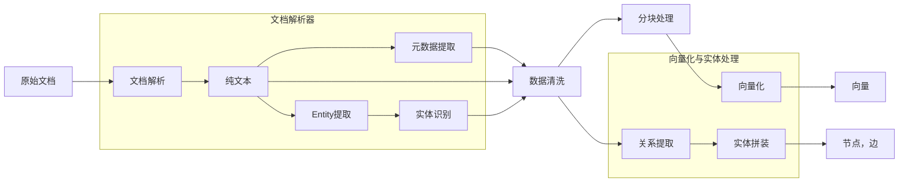
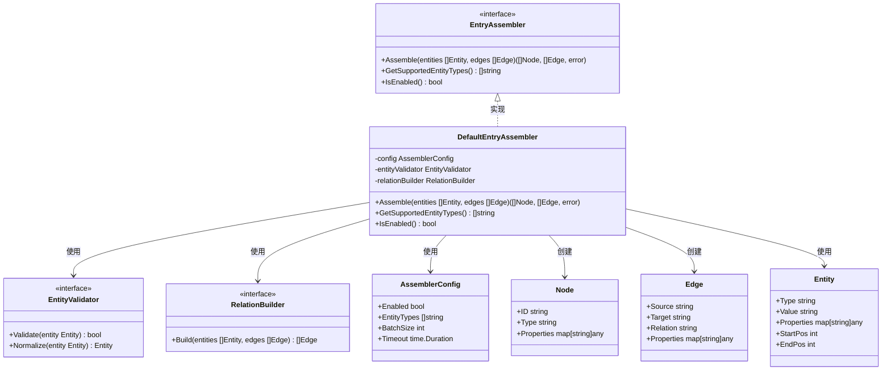
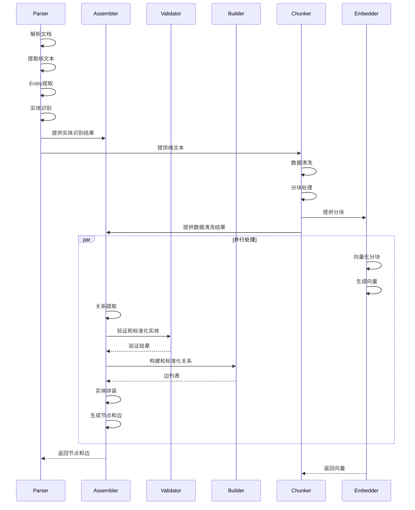
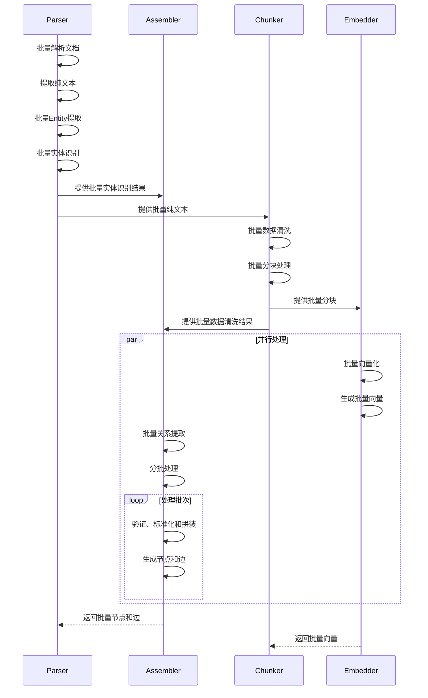
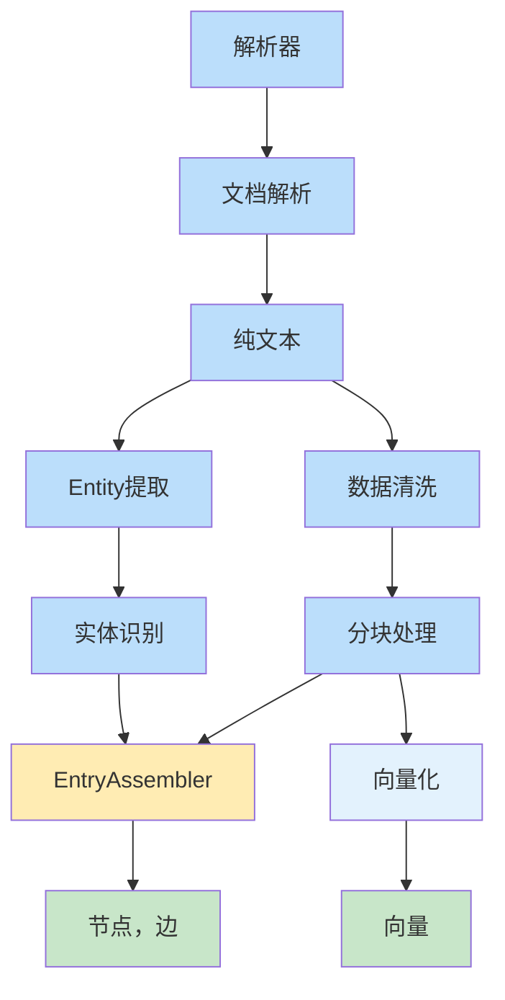
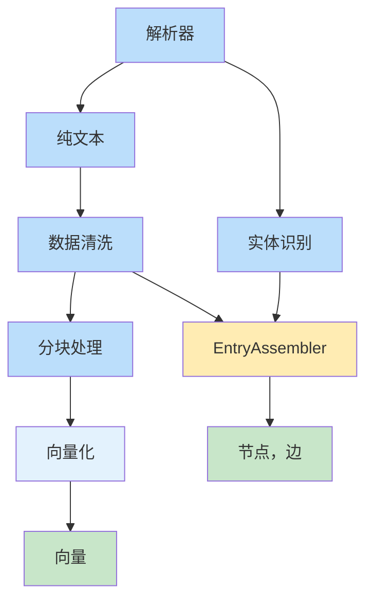

# 实体拼装器

实体拼装器（Entry Assembler）是 RAG 索引流水线中的关键组件，负责将解析阶段提取的实体特征拼装成结构化的 Node，并将其存入 GraphDB。

> 实体拼装 = 将分散的实体特征组合成完整的节点结构，建立实体间的关系

---

## 实体拼装器在 RAG 索引中的位置

实体拼装器位于分块处理之后，与向量化同一步：

**实体拼装器的作用**：

1. **实体整合**：将实体识别后的分散实体特征整合为完整的节点
2. **关系建立**：基于关系提取的结果，建立实体间的连接
3. **结构化输出**：生成结构化的节点和边，为知识图谱构建做准备
4. **语义增强**：为向量化和检索提供结构化语义信息

---

## `assembling` 包结构

### UML 类图

### 核心组件说明

| 组件                      | 职责                       | 实现方式                 |
| ------------------------- | -------------------------- | ------------------------ |
| **EntryAssembler**        | 实体拼装接口，定义核心方法 | 接口抽象                 |
| **DefaultEntryAssembler** | 默认实体拼装实现           | 基于配置和规则的实体拼装 |
| **AssemblerConfig**       | 拼装器配置                 | 配置结构体               |
| **EntityValidator**       | 实体验证器                 | 验证和标准化实体         |
| **RelationBuilder**       | 关系构建器                 | 基于边构建实体间的关系   |
| **Node**                  | 实体节点                   | 包含实体信息             |
| **Edge**                  | 节点间边                   | 表示实体间的连接         |
| **Entity**                | 原始实体                   | 从解析器获取的实体信息   |

---

## 实体拼装流程

### 基本流程

### 批量处理流程

---

## 实体验证与标准化

### 验证规则

| 规则       | 说明                 | 实现方式                 |
| ---------- | -------------------- | ------------------------ |
| 类型验证   | 验证实体类型是否支持 | EntityValidator.Validate |
| 属性验证   | 验证实体属性是否完整 | EntityValidator.Validate |
| 唯一性验证 | 确保实体 ID 唯一     | EntityValidator.Validate |
| 格式验证   | 验证实体属性格式     | EntityValidator.Validate |

### 标准化流程

| 步骤       | 说明               | 实现方式                  |
| ---------- | ------------------ | ------------------------- |
| 类型标准化 | 统一实体类型命名   | EntityValidator.Normalize |
| 属性标准化 | 统一属性格式和命名 | EntityValidator.Normalize |
| ID 标准化  | 生成统一的实体 ID  | EntityValidator.Normalize |
| 关系标准化 | 统一关系类型命名   | RelationBuilder.Build     |

---

## 与其他模块的集成

### 与解析器和分块器的集成

### 与向量化的集成

---

## 配置选项

### 拼装器配置

| 参数                   | 类型          | 说明               | 默认值                                 |
| ---------------------- | ------------- | ------------------ | -------------------------------------- |
| `Enabled`              | bool          | 是否启用实体拼装   | true                                   |
| `EntityTypes`          | []string      | 支持的实体类型     | ["person", "organization", "location"] |
| `BatchSize`            | int           | 批量处理大小       | 32                                     |
| `Timeout`              | time.Duration | 处理超时           | 30s                                    |
| `ValidationEnabled`    | bool          | 是否启用实体验证   | true                                   |
| `NormalizationEnabled` | bool          | 是否启用实体标准化 | true                                   |

---

## 性能优化

### 1. 批量处理
- 批量验证和拼装实体
- 批量写入 GraphDB
- 减少网络请求和数据库操作

### 2. 缓存策略
- 缓存已验证的实体
- 缓存已构建的关系
- 减少重复计算

### 3. 并行处理
- 并行验证实体
- 并行构建关系
- 提高处理速度

### 4. 错误处理
- 容错机制：单个实体错误不影响整体处理
- 重试机制：处理失败时自动重试
- 错误日志：详细记录错误信息

---

## 扩展点

### 1. 自定义实体拼装器
- 实现 `EntryAssembler` 接口
- 提供自定义的实体拼装逻辑
- 支持特定领域的实体处理

### 2. 自定义实体验证器
- 实现 `EntityValidator` 接口
- 提供自定义的验证规则
- 支持特定领域的实体验证

### 3. 自定义关系构建器
- 实现 `RelationBuilder` 接口
- 提供自定义的关系构建逻辑
- 支持特定领域的关系处理

---

## 总结

| 要点         | 说明                                       |
| ------------ | ------------------------------------------ |
| **核心功能** | 将实体识别和数据清洗后的实体拼装成节点和边 |
| **实现方式** | 基于配置和规则的实体拼装                   |
| **性能优化** | 批量处理、缓存、与向量化并行处理           |
| **集成能力** | 与解析器、分块器和向量化模块无缝集成       |
| **可扩展性** | 支持自定义实体拼装器、验证器和关系构建器   |
| **配置灵活** | 可根据需求配置实体类型和处理参数           |
| **错误处理** | 容错机制和重试机制                         |

实体拼装器是 RAG 系统的重要组成部分，它位于向量化与实体处理阶段。通过将实体识别和数据清洗后的实体拼装成结构化的节点和边，为 RAG 系统提供了丰富的语义信息，增强了系统的理解和检索能力。与向量化并行处理可以提高整体处理效率，确保知识图谱构建和向量生成的同步进行。