# 分块器

分块是将长文档切分为较小文本片段的过程，是 RAG 系统中连接文档解析与向量化的关键环节。

> 分块 = 把"长文章"切成"小段落"，每个小段落都能独立表达一个完整的意思

## 分块在 RAG 中的位置


```mermaid
flowchart LR
    A[原始文档] --> B[文档解析]
    B --> C[纯文本]
    C --> D[数据清洗]
    D --> E[分块处理]
    E --> F[文本块]
    F --> G[向量化]
    G --> H[向量数据库]

    style E fill:#fff3e0
```

---

## 为什么需要分块？

### 不分块的问题

| 问题           | 说明                             | 示例           |
| -------------- | -------------------------------- | -------------- |
| **向量稀释**   | 长文档包含太多主题，向量表达模糊 | 整本书作为一块 |
| **精度下降**   | 检索返回整页，用户需要自己找答案 | FAQ 整页返回   |
| **Token 浪费** | 无关内容占用 LLM 上下文          | 不需要的内容   |
| **重复存储**   | 相同内容在不同位置重复出现       | 通用条款重复   |

### 分块的核心目标

```
目标 1：每个块语义完整，独立可检索
目标 2：块大小适中，平衡精度与上下文
目标 3：块之间有重叠，保持上下文连续性
```

---

## `chunking` 包结构

### UML 类图

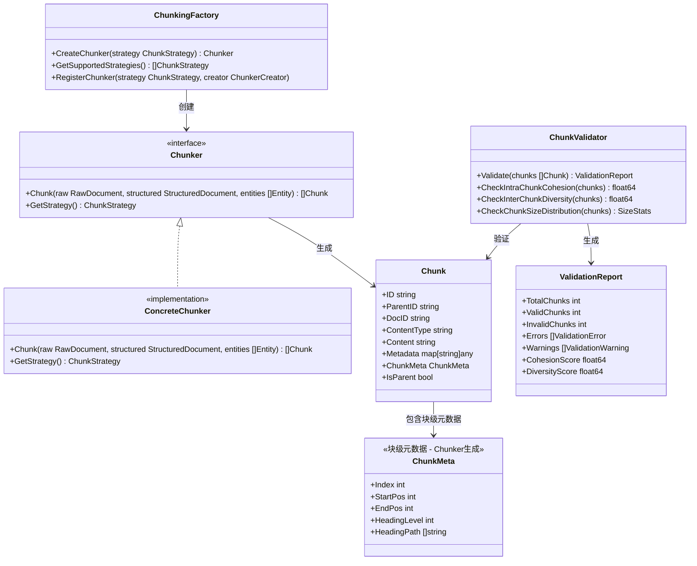
```mermaid
classDiagram
    class Chunker {
        <<interface>>
        +Chunk(raw RawDocument, structured StructuredDocument, entities []Entity) []Chunk
        +GetStrategy() ChunkStrategy
    }
    

    
    class Chunk {
        +ID string
        +ParentID string
        +DocID string
        +ContentType string
        +Content string
        +Metadata map[string]any
        +ChunkMeta ChunkMeta
        +IsParent bool
    }
    
    class ChunkMeta {
        <<块级元数据 - Chunker生成>>
        +Index int
        +StartPos int
        +EndPos int
        +HeadingLevel int
        +HeadingPath []string
    }
    
    class ConcreteChunker {
        <<implementation>>
        +Chunk(raw RawDocument, structured StructuredDocument, entities []Entity) []Chunk
        +GetStrategy() ChunkStrategy
    }

    
    class ChunkValidator {
        +Validate(chunks []Chunk) ValidationReport
        +CheckIntraChunkCohesion(chunks) float64
        +CheckInterChunkDiversity(chunks) float64
        +CheckChunkSizeDistribution(chunks) SizeStats
    }
    
    class ValidationReport {
        +TotalChunks int
        +ValidChunks int
        +InvalidChunks int
        +Errors []ValidationError
        +Warnings []ValidationWarning
        +CohesionScore float64
        +DiversityScore float64
    }
    
    class ChunkingFactory {
        +CreateChunker(strategy ChunkStrategy) Chunker
        +GetSupportedStrategies() []ChunkStrategy
        +RegisterChunker(strategy ChunkStrategy, creator ChunkerCreator)
    }
    
    Chunker <|.. ConcreteChunker
    Chunker --> Chunk : 生成
    Chunk --> ChunkMeta : 包含块级元数据
    ChunkValidator --> Chunk : 验证
    ChunkValidator --> ValidationReport : 生成
    ChunkingFactory --> Chunker : 创建
```

### 核心组件说明

#### 1. Chunker 接口

所有分块器的统一抽象接口，定义分块的核心方法。

| 方法          | 参数说明                                                      | 返回值        | 适用场景 |
| ------------- | ------------------------------------------------------------- | ------------- | -------- |
| `Chunk`       | raw: 原始文档<br>structured: 结构化文档<br>entities: 实体列表 | []Chunk       | 所有文档 |
| `GetStrategy` | -                                                             | ChunkStrategy | 策略识别 |

#### 2. Chunk 结构

表示分块后的文本片段，包含内容、从 Parser 传入的文档级元数据，以及 Chunker 生成的块级元数据。

| 字段          | 类型           | 说明             | 来源        |
| ------------- | -------------- | ---------------- | ----------- |
| `ID`          | string         | 块唯一标识       | Chunker生成 |
| `ParentID`    | string         | 父Chunk/父文档ID | Chunker生成 |
| `DocID`       | string         | 原始文档ID       | RawDocument |
| `ContentType` | string         | 内容类型         | Chunker生成 |
| `Content`     | string         | 块文本内容       | Chunker生成 |
| `Metadata`    | map[string]any | 扩展元数据       | RawDocument |
| `ChunkMeta`   | ChunkMeta      | 分块固定元数据   | Chunker生成 |

**数据流转说明**：

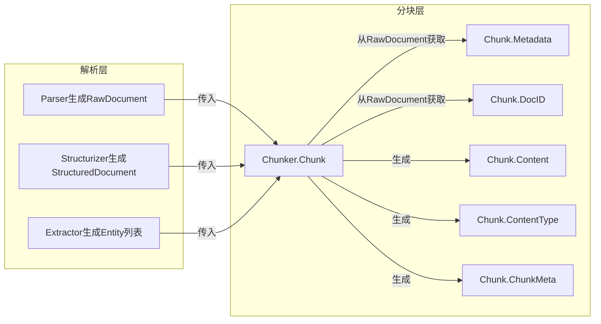
```mermaid
flowchart LR
    A[Parser生成RawDocument] -->|传入| D[Chunker.Chunk]
    B[Structurizer生成StructuredDocument] -->|传入| D
    C[Extractor生成Entity列表] -->|传入| D
    D -->|从RawDocument获取| E[Chunk.Metadata]
    D -->|从RawDocument获取| F[Chunk.DocID]
    D -->|生成| G[Chunk.Content]
    D -->|生成| H[Chunk.ContentType]
    D -->|生成| I[Chunk.ChunkMeta]
    
    subgraph 解析层
        A
        B
        C
    end
    
    subgraph 分块层
        D
        E
        F
        G
        H
        I
    end
```

**Metadata（map[string]any）- 来自 RawDocument**：

- **来源**：Parser 解析文档时提取的标准元数据和格式特定元数据，存储在 RawDocument.Metadata 中
- **传递方式**：通过 RawDocument 参数传入，Chunker 从 RawDocument.Metadata 中获取
- **标准字段**：`title`, `author`, `created_at`, `modified_at`, `source`, `content_type`, `page_count`, `language`
- **格式特定字段**：如 PDF 的 `pdf_version`, `producer`；Word 的 `word_version`, `table_count` 等
- **处理方式**：Chunker 将 RawDocument.Metadata 直接赋给 Chunk.Metadata，不做修改
- **用途**：全局过滤（如"只看2024年的文档"）、排序、访问控制、溯源

**ChunkMeta - 由 Chunker 生成**：

- **来源**：Chunker 在分块过程中根据文本结构和分块策略生成
- **内容**：描述块在文档中的位置和结构信息
- **特点**：每个块有独立的 ChunkMeta，反映分块后的结构信息
- **用途**：块定位、上下文恢复、相关性排序、结果展示

**两者关系**：

- `Metadata` 回答"这个块来自哪个文档"（文档固有属性，由 Parser 提供）
- `ChunkMeta` 回答"这个块在文档的什么位置"（分块衍生属性，由 Chunker 生成）
- 检索时通常先用 `Metadata` 过滤，再用 `ChunkMeta` 定位上下文

**ChunkMeta 字段详细说明**：

| 字段           | 类型     | 产生时机             | 计算逻辑                           | 用途                     |
| -------------- | -------- | -------------------- | ---------------------------------- | ------------------------ |
| `Index`        | int      | 创建块时             | 当前块在结果数组中的索引 (0-based) | 块排序、分页、相邻块查找 |
| `StartPos`     | int      | 提取内容时           | 内容在原文本中的起始字符索引       | 溯源定位、高亮显示       |
| `EndPos`       | int      | 提取内容时           | StartPos + len(Content)            | 溯源定位、范围确认       |
| `HeadingLevel` | int      | 识别标题时           | 根据标题标记计算 (H1=1, H2=2...)   | 层级过滤、大纲生成       |
| `HeadingPath`  | []string | 遍历文档时维护路径栈 | 遇到标题入栈，离开标题作用域出栈   | 上下文恢复、面包屑导航   |

**ChunkMeta 生成时序图**：

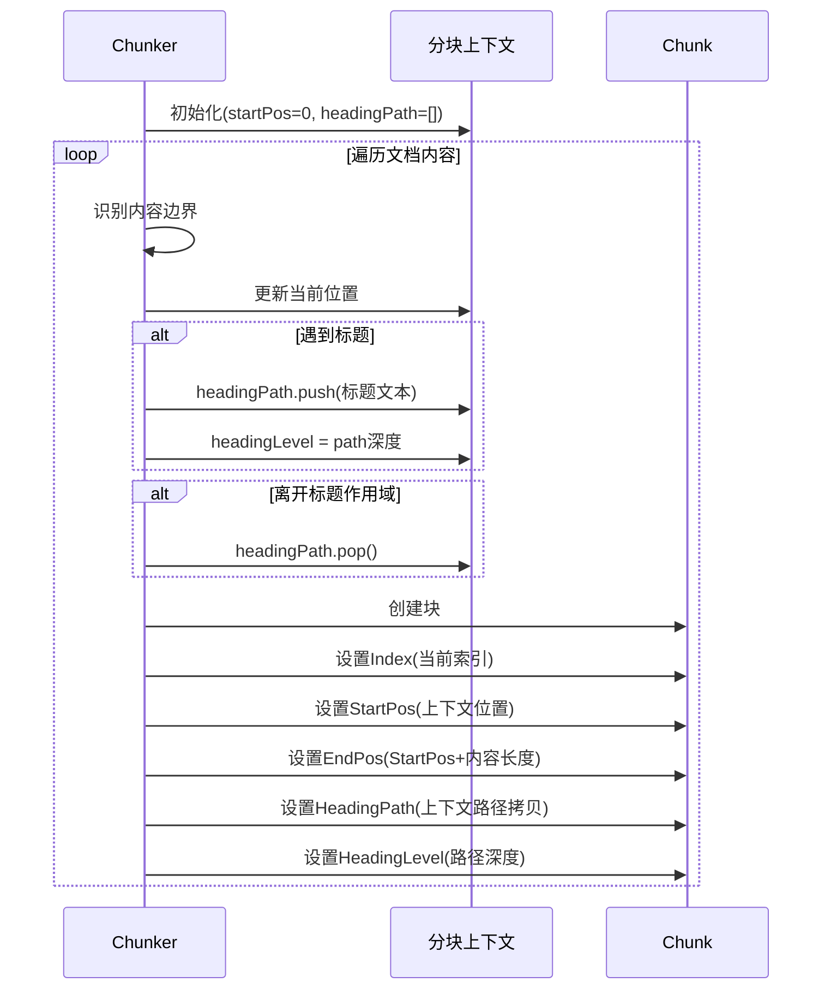
```mermaid
sequenceDiagram
    participant Chunker
    participant Context as 分块上下文
    participant Chunk
    
    Chunker->>Context: 初始化(startPos=0, headingPath=[])
    
    loop 遍历文档内容
        Chunker->>Chunker: 识别内容边界
        Chunker->>Context: 更新当前位置
        
        alt 遇到标题
            Chunker->>Context: headingPath.push(标题文本)
            Chunker->>Context: headingLevel = path深度
        end
        
        alt 离开标题作用域
            Chunker->>Context: headingPath.pop()
        end
        
        Chunker->>Chunk: 创建块
        Chunker->>Chunk: 设置Index(当前索引)
        Chunker->>Chunk: 设置StartPos(上下文位置)
        Chunker->>Chunk: 设置EndPos(StartPos+内容长度)
        Chunker->>Chunk: 设置HeadingPath(上下文路径拷贝)
        Chunker->>Chunk: 设置HeadingLevel(路径深度)
    end
    

```


---

## 分块策略详解


| 分块器               | 作用           | 适用场景   | 优缺点               |
| -------------------- | -------------- | ---------- | -------------------- |
| **FixedSizeChunker** | 固定大小切分   | 通用场景   | 简单但可能截断       |
| **SentenceChunker**  | 句子边界切分   | FAQ、对话  | 语义完整但大小不均   |
| **ParagraphChunker** | 段落边界切分   | 文章、报告 | 可读性强但大小差异大 |
| **RecursiveChunker** | 递归智能切分   | 复杂文档   | 智能但实现复杂       |
| **SemanticChunker**  | 语义相似度切分 | 高精度场景 | 质量高但成本高       |
| **CodeChunker**      | AST 语法树切分 | 代码检索   | 结构完整但需语言支持 |
| **ParentDocChunker** | 双层分块策略   | 上下文增强 | 精确+上下文但复杂    |

### 固定大小分块

**类名**:  FixedSizeChunker

**作用**：按固定字符数切分文本，实现简单、速度快。

**类结构**：

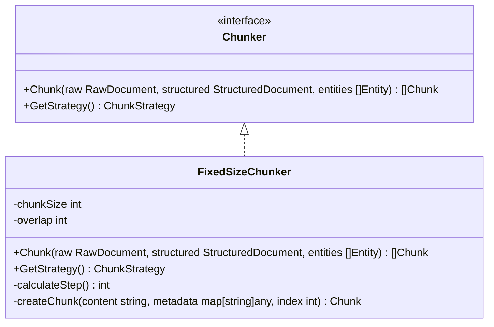
```mermaid
classDiagram
    class FixedSizeChunker {
        -chunkSize int
        -overlap int
        +Chunk(raw RawDocument, structured StructuredDocument, entities []Entity) []Chunk
        +GetStrategy() ChunkStrategy
        -calculateStep() int
        -createChunk(content string, metadata map[string]any, index int) Chunk
    }
    
    class Chunker {
        <<interface>>
        +Chunk(raw RawDocument, structured StructuredDocument, entities []Entity) []Chunk
        +GetStrategy() ChunkStrategy
    }
    
    Chunker <|.. FixedSizeChunker
```

**处理流程**：

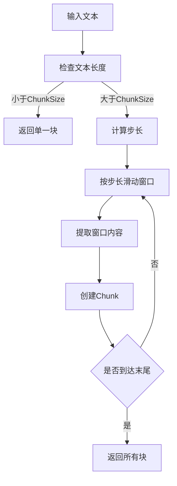
```mermaid
flowchart TD
    A[输入文本] --> B[检查文本长度]
    B -->|小于ChunkSize| C[返回单一块]
    B -->|大于ChunkSize| D[计算步长]
    D --> E[按步长滑动窗口]
    E --> F[提取窗口内容]
    F --> G[创建Chunk]
    G --> H{是否到达末尾}
    H -->|否| E
    H -->|是| I[返回所有块]
```

**特点**：

- **优点**：实现简单、速度快、块大小可预测
- **缺点**：可能在句子中间截断
- **适用**：通用场景、快速原型

**配置建议**：

| 场景       | ChunkSize | Overlap |
| ---------- | --------- | ------- |
| FAQ/客服   | 300-500   | 50-100  |
| 通用文档   | 800       | 100     |
| 长文本总结 | 1500      | 200     |

---

### 句子级分块

**类名**:  SentenceChunker

**作用**：按句子边界切分，保证每个块包含完整的句子。

**类结构**：

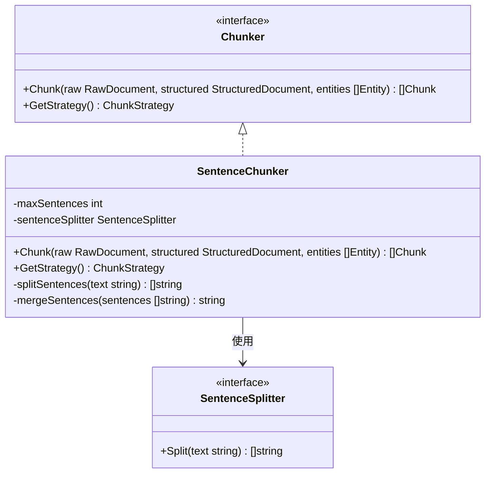
```mermaid
classDiagram
    class SentenceChunker {
        -maxSentences int
        -sentenceSplitter SentenceSplitter
        +Chunk(raw RawDocument, structured StructuredDocument, entities []Entity) []Chunk
        +GetStrategy() ChunkStrategy
        -splitSentences(text string) []string
        -mergeSentences(sentences []string) string
    }
    
    class SentenceSplitter {
        <<interface>>
        +Split(text string) []string
    }
    
    class Chunker {
        <<interface>>
        +Chunk(raw RawDocument, structured StructuredDocument, entities []Entity) []Chunk
        +GetStrategy() ChunkStrategy
    }
    
    Chunker <|.. SentenceChunker
    SentenceChunker --> SentenceSplitter : 使用
```

**处理流程**：

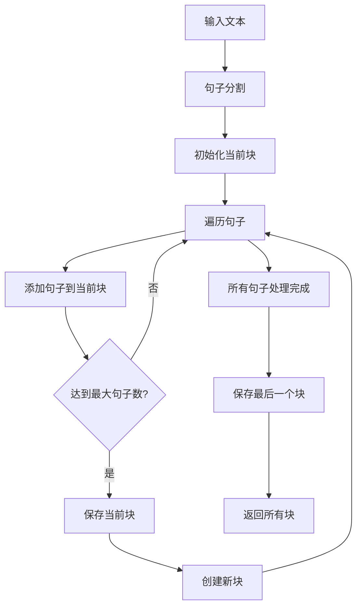
```mermaid
flowchart TD
    A[输入文本] --> B[句子分割]
    B --> C[初始化当前块]
    C --> D[遍历句子]
    D --> E[添加句子到当前块]
    E --> F{达到最大句子数?}
    F -->|否| D
    F -->|是| G[保存当前块]
    G --> H[创建新块]
    H --> D
    D --> I[所有句子处理完成]
    I --> J[保存最后一个块]
    J --> K[返回所有块]
```

**特点**：

- **优点**：句子完整、语义连贯
- **缺点**：块大小不均匀
- **适用**：FAQ、对话、问答场景

**配置建议**：

| 场景     | MaxSentences | OverlapSentences |
| -------- | ------------ | ---------------- |
| 短问答   | 3-5          | 1                |
| 长问答   | 8-12         | 2                |
| 对话记录 | 5-8          | 1-2              |

---

### 段落级分块

**类名**:  ParagraphChunker

**作用**：按段落边界切分，保持语义单元的完整性。

**类结构**：

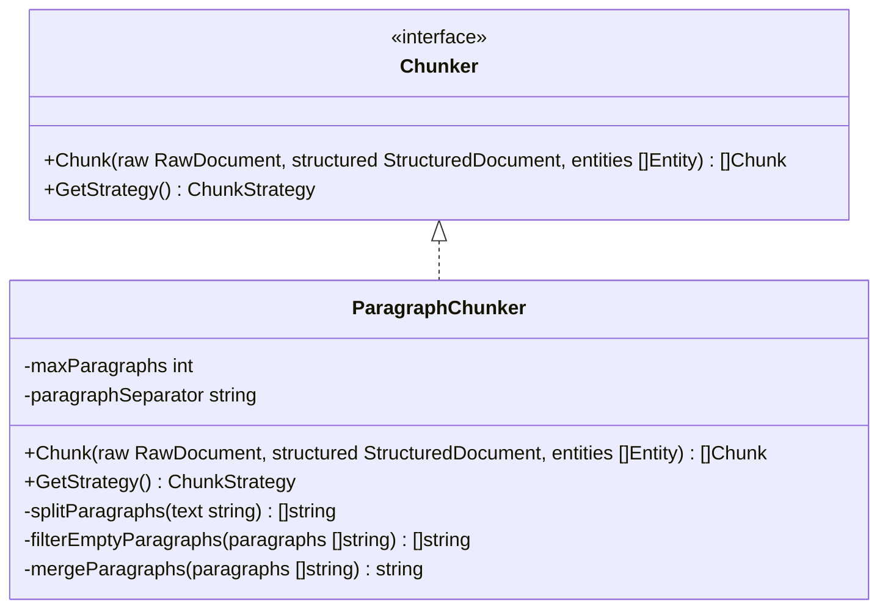
```mermaid
classDiagram
    class ParagraphChunker {
        -maxParagraphs int
        -paragraphSeparator string
        +Chunk(raw RawDocument, structured StructuredDocument, entities []Entity) []Chunk
        +GetStrategy() ChunkStrategy
        -splitParagraphs(text string) []string
        -filterEmptyParagraphs(paragraphs []string) []string
        -mergeParagraphs(paragraphs []string) string
    }
    
    class Chunker {
        <<interface>>
        +Chunk(raw RawDocument, structured StructuredDocument, entities []Entity) []Chunk
        +GetStrategy() ChunkStrategy
    }
    
    Chunker <|.. ParagraphChunker
```

**处理流程**：

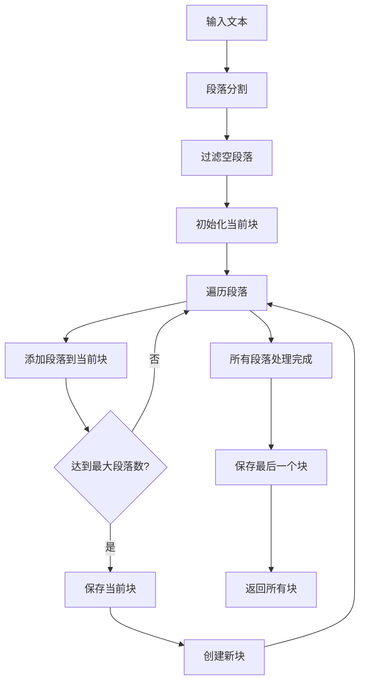
```mermaid
flowchart TD
    A[输入文本] --> B[段落分割]
    B --> C[过滤空段落]
    C --> D[初始化当前块]
    D --> E[遍历段落]
    E --> F[添加段落到当前块]
    F --> G{达到最大段落数?}
    G -->|否| E
    G -->|是| H[保存当前块]
    H --> I[创建新块]
    I --> E
    E --> J[所有段落处理完成]
    J --> K[保存最后一个块]
    K --> L[返回所有块]
```

**特点**：

- **优点**：语义完整、可读性强
- **缺点**：段落大小差异大
- **适用**：文章、报告、博客

**配置建议**：

| 场景 | MaxParagraphs | OverlapParagraphs |
| ---- | ------------- | ----------------- |
| 短文 | 2-3           | 0-1               |
| 报告 | 3-5           | 1                 |
| 书籍 | 5-8           | 1-2               |

---

### 递归分块

**类名**:  RecursiveChunker

**作用**：按优先级尝试不同级别的分割，智能选择最佳分割点。

**类结构**：

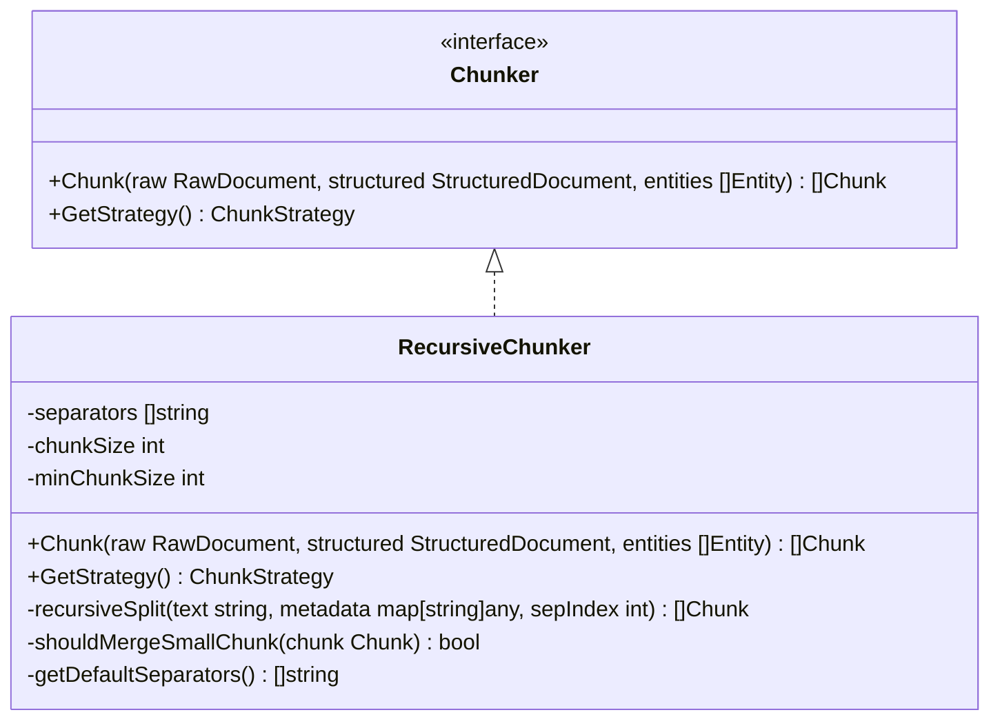
```mermaid
classDiagram
    class RecursiveChunker {
        -separators []string
        -chunkSize int
        -minChunkSize int
        +Chunk(raw RawDocument, structured StructuredDocument, entities []Entity) []Chunk
        +GetStrategy() ChunkStrategy
        -recursiveSplit(text string, metadata map[string]any, sepIndex int) []Chunk
        -shouldMergeSmallChunk(chunk Chunk) bool
        -getDefaultSeparators() []string
    }
    
    class Chunker {
        <<interface>>
        +Chunk(raw RawDocument, structured StructuredDocument, entities []Entity) []Chunk
        +GetStrategy() ChunkStrategy
    }
    
    Chunker <|.. RecursiveChunker
```

**分隔符优先级**：

```
1. \n\n\n  - 标题后双空行（章节边界）
2. \n\n      - 段落分隔
3. \n        - 换行
4. .         - 句子结束
5. ,         - 短语分隔
6. ""         - 字符（最后手段）
```

**处理流程**：

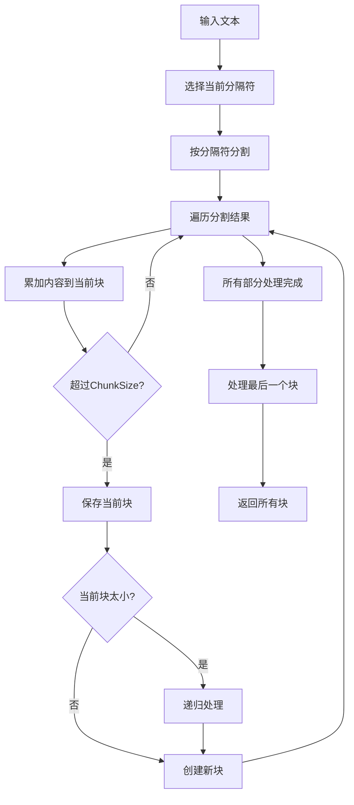
```mermaid
flowchart TD
    A[输入文本] --> B[选择当前分隔符]
    B --> C[按分隔符分割]
    C --> D[遍历分割结果]
    D --> E[累加内容到当前块]
    E --> F{超过ChunkSize?}
    F -->|否| D
    F -->|是| G[保存当前块]
    G --> H{当前块太小?}
    H -->|是| I[递归处理]
    H -->|否| J[创建新块]
    I --> J
    J --> D
    D --> K[所有部分处理完成]
    K --> L[处理最后一个块]
    L --> M[返回所有块]
```

**特点**：

- **优点**：智能选择分割点、块大小可控
- **缺点**：实现复杂
- **适用**：复杂文档、混合内容

---

### 语义分块

**类名**:  SemanticChunker

**作用**：基于语义相似度，在主题转换处切分。

**类结构**：

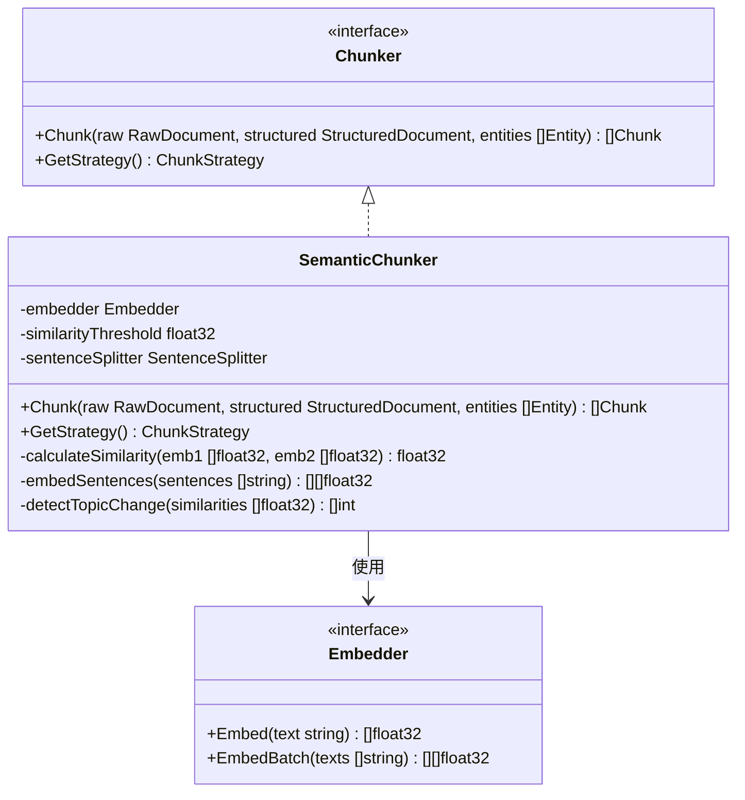
```mermaid
classDiagram
    class SemanticChunker {
        -embedder Embedder
        -similarityThreshold float32
        -sentenceSplitter SentenceSplitter
        +Chunk(raw RawDocument, structured StructuredDocument, entities []Entity) []Chunk
        +GetStrategy() ChunkStrategy
        -calculateSimilarity(emb1 []float32, emb2 []float32) float32
        -embedSentences(sentences []string) [][]float32
        -detectTopicChange(similarities []float32) []int
    }
    
    class Embedder {
        <<interface>>
        +Embed(text string) []float32
        +EmbedBatch(texts []string) [][]float32
    }
    
    class Chunker {
        <<interface>>
        +Chunk(raw RawDocument, structured StructuredDocument, entities []Entity) []Chunk
        +GetStrategy() ChunkStrategy
    }
    
    Chunker <|.. SemanticChunker
    SemanticChunker --> Embedder : 使用
```

**处理流程**：

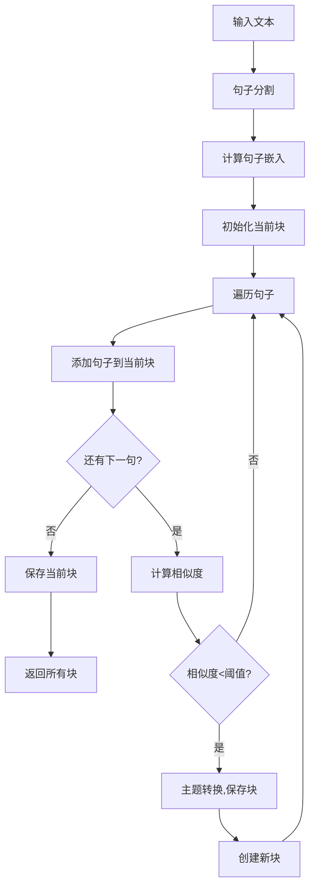
```mermaid
flowchart TD
    A[输入文本] --> B[句子分割]
    B --> C[计算句子嵌入]
    C --> D[初始化当前块]
    D --> E[遍历句子]
    E --> F[添加句子到当前块]
    F --> G{还有下一句?}
    G -->|否| H[保存当前块]
    G -->|是| I[计算相似度]
    I --> J{相似度<阈值?}
    J -->|否| E
    J -->|是| K[主题转换,保存块]
    K --> L[创建新块]
    L --> E
    H --> M[返回所有块]
```

**特点**：

- **优点**：块内语义高度一致
- **缺点**：需要调用嵌入模型、成本高
- **适用**：高精度场景、专业文档

**配置建议**：

| 场景     | SimilarityThreshold | 说明                   |
| -------- | ------------------- | ---------------------- |
| 严格分块 | 0.7-0.8             | 主题差异明显时切分     |
| 平衡分块 | 0.5-0.6             | 兼顾连贯性和一致性     |
| 宽松分块 | 0.3-0.4             | 允许更多内容在同一主题 |

---

### 代码分块

**类名**:  CodeChunker

**作用**：基于 AST 语法树，按函数、类边界切分代码。

**类结构**：

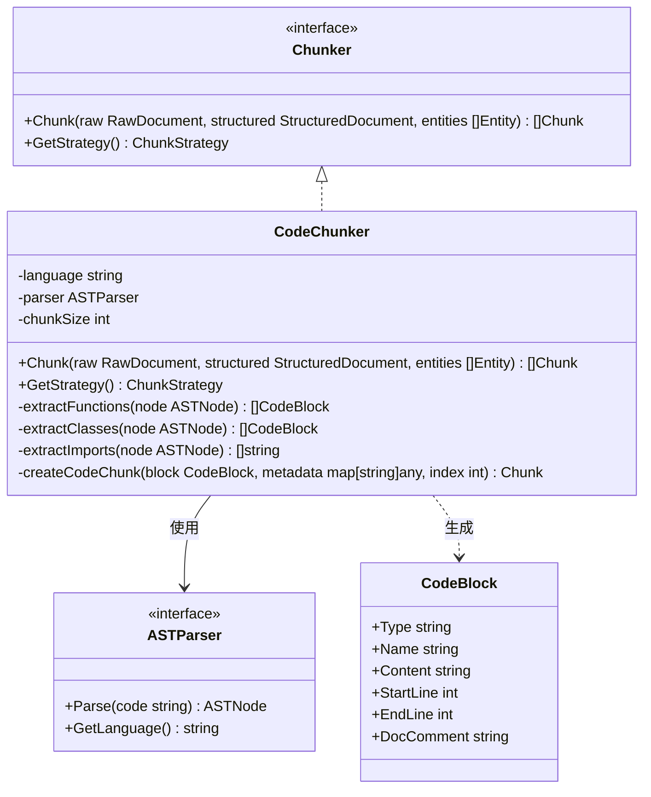
```mermaid
classDiagram
    class CodeChunker {
        -language string
        -parser ASTParser
        -chunkSize int
        +Chunk(raw RawDocument, structured StructuredDocument, entities []Entity) []Chunk
        +GetStrategy() ChunkStrategy
        -extractFunctions(node ASTNode) []CodeBlock
        -extractClasses(node ASTNode) []CodeBlock
        -extractImports(node ASTNode) []string
        -createCodeChunk(block CodeBlock, metadata map[string]any, index int) Chunk
    }
    
    class ASTParser {
        <<interface>>
        +Parse(code string) ASTNode
        +GetLanguage() string
    }
    
    class CodeBlock {
        +Type string
        +Name string
        +Content string
        +StartLine int
        +EndLine int
        +DocComment string
    }
    
    class Chunker {
        <<interface>>
        +Chunk(raw RawDocument, structured StructuredDocument, entities []Entity) []Chunk
        +GetStrategy() ChunkStrategy
    }
    
    Chunker <|.. CodeChunker
    CodeChunker --> ASTParser : 使用
    CodeChunker ..> CodeBlock : 生成
```

**处理流程**：

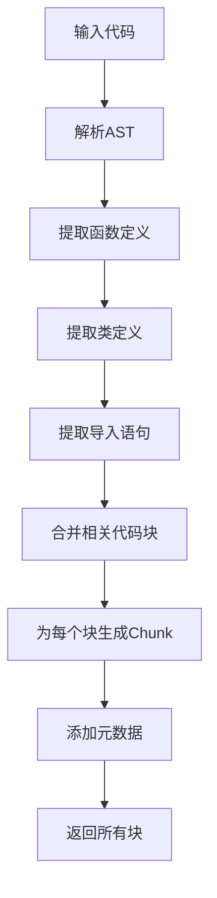
```mermaid
flowchart TD
    A[输入代码] --> B[解析AST]
    B --> C[提取函数定义]
    C --> D[提取类定义]
    D --> E[提取导入语句]
    E --> F[合并相关代码块]
    F --> G[为每个块生成Chunk]
    G --> H[添加元数据]
    H --> I[返回所有块]
```

**特点**：

- **优点**：保持代码结构完整、函数级检索
- **缺点**：需要语言特定的解析器
- **适用**：代码库、技术文档

**元数据字段**：

| 字段           | 说明     | 用途     |
| -------------- | -------- | -------- |
| `FunctionName` | 函数名   | 精确检索 |
| `ClassName`    | 类名     | 范围过滤 |
| `Parameters`   | 参数列表 | 签名匹配 |
| `ReturnType`   | 返回类型 | 类型过滤 |
| `DocComment`   | 文档注释 | 语义增强 |

---

## 分块验证器

**类名**:  ChunkValidator

**作用**：验证分块质量，评估分块效果。

**类结构**：

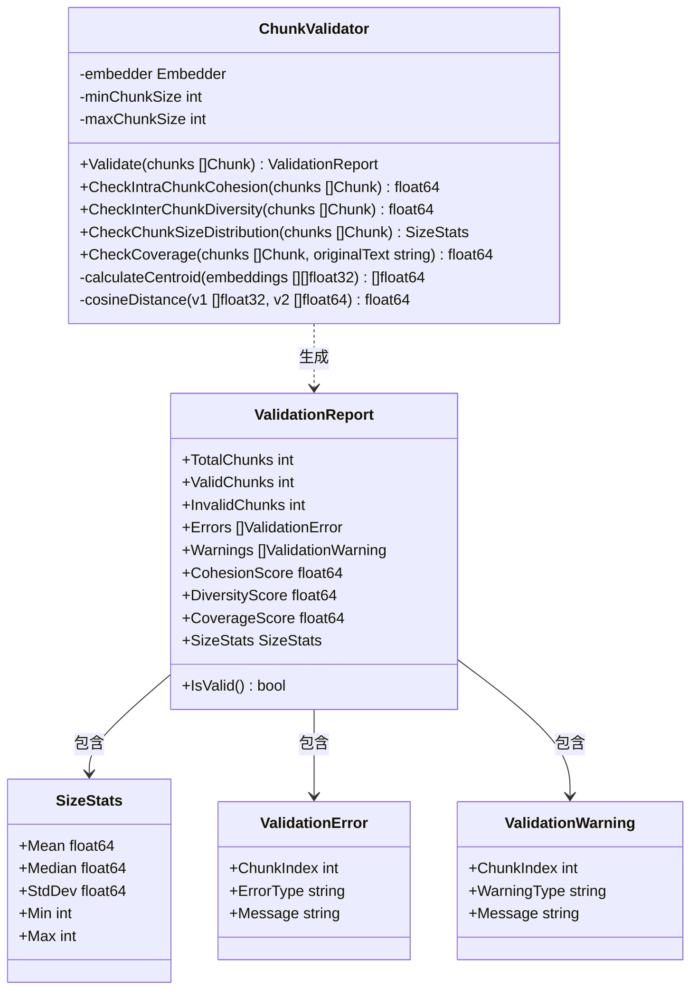
```mermaid
classDiagram
    class ChunkValidator {
        -embedder Embedder
        -minChunkSize int
        -maxChunkSize int
        +Validate(chunks []Chunk) ValidationReport
        +CheckIntraChunkCohesion(chunks []Chunk) float64
        +CheckInterChunkDiversity(chunks []Chunk) float64
        +CheckChunkSizeDistribution(chunks []Chunk) SizeStats
        +CheckCoverage(chunks []Chunk, originalText string) float64
        -calculateCentroid(embeddings [][]float32) []float64
        -cosineDistance(v1 []float32, v2 []float64) float64
    }
    
    class ValidationReport {
        +TotalChunks int
        +ValidChunks int
        +InvalidChunks int
        +Errors []ValidationError
        +Warnings []ValidationWarning
        +CohesionScore float64
        +DiversityScore float64
        +CoverageScore float64
        +SizeStats SizeStats
        +IsValid() bool
    }
    
    class SizeStats {
        +Mean float64
        +Median float64
        +StdDev float64
        +Min int
        +Max int
    }
    
    class ValidationError {
        +ChunkIndex int
        +ErrorType string
        +Message string
    }
    
    class ValidationWarning {
        +ChunkIndex int
        +WarningType string
        +Message string
    }
    
    ChunkValidator ..> ValidationReport : 生成
    ValidationReport --> SizeStats : 包含
    ValidationReport --> ValidationError : 包含
    ValidationReport --> ValidationWarning : 包含
```

### 验证指标

| 指标           | 说明             | 计算方法         |
| -------------- | ---------------- | ---------------- |
| **块内聚合度** | 块内语义一致性   | 嵌入向量方差     |
| **块间差异度** | 不同块之间的差异 | 平均余弦距离     |
| **大小分布**   | 块大小的统计分布 | 均值、方差、极值 |
| **覆盖率**     | 原文档内容保留率 | 字符覆盖率       |

### 验证流程

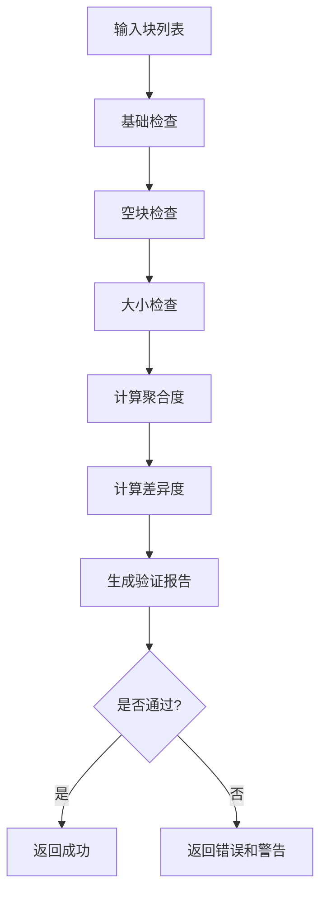
```mermaid
flowchart TD
    A[输入块列表] --> B[基础检查]
    B --> C[空块检查]
    C --> D[大小检查]
    D --> E[计算聚合度]
    E --> F[计算差异度]
    F --> G[生成验证报告]
    G --> H{是否通过?}
    H -->|是| I[返回成功]
    H -->|否| J[返回错误和警告]
```

---

## 分块工厂

**类名**:  ChunkingFactory

**作用**：根据策略类型创建对应的分块器实例。

**类结构**：

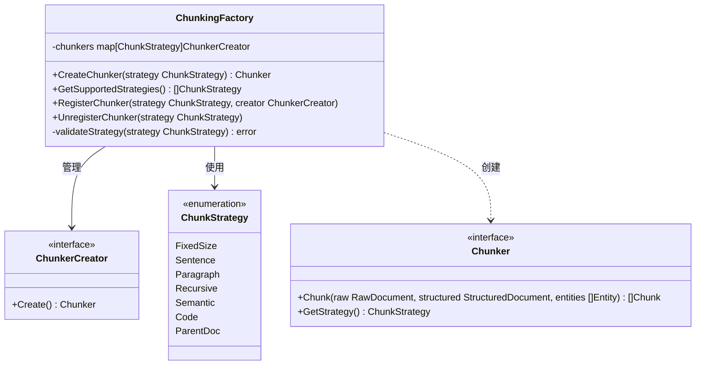
```mermaid
classDiagram
    class ChunkingFactory {
        -chunkers map[ChunkStrategy]ChunkerCreator
        +CreateChunker(strategy ChunkStrategy) Chunker
        +GetSupportedStrategies() []ChunkStrategy
        +RegisterChunker(strategy ChunkStrategy, creator ChunkerCreator) 
        +UnregisterChunker(strategy ChunkStrategy)
        -validateStrategy(strategy ChunkStrategy) error
    }
    
    class ChunkerCreator {
        <<interface>>
        +Create() Chunker
    }
    
    class ChunkStrategy {
        <<enumeration>>
        FixedSize
        Sentence
        Paragraph
        Recursive
        Semantic
        Code
        ParentDoc
    }
    
    class Chunker {
        <<interface>>
        +Chunk(raw RawDocument, structured StructuredDocument, entities []Entity) []Chunk
        +GetStrategy() ChunkStrategy
    }
    
    ChunkingFactory --> ChunkerCreator : 管理
    ChunkingFactory --> ChunkStrategy : 使用
    ChunkingFactory ..> Chunker : 创建
```

### 工厂方法

| 方法                     | 说明               |
| ------------------------ | ------------------ |
| `CreateChunker`          | 根据策略创建分块器 |
| `GetSupportedStrategies` | 获取支持的所有策略 |
| `RegisterChunker`        | 注册自定义分块器   |

### 使用示例

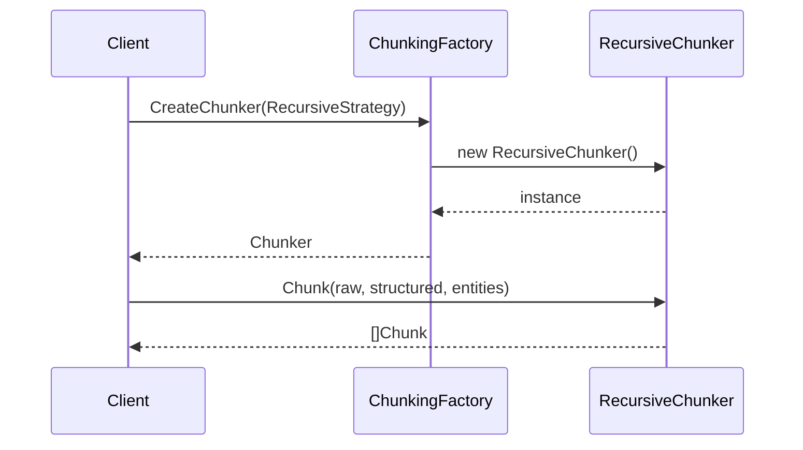
```mermaid
sequenceDiagram
    participant Client
    participant Factory as ChunkingFactory
    participant Chunker as RecursiveChunker
    
    Client->>Factory: CreateChunker(RecursiveStrategy)
    Factory->>Chunker: new RecursiveChunker()
    Chunker-->>Factory: instance
    Factory-->>Client: Chunker
    Client->>Chunker: Chunk(raw, structured, entities)
    Chunker-->>Client: []Chunk
```

---

## 分块策略选择机制

分块策略选择支持两种方式：**自动决策**（基于文档特征智能推荐）和**手动指定**（用户明确选择）。两种机制通过配置层解耦，允许灵活组合。

### 策略选择架构

```mermaid
classDiagram
    class ChunkingPipeline {
        -advisor ChunkingAdvisor
        -factory ChunkingFactory
        -formatStrategyMap map[string]ChunkStrategy
        +Chunk(raw RawDocument, structured StructuredDocument, entities []Entity, preferredStrategy) []Chunk
        -determineStrategy(metadata, preferred) ChunkStrategy
    }
    
    class ChunkingAdvisor {
        <<interface>>
        +RecommendStrategy(contentType, contentSample, metadata) ChunkStrategy
    }
    
    class ChunkingFactory {
        +CreateChunker(strategy) Chunker
        +RegisterDefaultChunker(contentType, strategy)
        +GetSupportedStrategies() []ChunkStrategy
    }
    
    class DefaultAdvisor {
        -rules []DecisionRule
        +RecommendStrategy(contentType, contentSample, metadata) ChunkStrategy
        -matchRules(metadata) ChunkStrategy
    }
    
    class DecisionRule {
        +Condition RuleCondition
        +Strategy ChunkStrategy
        +Priority int
    }
    
    ChunkingPipeline --> ChunkingAdvisor : 使用
    ChunkingPipeline --> ChunkingFactory : 使用
    ChunkingAdvisor <|.. DefaultAdvisor : 实现
    DefaultAdvisor --> DecisionRule : 包含
```

### 自动决策机制

**决策规则表**：

| 优先级 | 条件（Condition）                                                      | 推荐策略         | 说明                    |
| ------ | ---------------------------------------------------------------------- | ---------------- | ----------------------- |
| 1      | `content_type` 属于代码类型（text/x-go, text/x-python等）              | CodeChunker      | 代码需要AST解析保持结构 |
| 2      | `content_type == application/pdf` 且 `has_structured_headings == true` | RecursiveChunker | PDF有标题结构时递归分割 |
| 3      | `content_type == text/markdown`                                        | RecursiveChunker | Markdown天然有层级结构  |
| 4      | `avg_sentence_length < 50` 且 `content_type == text/plain`             | SentenceChunker  | 短句文本适合句子级分割  |
| 5      | `content_type` 属于结构化数据（application/json, text/csv）            | SemanticChunker  | 结构化数据按语义聚类    |
| 默认   | 其他所有情况                                                           | RecursiveChunker | 通用场景使用递归分块    |

**决策流程**：

```mermaid
flowchart TD
    A[开始选择策略] --> B{用户是否指定?}
    B -->|是| C[使用用户指定策略]
    B -->|否| D{格式映射表是否有匹配?}
    D -->|是| E[使用映射表策略]
    D -->|否| F[Advisor分析文档特征]
    F --> G{匹配决策规则}
    G -->|匹配成功| H[返回推荐策略]
    G -->|无匹配| I[返回默认策略]
    
    C --> J[执行分块]
    E --> J
    H --> J
    I --> J
```

### 手动指定机制

**用户显式选择**：

```mermaid
sequenceDiagram
    participant Client
    participant Pipeline as ChunkingPipeline
    participant Factory as ChunkingFactory
    participant Chunker as ConcreteChunker
    
    Client->>Pipeline: Chunk(raw, structured, entities, RecursiveStrategy)
    Pipeline->>Pipeline: preferredStrategy不为空
    Pipeline->>Factory: CreateChunker(RecursiveStrategy)
    Factory->>Chunker: 创建实例
    Chunker-->>Factory: instance
    Factory-->>Pipeline: Chunker
    Pipeline->>Chunker: Chunk(raw, structured, entities)
    Chunker-->>Pipeline: []Chunk
    Pipeline-->>Client: 返回结果
```

**格式-策略映射配置**：

| 文件格式（MIME Type）    | 默认策略         | 可覆盖 | 说明                    |
| ------------------------ | ---------------- | ------ | ----------------------- |
| text/x-go                | CodeChunker      | 是     | Go源代码                |
| text/x-python            | CodeChunker      | 是     | Python源代码            |
| text/x-java              | CodeChunker      | 是     | Java源代码              |
| text/x-typescript        | CodeChunker      | 是     | TypeScript源代码        |
| text/x-rust              | CodeChunker      | 是     | Rust源代码              |
| application/pdf          | RecursiveChunker | 是     | PDF文档                 |
| text/markdown            | RecursiveChunker | 是     | Markdown文档            |
| text/plain               | RecursiveChunker | 是     | 纯文本（通用默认）      |
| text/html                | ParagraphChunker | 是     | HTML网页                |
| application/json         | SemanticChunker  | 是     | JSON结构化数据          |
| text/csv                 | SemanticChunker  | 是     | CSV表格数据             |
| application/xml          | SemanticChunker  | 是     | XML结构化数据           |
| text/x-faq               | SentenceChunker  | 是     | FAQ问答对（自定义格式） |
| text/x-dialogue          | SentenceChunker  | 是     | 对话记录（自定义格式）  |
| application/octet-stream | FixedSizeChunker | 是     | 二进制转文本（无结构）  |
| text/x-context-required  | ParentDocChunker | 是     | 需要上下文增强的场景    |

**策略覆盖说明**：

| Chunker          | 映射方式 | 原因                                                 |
| ---------------- | -------- | ---------------------------------------------------- |
| FixedSizeChunker | 手动指定 | 通用分块器，无特定格式绑定，适合快速原型或无结构文本 |
| SentenceChunker  | 条件映射 | 需结合内容特征（句子长度）判断，非纯格式决定         |
| ParagraphChunker | 格式映射 | HTML等有明确段落标记的格式                           |
| RecursiveChunker | 格式映射 | 有层级结构的文档格式（PDF、Markdown）                |
| SemanticChunker  | 格式映射 | 结构化数据格式（JSON、CSV、XML）                     |
| CodeChunker      | 格式映射 | 代码文件有明确MIME类型                               |
| ParentDocChunker | 条件映射 | 需结合使用场景判断，适合需要上下文增强的场景         |

### 策略选择优先级

```mermaid
graph TD
    A[策略选择请求] --> B{Level 1<br/>用户显式指定}
    B -->|指定了| C[使用指定策略]
    B -->|未指定| D{Level 2<br/>格式映射表}
    D -->|有映射| E[使用映射策略]
    D -->|无映射| F{Level 3<br/>Advisor推荐}
    F -->|匹配规则| G[使用推荐策略]
    F -->|无匹配| H[使用默认策略]
    
    C --> I[执行分块]
    E --> I
    G --> I
    H --> I
```

**优先级说明**：

1. **Level 1 - 用户显式指定**：最高优先级，用户明确知道需要什么策略
2. **Level 2 - 格式映射表**：管理员预设的格式-策略映射，适合标准化场景
3. **Level 3 - Advisor推荐**：基于文档内容特征智能推荐，适合探索性场景
4. **默认策略**：当以上都未匹配时，使用RecursiveChunker作为安全默认

---

## 场景化分块策略

### 精准问答（FAQ/客服）

| 配置项 | 值              | 说明           |
| ------ | --------------- | -------------- |
| 分块器 | SentenceChunker | 保证句子完整   |
| 目标   | 精确匹配        | 问答对一一对应 |

### 长文本总结（研报/书籍）

| 配置项 | 值               | 说明           |
| ------ | ---------------- | -------------- |
| 分块器 | ParagraphChunker | 保持段落完整   |
| 目标   | 上下文丰富       | 支持长文本推理 |

### 代码检索

| 配置项 | 值          | 说明         |
| ------ | ----------- | ------------ |
| 分块器 | CodeChunker | AST 解析     |
| 目标   | 结构完整    | 精确到函数级 |

### 混合文档

| 配置项 | 值               | 说明               |
| ------ | ---------------- | ------------------ |
| 分块器 | RecursiveChunker | 智能分割           |
| 目标   | 自适应           | 自动选择最佳分割点 |

### 上下文增强（ParentDoc）

| 配置项   | 值               | 说明         |
| -------- | ---------------- | ------------ |
| 分块器   | ParentDocChunker | 双层分块     |
| 父块策略 | Recursive        | 段落级分块   |
| 子块策略 | Sentence         | 句子级分块   |
| 父块大小 | 1000-1500 字符   | 上下文丰富   |
| 子块大小 | 300-500 字符     | 精确匹配     |
| 目标     | 精确+上下文      | 结合两者优点 |

---

## ParentDoc 功能设计

ParentDoc 功能是一种双层分块策略，通过小分块（子块）查找其所属大分块（父块），结合了小分块的精确性和大分块的上下文丰富性。

### 核心概念

- **父块（Parent Chunk）**：较大的文本块，包含完整的上下文信息，通常为段落级别或更大
- **子块（Child Chunk）**：较小的文本块，粒度更细，通常为句子级别或更小
- **层级关系**：每个子块关联到一个父块，通过 `ParentID` 字段建立引用

### 为什么需要 ParentDoc？

| 问题               | 传统分块                           | ParentDoc 解决方案                       |
| ------------------ | ---------------------------------- | ---------------------------------------- |
| 小分块缺乏上下文   | 要么放弃上下文，要么增大块大小     | 小分块保留精确性，同时通过父块获取上下文 |
| 大分块精度不足     | 检索返回大块，需要手动定位相关内容 | 先检索小分块，再通过父块获取完整上下文   |
| 向量数据库存储冗余 | 大分块包含大量无关信息             | 只存储小分块，父块按需加载               |

### 架构设计

```mermaid
classDiagram
    class ParentDocChunker {
        -parentChunker Chunker
        -childChunker Chunker
        +Chunk(raw RawDocument, structured StructuredDocument, entities []Entity) []Chunk
        +GetStrategy() ChunkStrategy
        -createParentChildRelationship(parents []Chunk, children []Chunk) []Chunk
        -findParentForChild(child Chunk, parents []Chunk) string
    }
    
    class ParentDocOptions {
        +ParentStrategy ChunkStrategy
        +ChildStrategy ChunkStrategy
        +MaxParentSize int
        +MaxChildSize int
    }
    
    class Chunker {
        <<interface>>
        +Chunk(raw RawDocument, structured StructuredDocument, entities []Entity) []Chunk
        +GetStrategy() ChunkStrategy
    }
    
    class Chunk {
        +ID string
        +ParentID string
        +DocID string
        +ContentType string
        +Content string
        +Metadata map[string]any
        +ChunkMeta ChunkMeta
    }
    
    ParentDocChunker --> Chunker : 使用
    ParentDocChunker --> ParentDocOptions : 配置
    Chunker --> Chunk : 生成
```

### 处理流程

```mermaid
flowchart TD
    A[输入文本] --> B[生成父块<br/>ParentChunker]
    A --> C[生成子块<br/>ChildChunker]
    B --> D[保存父块列表]
    C --> E[遍历子块]
    D --> F[为每个子块查找父块]
    E --> F
    F --> G[建立父子关系<br/>设置ParentID]
    G --> H[返回所有块]
    
    style B fill:#e3f2fd
    style C fill:#e8f5e9
    style F fill:#fff3e0
```

### 父子关系建立算法

1. **位置匹配**：根据子块的 `StartPos` 和 `EndPos`，找到包含该范围的最小父块
2. **层级匹配**：如果多个父块包含子块，选择最内层（层级最深）的父块
3. **标题路径匹配**：利用 `HeadingPath` 确保子块与父块在同一逻辑章节内

```mermaid
flowchart TD
    A[子块位置] --> B{是否在父块范围内?}
    B -->|否| C[无父块]
    B -->|是| D[收集所有包含的父块]
    D --> E{只有一个父块?}
    E -->|是| F[直接关联]
    E -->|否| G[选择最小的父块]
    G --> H[检查标题路径]
    H --> I[关联最合适的父块]
    
    C --> J[设置ParentID为空]
    F --> K[设置ParentID为父块ID]
    I --> K
    J --> L[返回结果]
    K --> L
```

### 检索流程

```mermaid
sequenceDiagram
    participant Client
    participant Retriever
    participant DB as 向量数据库
    participant ParentStore as 父块存储
    
    Client->>Retriever: 检索查询
    Retriever->>DB: 搜索相关子块
    DB-->>Retriever: 返回子块列表
    
    loop 处理每个子块
        Retriever->>Retriever: 提取ParentID
        Retriever->>ParentStore: 加载父块(ParentID)
        ParentStore-->>Retriever: 返回父块
        Retriever->>Retriever: 合并子块+父块上下文
    end
    
    Retriever-->>Client: 返回增强结果
```

### 配置参数

| 参数             | 类型          | 说明         | 默认值    |
| ---------------- | ------------- | ------------ | --------- |
| `ParentStrategy` | ChunkStrategy | 父块分块策略 | Recursive |
| `ChildStrategy`  | ChunkStrategy | 子块分块策略 | Sentence  |
| `MaxParentSize`  | int           | 父块最大大小 | 2000      |
| `MaxChildSize`   | int           | 子块最大大小 | 500       |

### 应用场景

#### 精准问答 + 上下文增强

1. **检索阶段**：使用子块（句子级）进行精确匹配
2. **上下文增强**：找到子块对应的父块（段落级），获取完整上下文
3. **结果呈现**：向 LLM 提供子块（精确答案）+ 父块（完整背景）

#### 代码检索 + 函数上下文

1. **检索阶段**：使用子块（代码片段）进行精确匹配
2. **上下文增强**：找到子块对应的父块（完整函数/类）
3. **结果呈现**：向用户展示代码片段 + 完整函数定义

### 实现建议

1. **父块存储**：可以将父块存储在单独的索引中，或与子块存储在同一索引但标记 `IsParent=true`
2. **父子映射**：建立子块 ID 到父块 ID 的映射表，加速查询
3. **缓存机制**：缓存最近访问的父块，减少重复加载
4. **批量处理**：批量查询父块，减少数据库往返

---

---

选择分块策略需要根据具体场景权衡，没有万能的最佳方案。建议通过 ChunkValidator 评估不同策略的效果，选择最适合当前场景的分块器。
