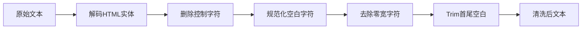
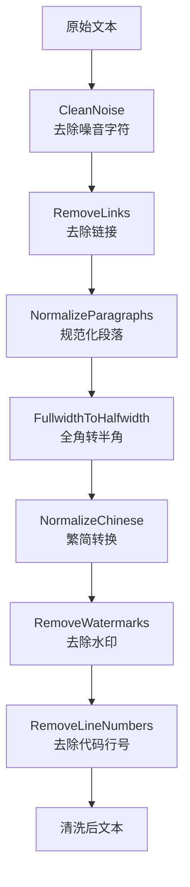

# 数据清洗

数据清洗是 RAG 系统预处理的关键环节，负责对解析后的纯文本进行去噪、标准化、格式转换等处理，确保后续分块和向量化的质量。

> 数据清洗 = 把"脏乱差"的文本变成"干净整洁"的结构化文本

## 数据清洗在 RAG 中的位置

```mermaid
flowchart LR
    A[原始文档] --> B[文档解析]
    B --> C[StructureNode]
    C --> D[StructureNode.Clean()]
    D --> E[清洗后StructureNode]
    E --> F[分块处理]
    F --> G[向量化]

    style D fill:#fff3e0
    style E fill:#e8f5e9
```

---

## 为什么需要数据清洗？

### 原始文本的常见问题

| 问题类型          | 示例                             | 对 RAG 的影响  |
| ----------------- | -------------------------------- | -------------- |
| **HTML 残留**     | `&nbsp;`, `<br>`, `&amp;`        | 噪音字符干扰   |
| **特殊符号**      | 多余空格、制表符、换行符         | 分块边界错误   |
| **大小写混乱**    | Title / TITLE / title            | 关键词匹配问题 |
| **超链接残留**    | `[点击这里](http://example.com)` | 干扰理解       |
| **代码片段**      | 行号、缩进混乱                   | 语义混淆       |
| **水印/页眉页脚** | "机密文件"、页码                 | 引入无关信息   |
| **语言混杂**      | 中英混杂、表情符号               | 向量化效果下降 |

### 数据清洗的价值

```
清洗前："在这个炎热的夏天   ，我们去游泳。\n\n\n\n\n      "
清洗后："在这个炎热的夏天，我们去游泳。"
```

---

## 清洗函数

所有清洗方法都是 `func(text string) string` 的纯函数，输入文本，输出清洗后的文本。这些函数可以直接集成到 `StructureNode.Clean()` 方法中。

### 1. CleanNoise - 去除噪音字符

**作用**：去除 HTML 实体、控制字符、特殊空白等噪音。

| 类型      | 示例                                     | 处理方式       |
| --------- | ---------------------------------------- | -------------- |
| HTML 实体 | `&nbsp;`, `&lt;`, `&gt;`, `&amp;`        | 解码为对应字符 |
| 控制字符  | `\x00`, `\x08`, `\x1f`                   | 直接删除       |
| 特殊空白  | `\u200b` (零宽空格), `\xa0` (不换行空格) | 替换为普通空格 |
| 多余空白  | 连续空格、Tab                            | 合并为单个空格 |

**处理流程**：



### 2. RemoveLinks - 去除链接

**作用**：去除 Markdown 链接、HTML 链接、裸露 URL。

| 类型          | 输入示例                              | 输出结果 |
| ------------- | ------------------------------------- | -------- |
| Markdown 链接 | `[点击这里](http://example.com)`      | 点击这里 |
| Markdown 图片 | `` | (删除)   |
| HTML 链接     | `<a href="...">文本</a>`              | 文本     |
| 裸露 URL      | `http://example.com`                  | (删除)   |

### 3. NormalizeParagraphs - 规范化段落

**作用**：规范化段落分隔，去除多余换行。

| 操作             | 输入示例             | 输出结果         |
| ---------------- | -------------------- | ---------------- |
| 合并多余换行     | `段落1\n\n\n\n段落2` | `段落1\n\n段落2` |
| 去除行首行尾空格 | `  文本内容  `       | `文本内容`       |
| 规范化缩进       | `\t\t缩进内容`       | `缩进内容`       |

### 4. FullwidthToHalfwidth - 全角半角转换

**作用**：将全角字符转换为半角字符。

| 字符类型 | 全角范围                  | 半角结果            |
| -------- | ------------------------- | ------------------- |
| 字母数字 | `Ａ-Ｚ`, `ａ-ｚ`, `０-９` | `A-Z`, `a-z`, `0-9` |
| 标点符号 | `！`, `？`, `：`          | `!`, `?`, `:`       |
| 空格     | `　` (全角空格)           | ` ` (半角空格)      |

### 5. NormalizeChinese - 繁简转换

**作用**：将繁体中文转换为简体中文。

| 繁体 | 简体 |
| ---- | ---- |
| 系統 | 系统 |
| 資料 | 资料 |
| 處理 | 处理 |

### 6. RemoveWatermarks - 去除水印

**作用**：去除文档中的水印文字。

**常见水印关键词**：

- 中文：机密、内部文件、版权所有、未经授权
- 英文：CONFIDENTIAL、INTERNAL、COPYRIGHT、UNAUTHORIZED

### 7. RemoveLineNumbers - 去除代码行号

**作用**：去除代码片段中的行号。

**处理示例**：

```
输入：
    1  package main
    2  
    3  func main() {
    4      println("hello")
    5  }

输出：
package main

func main() {
    println("hello")
}
```

### 8. DesensitizePII - 隐私脱敏（可选）

**作用**：识别并脱敏敏感信息。

| 信息类型 | 正则模式               | 脱敏方式             |
| -------- | ---------------------- | -------------------- |
| 手机号   | `1[3-9]\d{9}`          | `138****1234`        |
| 身份证号 | `\d{17}[\dXx]`         | `310***********1234` |
| 银行卡号 | `\d{16,19}`            | `6222****1234`       |
| API 密钥 | `[A-Za-z0-9]{32,}`     | `sk-****xxxx`        |
| 邮箱     | `[\w.-]+@[\w.-]+\.\w+` | `a***@example.com`   |

---

## 默认清洗流程

`StructureNode.Clean()` 方法按以下顺序依次调用各清洗函数：



**执行顺序说明**：

1. **CleanNoise 优先**：先处理底层字符问题，避免后续步骤受干扰
2. **RemoveLinks 次之**：去除链接结构，保留文本内容
3. **NormalizeParagraphs**：规范化段落结构，为分块做准备
4. **字符转换类**：全角半角、繁简转换
5. **内容过滤类**：水印、行号等特定内容去除

---

## StructureNode.Clean() 实现

在 `parsing.md` 中，`StructureNode` 结构体应添加 `Clean()` 方法，用于清洗自身的 `Text` 和 `Title` 字段：

```go
// StructureNode 文档结构节点，对应文档中的标题、段落、列表、表格等单元
type StructureNode struct {
    NodeType  string          `json:"nodeType"`  // 节点类型（heading/paragraph/table/list 等）
    Title     string          `json:"title"`     // 节点标题（仅 heading 类型有效）
    Level     int             `json:"level"`     // 标题层级（仅 heading 类型有效，H1=1、H2=2...）
    Text      string          `json:"text"`      // 清洗后的纯文本内容（核心，无任何格式垃圾）
    StartPos  int             `json:"startPos"`  // 文本在原始清洗后内容中的起始位置（用于分块定位）
    EndPos    int             `json:"endPos"`    // 文本在原始清洗后内容中的结束位置（用于分块定位）
    Children  []*StructureNode `json:"children"` // 子节点（如 H1 下的 H2、段落下的列表）
}

// Clean 清洗当前节点的 Text 和 Title 字段，并递归清洗所有子节点
func (n *StructureNode) Clean() {
    // 清洗 Title 字段（仅对 heading 类型有效）
    if n.NodeType == "heading" && n.Title != "" {
        n.Title = CleanText(n.Title)
    }
    
    // 清洗 Text 字段
    if n.Text != "" {
        n.Text = CleanText(n.Text)
    }
    
    // 递归清洗子节点
    for _, child := range n.Children {
        child.Clean()
    }
}

// CleanText 按默认顺序应用所有清洗函数
func CleanText(text string) string {
    text = CleanNoise(text)
    text = RemoveLinks(text)
    text = NormalizeParagraphs(text)
    text = FullwidthToHalfwidth(text)
    text = NormalizeChinese(text)
    text = RemoveWatermarks(text)
    text = RemoveLineNumbers(text)
    return text
}
```

---

## 集成说明

### 与 Structurizer 的集成

在 `Structurizer` 接口的 `Structure` 方法中，当解析生成 `StructuredDocument` 后，应调用根节点的 `Clean()` 方法进行整体清洗：

```go
// Structure 接收原始文档，先清洗再结构化，输出结构化文档
func (s *ConcreteStructurizer) Structure(raw *RawDocument) (*StructuredDocument, error) {
    // 解析原始文档生成 StructuredDocument
    structured, err := s.parse(raw)
    if err != nil {
        return nil, err
    }
    
    // 调用根节点的 Clean() 方法进行整体清洗
    if structured.Root != nil {
        structured.Root.Clean()
    }
    
    return structured, nil
}
```

### 优势

1. **统一清洗**：所有 `StructureNode` 实例都通过相同的 `Clean()` 方法进行清洗，确保清洗逻辑一致性
2. **递归处理**：自动递归清洗所有子节点，无需手动遍历
3. **简单集成**：只需在 `Structurizer` 中调用一次 `Root.Clean()`，即可完成整个文档的清洗
4. **可扩展性**：如需添加新的清洗函数，只需修改 `CleanText` 函数即可
5. **无额外依赖**：清洗函数均为纯函数，无外部依赖

---

## 总结

| 清洗函数                 | 作用             | 必要性 |
| ------------------------ | ---------------- | ------ |
| **CleanNoise**           | 去除噪音字符     | 必须   |
| **RemoveLinks**          | 去除链接保留文本 | 必须   |
| **NormalizeParagraphs**  | 规范化段落结构   | 必须   |
| **FullwidthToHalfwidth** | 全角转半角       | 推荐   |
| **NormalizeChinese**     | 繁简转换         | 按需   |
| **RemoveWatermarks**     | 去除水印         | 按需   |
| **RemoveLineNumbers**    | 去除代码行号     | 按需   |
| **DesensitizePII**       | 隐私脱敏         | 可选   |

数据清洗是确定性的操作，按固定顺序依次调用各清洗函数即可，无需策略选择。通过在 `StructureNode` 中集成 `Clean()` 方法，实现了清洗逻辑与数据结构的紧密结合，使整个清洗过程更加简洁和高效。
