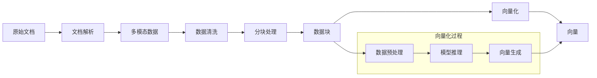
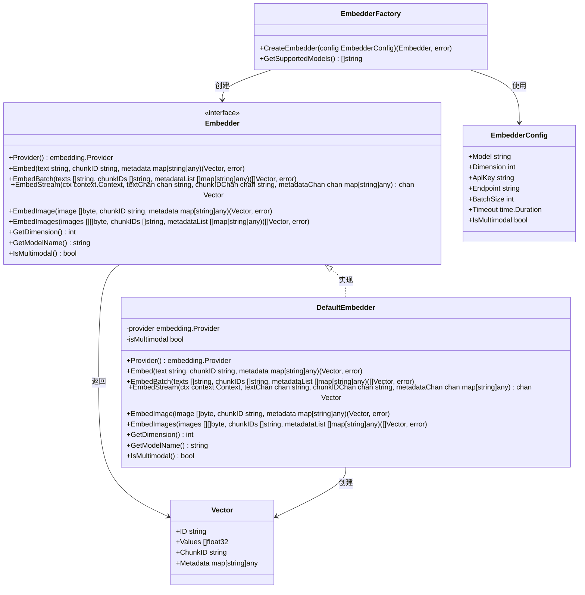
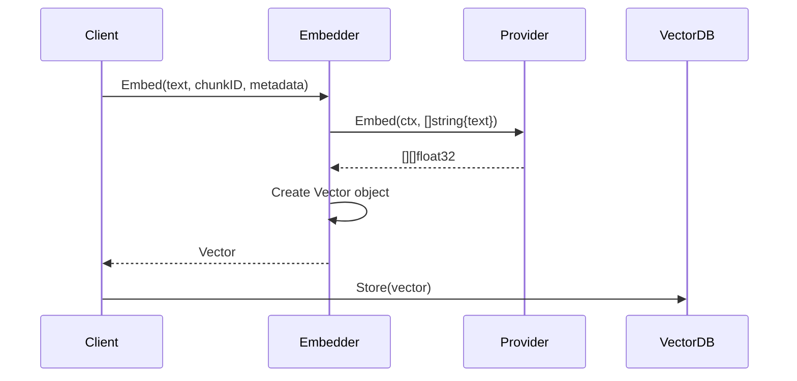
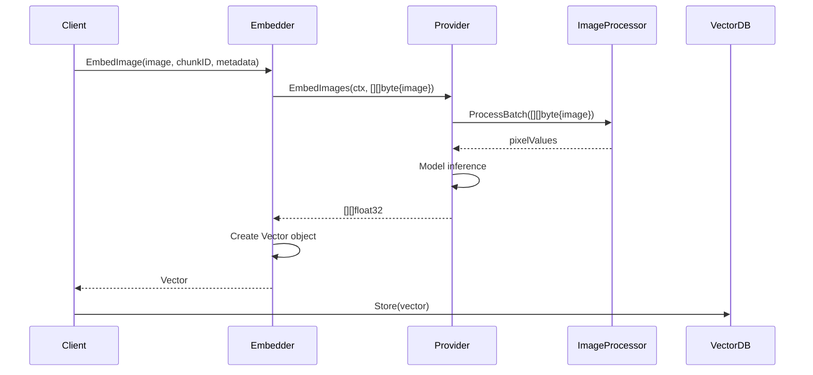
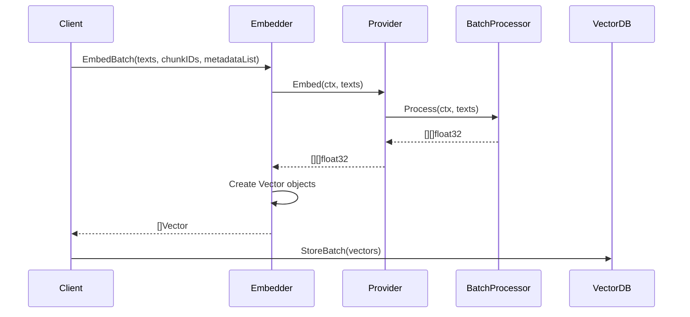
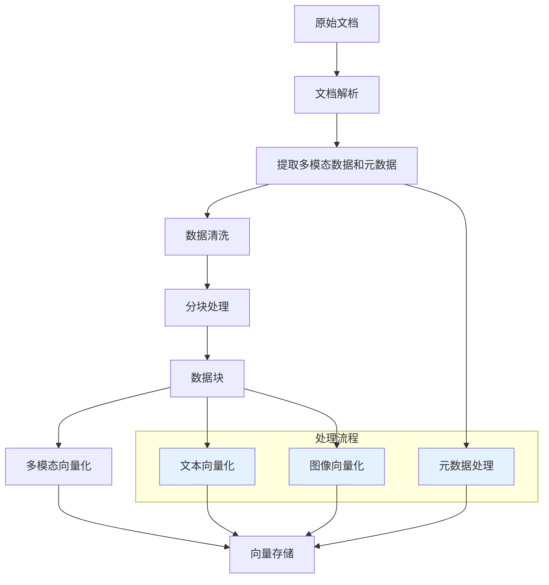

# 向量索引

向量化是将文本、图像等数据转换为稠密向量的过程，是 RAG 系统实现语义检索的核心技术。

> 向量化 = 把数据转换成"语义坐标"，语义相近的内容在向量空间中距离也相近

---

## 向量化在 RAG 索引中的位置

向量化是 RAG 索引流水线的关键环节，连接分块处理和向量存储：

**向量化的作用**：

1. **语义理解**：将数据的语义信息编码为向量
2. **相似性计算**：通过向量距离衡量数据相似度
3. **高效检索**：在向量空间中快速找到相似内容
4. **多模态融合**：为不同类型的内容提供统一的向量表示

---

## 多模态向量化集成设计

### 1. 集成目标

本项目将直接调用 `github.com/DotNetAge/gochat` 提供的embedding能力，实现多模态向量化功能。

### 2. gochat 包分析

#### 2.1 核心接口

| 接口                 | 说明             | 支持的模态  |
| -------------------- | ---------------- | ----------- |
| `Provider`           | 基础向量化接口   | 文本        |
| `MultimodalProvider` | 多模态向量化接口 | 文本 + 图像 |

#### 2.2 关键实现

| 实现类                 | 说明                   | 支持的模态  |
| ---------------------- | ---------------------- | ----------- |
| `LocalProvider`        | 本地文本向量化         | 文本        |
| `CLIPProvider`         | CLIP 模型实现          | 文本 + 图像 |
| `BGEProvider`          | BGE 模型实现           | 文本        |
| `SentenceBERTProvider` | Sentence-BERT 模型实现 | 文本        |

#### 2.3 支持的数据类型

- **文本**：字符串数组
- **图像**：字节数组（支持 JPEG、PNG 格式）

---

## `embedding` 包结构

### UML 类图

### 核心组件说明

| 组件                | 职责                     | 实现方式                       |
| ------------------- | ------------------------ | ------------------------------ |
| **Embedder**        | 向量化接口，定义核心方法 | 接口抽象（支持多模态）         |
| **DefaultEmbedder** | 默认实现                 | 内置 gochat 包的 Provider 接口 |
| **EmbedderFactory** | 工厂类，创建向量化实例   | 依赖注入                       |
| **EmbedderConfig**  | 向量化配置               | 配置结构体（支持多模态配置）   |
| **Vector**          | 向量对象                 | 包含向量值、chunk ID 和元数据  |

**注意**：`Embedder` 中的 `Provider` 是 gochat 包提供的接口，用于实现文本向量化。 gochat 提供以下实现类：

- `embedding.SentenceBERTProvider` ：Sentence-BERT 模型实现
- `embedding.BGEProvider`          ：BGE 模型实现
- `embedding.CLIPProvider`         ：CLIP 模型实现

---

## 多模态向量化流程

### 1. 文本向量化流程

### 2. 图像向量化流程

### 3. 批量处理流程

---

## 多模态数据预处理与后处理

### 1. 文本预处理

| 步骤   | 说明                | 实现方式                  |
| ------ | ------------------- | ------------------------- |
| 分词   | 将文本分割为 tokens | gochat.Tokenizer          |
| 截断   | 限制 token 数量     | gochat.Tokenizer.Truncate |
| 批处理 | 批量处理文本        | gochat.BatchProcessor     |

### 2. 图像预处理

| 步骤     | 说明         | 实现方式              |
| -------- | ------------ | --------------------- |
| 解码     | 解码图像字节 | gochat.ImageProcessor |
| 调整大小 | 调整图像尺寸 | gochat.ImageProcessor |
| 裁剪     | 中心裁剪     | gochat.ImageProcessor |
| 归一化   | 归一化像素值 | gochat.ImageProcessor |

### 3. 后处理

| 步骤       | 说明              | 实现方式       |
| ---------- | ----------------- | -------------- |
| 类型转换   | float32 → float32 | 直接使用       |
| 向量存储   | 存储到向量数据库  | 向量数据库接口 |
| 元数据处理 | 存储元数据        | 直接存储原始值 |

---

## 向量化配置

### 配置选项

| 参数           | 类型          | 说明                 | 默认值              |
| -------------- | ------------- | -------------------- | ------------------- |
| `Model`        | string        | 模型名称             | "bge-small-en-v1.5" |
| `Dimension`    | int           | 向量维度             | 384                 |
| `ApiKey`       | string        | API 密钥（远程模型） | ""                  |
| `Endpoint`     | string        | API 端点（远程模型） | ""                  |
| `BatchSize`    | int           | 批量处理大小         | 32                  |
| `Timeout`      | time.Duration | 请求超时             | 30s                 |
| `MaxTokens`    | int           | 最大 token 数        | 512                 |
| `IsMultimodal` | bool          | 是否启用多模态       | false               |

### 内置模型

| 模型                       | 类型 | 维度 | 特点            | 适用场景  | 多模态支持 |
| -------------------------- | ---- | ---- | --------------- | --------- | ---------- |
| **bge-small-en-v1.5**      | 本地 | 384  | 轻量、快速      | 实时处理  | 否         |
| **bge-base-en-v1.5**       | 本地 | 768  | 平衡精度与速度  | 通用场景  | 否         |
| **bge-large-en-v1.5**      | 本地 | 1024 | 高精度          | 重要文档  | 否         |
| **clip-vit-b-32**          | 本地 | 512  | 多模态支持      | 图像+文本 | 是         |
| **text-embedding-3-small** | 远程 | 1536 | OpenAI 最新模型 | 通用场景  | 否         |
| **text-embedding-3-large** | 远程 | 3072 | 高精度          | 复杂语义  | 否         |

---

## 性能优化

### 1. 批量处理
- 批量向量化比单条向量化更高效
- 合理设置 `BatchSize` 参数
- 支持并行处理多个批次

### 2. 缓存策略
- 缓存常见文本的向量
- 使用 LRU 缓存管理内存
- 缓存命中时直接返回向量

### 3. 流式处理
- 支持边分块边向量化
- 减少内存占用
- 适用于大文档处理

### 4. 模型选择
- 小模型：速度优先，适用于实时处理
- 大模型：精度优先，适用于重要文档
- 多模态模型：适用于图像+文本场景
- 混合使用：根据数据类型和重要性选择模型

---

## 与解析和分块的集成

### 与解析器的集成

解析器提取的文本和元数据直接传递给向量化模块，元数据用于 BM25 搜索和过滤，不需要进行向量化。

### 与分块器的集成

分块器生成的文本块被批量传递给向量化模块，生成向量后与元数据一起存储。

### 多模态集成

多模态模型（如 CLIP）可以同时处理文本和图像，生成统一的向量表示，支持跨模态相似性搜索。

### 端到端流程

---

## 集成测试用例

### 1. 文本向量化测试

| 测试用例 | 输入                                       | 预期输出     | 验证方法     |
| -------- | ------------------------------------------ | ------------ | ------------ |
| 单条文本 | "Hello world", chunkID, metadata           | Vector对象   | 维度验证     |
| 批量文本 | ["Hello", "World"], chunkIDs, metadataList | []Vector对象 | 批量大小验证 |
| 空文本   | "", chunkID, metadata                      | Vector对象   | 零向量验证   |
| 长文本   | 1000词文本, chunkID, metadata              | Vector对象   | 截断验证     |

### 2. 图像向量化测试

| 测试用例 | 输入                                | 预期输出     | 验证方法     |
| -------- | ----------------------------------- | ------------ | ------------ |
| 单张图像 | JPEG图像, chunkID, metadata         | Vector对象   | 维度验证     |
| 批量图像 | [JPEG, PNG], chunkIDs, metadataList | []Vector对象 | 批量大小验证 |
| 空图像   | 空字节数组, chunkID, metadata       | 错误         | 错误处理验证 |
| 格式错误 | 非图像字节, chunkID, metadata       | 错误         | 错误处理验证 |

### 3. 多模态功能测试

| 测试用例        | 输入                          | 预期输出       | 验证方法       |
| --------------- | ----------------------------- | -------------- | -------------- |
| 文本-图像相似度 | 文本+图像, chunkIDs, metadata | 相似度分数     | 余弦相似度计算 |
| 跨模态检索      | 文本查询, chunkID, metadata   | 相似图像       | 向量检索验证   |
| 模型切换        | 不同模型, chunkID, metadata   | 不同维度Vector | 维度验证       |

### 4. 性能测试

| 测试用例     | 输入       | 预期输出 | 验证方法 |
| ------------ | ---------- | -------- | -------- |
| 批量处理性能 | 1000条文本 | <5秒     | 时间测量 |
| 内存使用     | 1000条文本 | <500MB   | 内存测量 |
| 并发处理     | 10并发请求 | 正确结果 | 并发验证 |

---

## 总结

| 要点           | 说明                                           |
| -------------- | ---------------------------------------------- |
| **核心功能**   | 将文本和图像转换为语义向量，支持相似性搜索     |
| **实现方式**   | DefaultEmbedder 内置 gochat 包的 Provider 接口 |
| **多模态支持** | 支持文本和图像的统一向量表示                   |
| **性能优化**   | 批量处理、缓存、流式处理                       |
| **集成能力**   | 与解析器和分块器无缝集成                       |
| **可扩展性**   | 直接使用 gochat 提供的各种 Provider            |
| **配置灵活**   | 可根据需求选择不同模型和参数                   |
| **元数据处理** | 元数据用于 BM25 搜索和过滤，不进行向量化       |

向量化是 RAG 系统的核心技术之一，它将数据的语义信息编码为向量，为后续的相似性搜索和检索增强提供了基础。通过集成 gochat 包的多模态功能，我们可以处理文本和图像等多种类型的数据，为 RAG 系统增添更多可能性。元数据则保持原始格式，用于 BM25 关键词搜索、精确过滤和多路融合查询。通过合理的向量化策略和元数据利用，可以显著提升 RAG 系统的检索精度和效率。