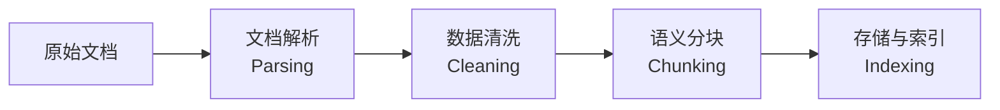

# 索引概述

在 RAG 系统中，有一句至理名言：**Garbage in, Garbage out (垃圾进，垃圾出)**。无论你的 LLM 多么强大，如果索引阶段的数据质量低下、分块不合理或解析丢失了结构信息，检索效果都将大打折扣。

## 索引阶段的四个核心生命周期

### 文档解析 (Parsing)

将 PDF、PPT、Word 等“人类友好”的格式转化为“机器友好”的纯文本或结构化数据（如 Markdown）。解析质量直接决定了后续所有环节的上限。

### 数据清洗 (Cleaning)

去除文本中无用的信息，如标点符号、数字、特殊字符、空行、重复行等。降低内容中的“噪音”。

### 语义分块 (Chunking)

- **挑战**：Chunk 太小会导致语义断裂；Chunk 太大则引入过多噪声。
- **进阶**：使用 Parent-Document 策略，即“索引小块，检索大块”。

### 存储与索引 (Indexing)

GoRAG 采用融合索引策略，数据进行过引

- BM25 索引, 用于支持稀疏检索 - 由全文索引数据库 (Bleve)
- 向量索引, 用于语义检索（稠密检索）- 由向量数据库支持
- Entity 索引, 用于实体检索 - 由知识图谱数据库 (GraphDB)

