# 索引器

索引器（Indexer）是 RAG 索引管线的核心调度组件，负责协调和管理从文档解析到向量存储的完整索引流程。它基于 `github.com/DotNetAge/gochat` 的 pipeline 框架构建，提供自动文件监控、实时变更检测和灵活的索引触发机制。

> 索引器 = 索引管线的"大脑"，负责协调各阶段工作，确保文档高效、准确地进入向量数据库中。

---

## 索引器在 RAG 系统中的位置

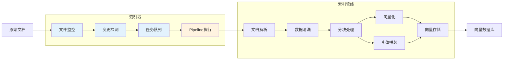

---

## 核心职责

1. **文件系统监控**：监听指定目录的文件变更事件（创建、修改、删除、重命名）
2. **变更事件处理**：将文件系统事件转换为索引任务，管理任务优先级和调度
3. **Pipeline 编排**：基于 gochat pipeline 框架组织索引流程的各个阶段
4. **索引触发管理**：支持自动触发（文件变更）和手动触发（API 调用）两种模式
5. **任务队列管理**：维护索引任务队列，支持并发控制和背压机制
6. **状态追踪**：记录文档索引状态，支持增量更新和冲突处理

---

## 整体架构设计

### 架构概览

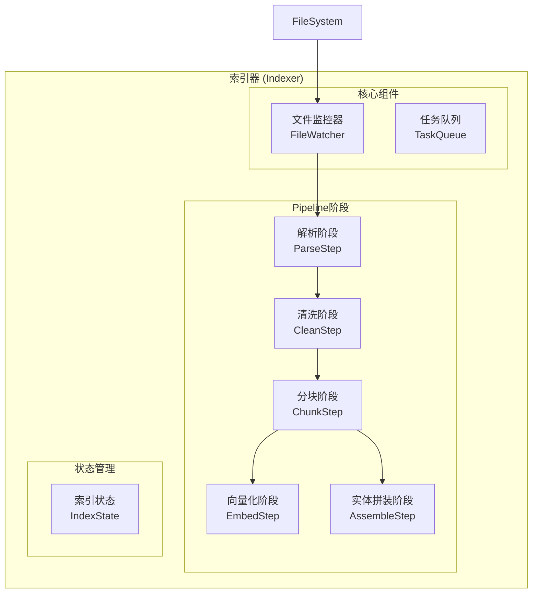

### 核心组件说明

| 组件            | 职责                               | 关键技术              |
| --------------- | ---------------------------------- | --------------------- |
| **FileWatcher** | 监控文件系统变更事件，触发增量检查 | fsnotify              |
| **TaskQueue**   | 管理索引任务队列，支持优先级调度   | 优先级队列 / 延迟队列 |
---

## 与 gochat Pipeline 框架集成

### Pipeline 框架核心概念

gochat pipeline 框架提供以下核心抽象：

| 概念         | 说明               | 在索引器中的应用        |
| ------------ | ------------------ | ----------------------- |
| **Pipeline** | 管理 Step 执行序列 | 组织索引流程的各个阶段  |
| **Step**     | 单个处理步骤       | 对应索引管线的各个 Step |
| **State**    | 线程安全的状态存储 | 传递文档数据和中间结果  |
| **Hook**     | 执行观察点         | 日志记录、指标收集      |

### Pipeline 注册与配置

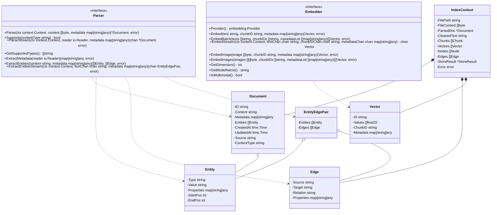


`Pipeline` 使用示例

```go
// 2. 创建 Pipeline
indexPipeline := pipeline.New[*IndexContext]()

// 3. 添加 Steps
indexPipeline.AddSteps(
                    Parse(),
                    Clean(), 
                    Chunk(), 
                    Embed(), 
                    Assemble(), 
                    Store())

// 4. 添加 Hooks（可选）
indexPipeline.AddHook(Logging())
indexPipeline.AddHook(Metrics())

// 5. 执行 Pipeline
ctx := &IndexContext{
    FilePath: "/path/to/document.pdf",
}
err := indexPipeline.Execute(context.Background(), ctx)
```

### Step 划分与数据流

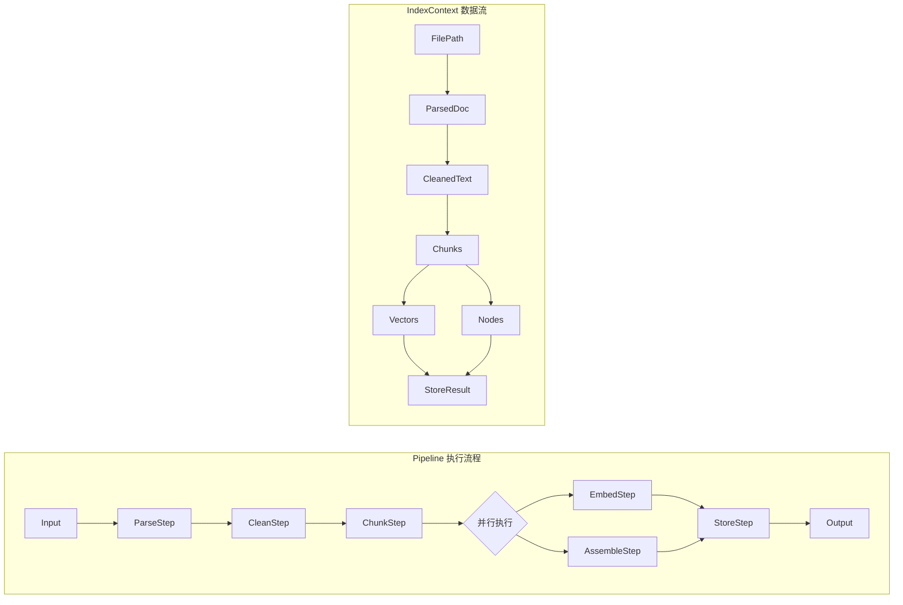

### Hook 使用示例

```go
// 日志 Hook 实现
type LoggingHook struct{}

func (h *LoggingHook) OnStepStart(ctx context.Context, step pipeline.Step[*IndexContext], state *IndexContext) {
    log.Printf("Starting step: %s for file: %s", step.Name(), state.FilePath)
}

func (h *LoggingHook) OnStepError(ctx context.Context, step pipeline.Step[*IndexContext], state *IndexContext, err error) {
    log.Printf("Step %s failed for file %s: %v", step.Name(), state.FilePath, err)
}

func (h *LoggingHook) OnStepComplete(ctx context.Context, step pipeline.Step[*IndexContext], state *IndexContext) {
    log.Printf("Step %s completed for file: %s", step.Name(), state.FilePath)
}

// 指标 Hook 实现
type MetricsHook struct {
    metrics MetricsCollector
}

func (h *MetricsHook) OnStepStart(ctx context.Context, step pipeline.Step[*IndexContext], state *IndexContext) {
    h.metrics.RecordStepStart(step.Name())
}

func (h *MetricsHook) OnStepComplete(ctx context.Context, step pipeline.Step[*IndexContext], state *IndexContext) {
    h.metrics.RecordStepComplete(step.Name())
}

func (h *MetricsHook) OnStepError(ctx context.Context, step pipeline.Step[*IndexContext], state *IndexContext, err error) {
    h.metrics.RecordStepError(step.Name(), err)
}
```

---

## 核心功能实现

### 1. Indexer 组件设计

**核心原则**：当启用`Watch`方法时，`Indexer`会进入阻塞状态，因此每个`Indexer`实例对应一个目录。

#### 1.1 组件结构

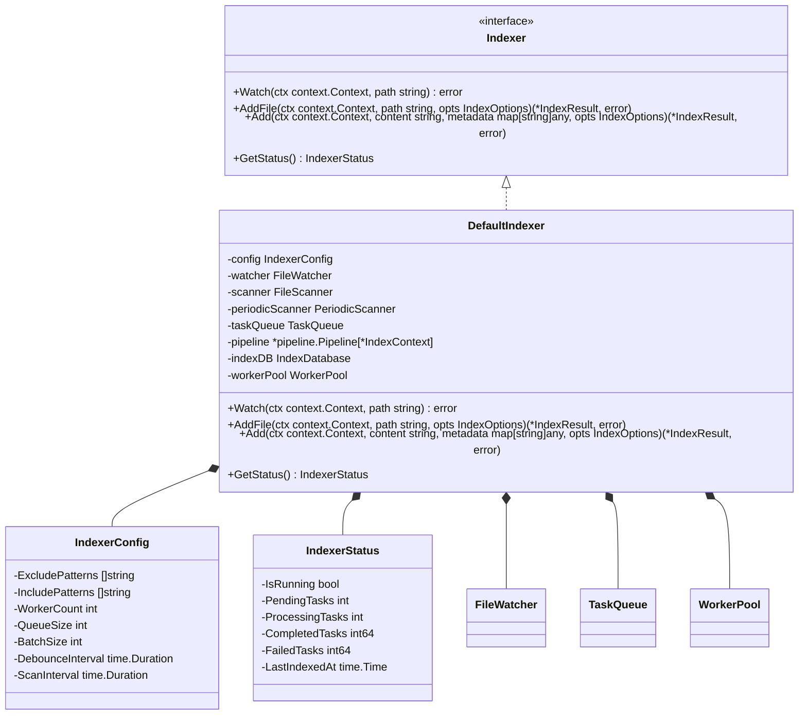

#### 1.2 文件系统监听策略

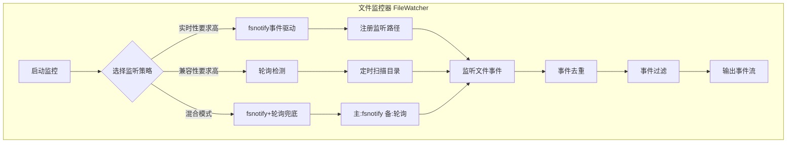

**监听策略对比**：

| 策略         | 优点                 | 缺点                 | 适用场景            |
| ------------ | -------------------- | -------------------- | ------------------- |
| **fsnotify** | 实时性高、资源占用低 | 跨平台兼容性差       | Linux/Mac 生产环境  |
| **轮询**     | 兼容性好、可靠性高   | 实时性差、资源占用高 | Windows 环境 / 兜底 |
| **混合模式** | 兼顾实时性和可靠性   | 实现复杂             | 关键业务场景        |

#### 1.3 变更事件处理流程

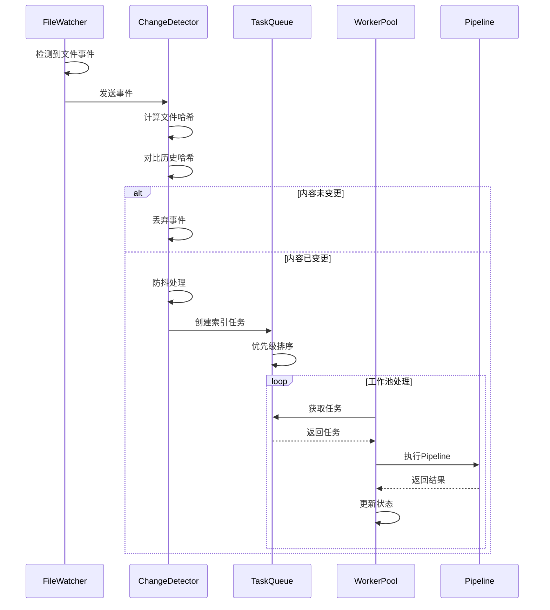

### 2. 实时检测功能

#### 2.1 文件变更检测算法

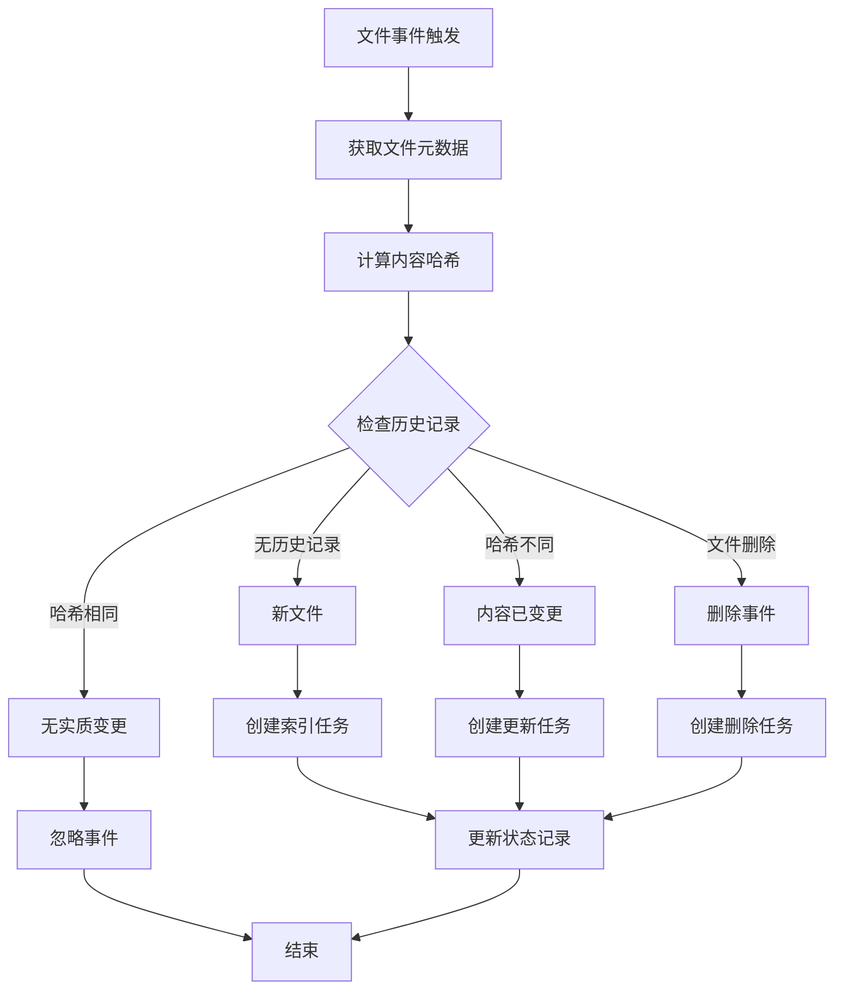

**检测算法实现**：

```go
// ChangeDetector 变更检测器
type ChangeDetector struct {
    stateStore StateStore
    hashAlgo   HashAlgorithm
}

// Detect 检测文件变更
func (d *ChangeDetector) Detect(event FileEvent) (ChangeType, error) {
    currentState := d.getCurrentState(event.Path)
    historyState, exists := d.stateStore.Get(event.Path)
    
    switch event.Type {
    case EventCreate:
        if exists {
            return ChangeNone, nil
        }
        return ChangeCreate, nil
        
    case EventModify:
        if !exists {
            return ChangeCreate, nil
        }
        if currentState.Hash == historyState.Hash {
            return ChangeNone, nil
        }
        return ChangeUpdate, nil
        
    case EventDelete:
        if !exists {
            return ChangeNone, nil
        }
        return ChangeDelete, nil
        
    case EventRename:
        return ChangeRename, nil
    }
    
    return ChangeNone, fmt.Errorf("unknown event type: %v", event.Type)
}
```

#### 2.2 防抖与节流机制

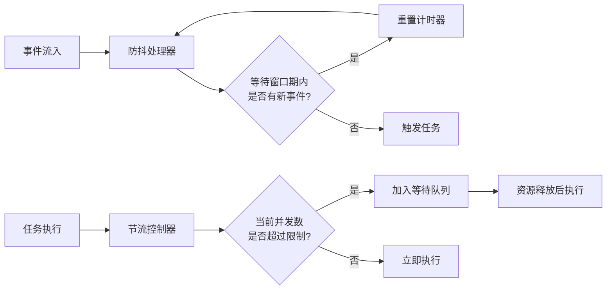

### 3. 自动索引更新

#### 3.1 增量更新机制

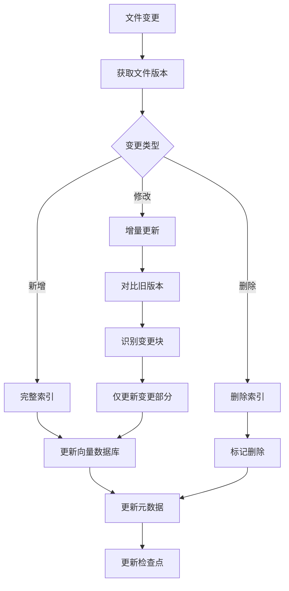

#### 3.2 冲突处理方案

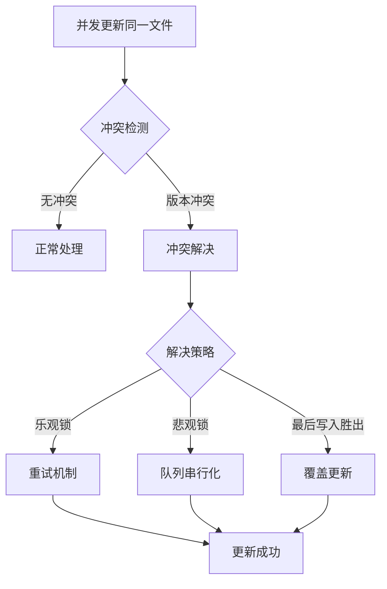

**冲突处理策略**：

| 策略             | 实现方式               | 适用场景     |
| ---------------- | ---------------------- | ------------ |
| **乐观锁**       | 版本号检查             | 读多写少     |
| **悲观锁**       | 文件级锁               | 写多读少     |
| **队列串行化**   | 同一文件任务入同一队列 | 强一致性要求 |
| **最后写入胜出** | 时间戳比较             | 最终一致性   |

#### 3.3 性能优化措施

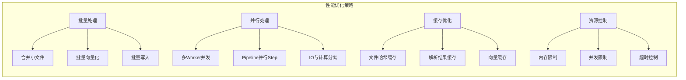

### 4. Indexer 的使用示例

```go
// 1. 单文件索引
result, err := indexer.AddFile(ctx, "/path/to/doc.pdf", IndexOptions{
    Priority:     PriorityHigh,
    Sync:         true,
    Timeout:      5 * time.Minute,
    ForceUpdate:  true,
})

// 2. 批量文件索引
results, err := indexer.AddFiles(ctx, []string{
    "/path/to/doc1.pdf",
    "/path/to/doc2.docx",
}, IndexOptions{
    Priority: PriorityNormal,
    Sync:     false,
})

// 3. 内容直接索引
result, err := indexer.Add(ctx, 
    "这是一段需要索引的文本内容",
    map[string]any{
        "title": "示例文档",
        "author": "张三",
        "source": "manual",
    },
    IndexOptions{
        Priority: PriorityHigh,
        Sync:     true,
    },
)

// 4. 流式索引
result, err := indexer.AddStream(ctx, 
    reader,
    map[string]any{"filename": "large-file.pdf"},
    IndexOptions{
        Priority: PriorityLow,
        Sync:     false,
    },
)
```

---

## 技术实现细节

### 1. 自动监控实现机制

#### 1.1 技术组件选型

| 组件         | 技术选型                              | 说明                     |
| ------------ | ------------------------------------- | ------------------------ |
| **文件监控** | fsnotify (Linux/Mac) + 轮询 (Windows) | 跨平台文件事件监听       |
| **任务队列** | 优先级队列 + 延迟队列                 | 支持任务优先级和定时执行 |
| **工作池**   | 动态 Goroutine 池                     | 根据负载自动调整并发数   |
| **状态存储** | SQLite / Redis                        | 轻量级状态持久化         |
| **配置管理** | Viper                                 | 支持热更新配置           |

#### 1.2 配置参数

```yaml
indexer:
  # 监控配置
  watcher:
    enabled: true
    strategy: "hybrid"
    poll_interval: 30s
    debounce_interval: 2s
    
  watch_dirs:
    - path: "/data/documents"
      recursive: true
      include_patterns: ["*.pdf", "*.docx", "*.md"]
      exclude_patterns: ["*.tmp", ".git/*"]
    
  # 队列配置
  queue:
    size: 10000
    priority_levels: 3
    default_priority: "normal"
    
  # 工作池配置
  worker_pool:
    min_workers: 2
    max_workers: 10
    queue_capacity: 100
    
  # 性能优化
  optimization:
    batch_size: 32
    max_file_size: 100MB
    concurrent_limit: 5
    cache_enabled: true
    cache_ttl: 1h
```

#### 1.3 运行原理

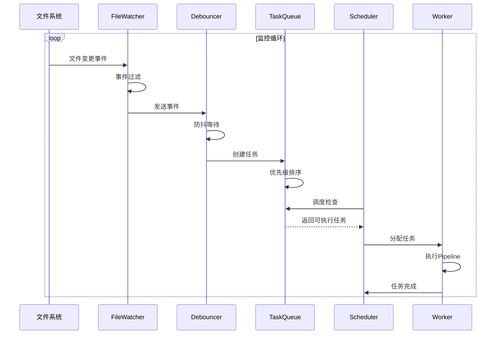

### 2. 索引触发条件

#### 2.1 自动触发条件

| 条件           | 触发时机           | 优先级 | 说明         |
| -------------- | ------------------ | ------ | ------------ |
| **文件创建**   | 新文件写入监控目录 | Normal | 完整索引流程 |
| **文件修改**   | 文件内容发生变更   | Normal | 增量更新     |
| **文件删除**   | 文件从目录移除     | High   | 立即删除索引 |
| **文件重命名** | 文件路径变更       | Low    | 更新元数据   |
| **定时扫描**   | 按配置周期执行     | Low    | 兜底机制     |

#### 2.2 手动触发条件

| 条件         | 触发方式      | 优先级 | 说明     |
| ------------ | ------------- | ------ | -------- |
| **API调用**  | HTTP/gRPC接口 | High   | 即时响应 |
| **CLI命令**  | 命令行工具    | High   | 运维操作 |
| **消息队列** | 消费MQ消息    | Normal | 异步处理 |

#### 2.3 优先级规则

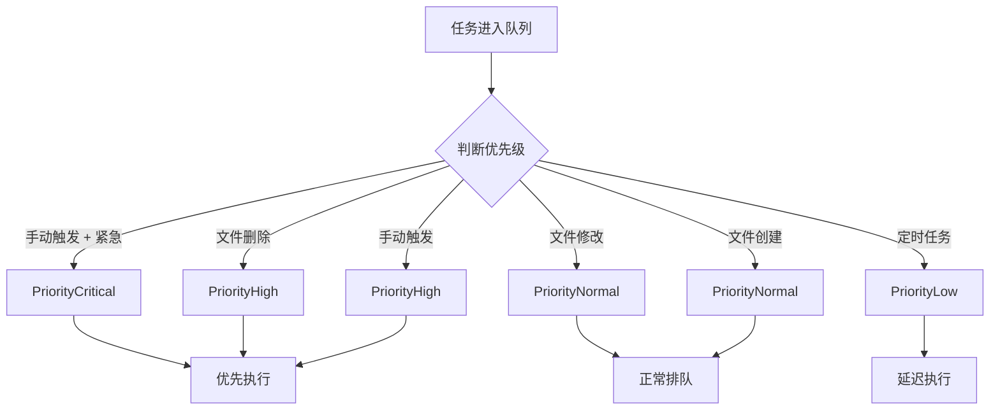

### 3. 错误处理机制

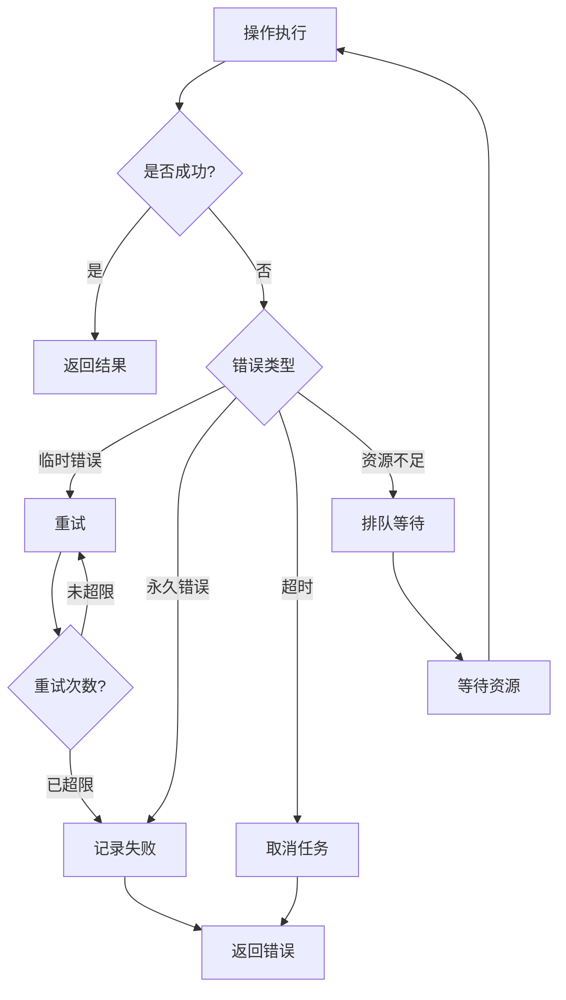

**错误类型定义**：

```go
var (
    ErrInvalidPath     = errors.New("invalid file path")
    ErrFileNotFound    = errors.New("file not found")
    ErrFileTooLarge    = errors.New("file size exceeds limit")
    ErrUnsupportedType = errors.New("unsupported file type")
    ErrParseFailed     = errors.New("document parse failed")
    ErrIndexExists     = errors.New("document already indexed")
    ErrIndexNotFound   = errors.New("document not found in index")
    ErrTimeout         = errors.New("index operation timeout")
    ErrQueueFull       = errors.New("task queue is full")
    ErrPipelineFailed  = errors.New("pipeline execution failed")
)
```

---

## 关键功能实现

### 1. Pipeline Step 实现

```go
// ParseStep 解析步骤
type ParseStep struct {
    parserPool *ParserPool
}

func (s *ParseStep) Name() string {
    return "ParseStep"
}

func (s *ParseStep) Execute(ctx context.Context, state *IndexContext) error {
    // 1. 读取文件内容
    content, err := os.ReadFile(state.FilePath)
    if err != nil {
        return fmt.Errorf("read file failed: %w", err)
    }
    
    // 2. 提取文件类型
    contentType := detectContentType(state.FilePath, content)
    
    // 3. 选择合适的解析器
    parser := s.parserPool.SelectParser(contentType)
    
    // 4. 准备初始元数据
    initialMetadata := map[string]any{
        "source":      state.FilePath,
        "content_type": contentType,
        "created_at":  time.Now(),
    }
    
    // 5. 执行解析
    doc, err := parser.Parse(ctx, content, initialMetadata)
    if err != nil {
        return fmt.Errorf("parse failed: %w", err)
    }
    
    // 6. 提取实体（如果需要）
    if doc.Content != "" {
        entities, edges, err := parser.ExtractEntities(doc.Content, doc.Metadata)
        if err == nil {
            doc.Entities = entities
            // 可以将实体信息添加到元数据中，供后续处理使用
            doc.Metadata["entity_count"] = len(entities)
        }
    }
    
    state.ParsedDoc = doc
    return nil
}

func detectContentType(filePath string, content []byte) string {
    // 根据文件扩展名和内容检测MIME类型
    // 实现略
    return "application/octet-stream"
}

// ParserPool 解析器池
type ParserPool struct {
    parsers   []Parser
    semaphore chan struct{}
    cache     ParseCache
}

func NewParserPool(maxConcurrency int) *ParserPool {
    return &ParserPool{
        parsers:   make([]Parser, 0),
        semaphore: make(chan struct{}, maxConcurrency),
        cache:     NewParseCache(),
    }
}

func (p *ParserPool) Register(parser Parser) {
    p.parsers = append(p.parsers, parser)
}

func (p *ParserPool) SelectParser(contentType string) Parser {
    for _, parser := range p.parsers {
        if parser.Supports(contentType) {
            return parser
        }
    }
    // 返回默认解析器
    return NewTextParser()
}

func (p *ParserPool) ParseBatch(ctx context.Context, docs []string) chan *Document {
    resultChan := make(chan *Document, len(docs))
    var wg sync.WaitGroup
    
    for _, docPath := range docs {
        wg.Add(1)
        go func(path string) {
            defer wg.Done()
            
            p.semaphore <- struct{}{}
            defer func() { <-p.semaphore }()
            
            content, err := os.ReadFile(path)
            if err != nil {
                log.Printf("Error reading file %s: %v", path, err)
                return
            }
            
            contentType := detectContentType(path, content)
            parser := p.SelectParser(contentType)
            
            initialMetadata := map[string]any{
                "source":      path,
                "content_type": contentType,
            }
            
            doc, err := parser.Parse(ctx, content, initialMetadata)
            if err != nil {
                log.Printf("Error parsing file %s: %v", path, err)
                return
            }
            
            resultChan <- doc
        }(docPath)
    }
    
    go func() {
        wg.Wait()
        close(resultChan)
    }()
    
    return resultChan
}

// ParseCache 解析缓存
type ParseCache struct {
    store map[string]string
    ttl   time.Duration
}

func NewParseCache() ParseCache {
    return ParseCache{
        store: make(map[string]string),
        ttl:   24 * time.Hour,
    }
}

// ChunkStep 分块步骤
type ChunkStep struct {
    factory       ChunkingFactory
    advisor       ChunkingAdvisor
    formatStrategyMap map[string]ChunkStrategy
}

func (s *ChunkStep) Name() string {
    return "ChunkStep"
}

func (s *ChunkStep) Execute(ctx context.Context, state *IndexContext) error {
    // 1. 确定分块策略
    strategy := s.determineStrategy(state.ParsedDoc.Metadata)
    
    // 2. 创建分块器
    chunker := s.factory.CreateChunker(strategy)
    
    // 3. 执行分块
    chunks := chunker.Chunk(
        state.ParsedDoc.Content,
        state.ParsedDoc.Metadata,
        ChunkOptions{
            ChunkSize:    800,
            ChunkOverlap: 100,
            PreserveStructure: true,
        }
    )
    
    // 4. 处理ParentDoc关系（如果使用ParentDoc策略）
    if strategy == ParentDocStrategy {
        // 父子块关系已由ParentDocChunker自动处理
    }
    
    state.Chunks = chunks
    return nil
}

func (s *ChunkStep) determineStrategy(metadata map[string]any) ChunkStrategy {
    // 1. 检查是否有明确指定的策略
    if strategy, ok := metadata["chunk_strategy"]; ok {
        if strat, ok := strategy.(ChunkStrategy); ok {
            return strat
        }
    }
    
    // 2. 检查格式映射表
    if contentType, ok := metadata["content_type"]; ok {
        if strategy, ok := s.formatStrategyMap[contentType.(string)]; ok {
            return strategy
        }
    }
    
    // 3. 使用Advisor推荐策略
    if s.advisor != nil {
        contentSample := ""
        if content, ok := metadata["content_sample"]; ok {
            contentSample = content.(string)
        }
        return s.advisor.RecommendStrategy(
            metadata["content_type"].(string),
            contentSample,
            metadata,
        )
    }
    
    // 4. 默认策略
    return RecursiveStrategy
}

// EmbedStep 向量化步骤
type EmbedStep struct {
    embedder Embedder
}

func (s *EmbedStep) Name() string {
    return "EmbedStep"
}

func (s *EmbedStep) Execute(ctx context.Context, state *IndexContext) error {
    texts := make([]string, len(state.Chunks))
    chunkIDs := make([]string, len(state.Chunks))
    metadataList := make([]map[string]any, len(state.Chunks))
    
    for i, chunk := range state.Chunks {
        texts[i] = chunk.Content
        chunkIDs[i] = chunk.ID
        metadataList[i] = chunk.Metadata
    }
    
    vectors, err := s.embedder.EmbedBatch(texts, chunkIDs, metadataList)
    if err != nil {
        return fmt.Errorf("embedding failed: %w", err)
    }
    
    state.Vectors = vectors
    return nil
}
```

### 2. 文件监控与变更检测

#### 2.1 设计原则

**核心原则**：

1. **依赖文件系统事件**：文件系统事件作为唯一触发器
2. **使用文件修改时间**：文件系统提供的可靠信息
3. **利用现有存储**：复用向量存储系统，避免引入新组件

**工作模式**：

- **文件监控模式**：监听文件系统事件，触发增量检查


#### 2.2 变更检测算法

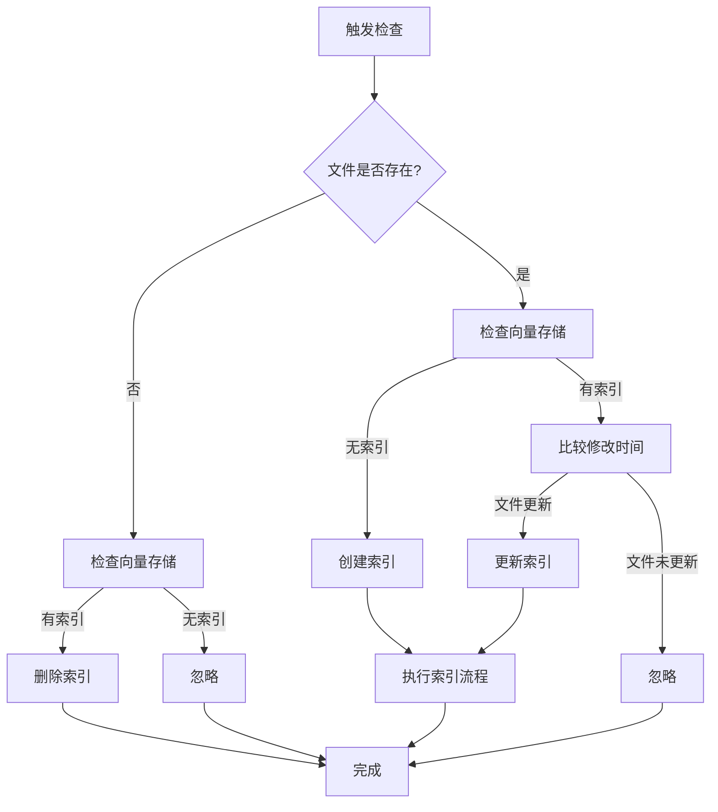


#### 2.3 文件监控实现

```go
// FileWatcher 文件监控器
type FileWatcher struct {
    scanner       *FileScanner
    eventChan     chan FileEvent
    debounceMap   map[string]*time.Timer
    debounceMutex sync.Mutex
    debounceDelay time.Duration
}

// Watch 监控目录
func (w *FileWatcher) Watch(ctx context.Context, dir string) error {
    watcher, err := fsnotify.NewWatcher()
    if err != nil {
        return err
    }
    defer watcher.Close()
    
    err = watcher.Add(dir)
    if err != nil {
        return err
    }
    
    go w.processEvents(ctx, watcher)
    return nil
}

// processEvents 处理文件事件
func (w *FileWatcher) processEvents(ctx context.Context, watcher *fsnotify.Watcher) {
    for {
        select {
        case event := <-watcher.Events:
            w.handleEvent(event)
        case err := <-watcher.Errors:
            log.Printf("Watcher error: %v", err)
        case <-ctx.Done():
            return
        }
    }
}

// handleEvent 处理单个事件
func (w *FileWatcher) handleEvent(event fsnotify.Event) {
    w.debounceMutex.Lock()
    defer w.debounceMutex.Unlock()
    
    if timer, exists := w.debounceMap[event.Name]; exists {
        timer.Stop()
    }
    
    w.debounceMap[event.Name] = time.AfterFunc(w.debounceDelay, func() {
        // 文件事件只是触发器，实际变更检测由 Scanner 完成
        action, err := w.scanner.ScanFile(event.Name)
        if err != nil {
            log.Printf("Scan file error: %v", err)
            return
        }
        
        if action != ActionIgnore {
            w.eventChan <- FileEvent{
                Path:   event.Name,
                Action: action,
                Timestamp: time.Now(),
            }
        }
        
        delete(w.debounceMap, event.Name)
    })
}
```


### 3. 任务队列实现

```go
// TaskQueue 优先级任务队列
type TaskQueue struct {
    queues    map[TaskPriority][]IndexTask
    mutex     sync.RWMutex
    size      int
    capacity  int
}

func (q *TaskQueue) Push(task IndexTask) error {
    q.mutex.Lock()
    defer q.mutex.Unlock()
    
    if q.size >= q.capacity {
        return ErrQueueFull
    }
    
    priority := task.Priority
    q.queues[priority] = append(q.queues[priority], task)
    q.size++
    
    return nil
}

func (q *TaskQueue) Pop() (IndexTask, error) {
    q.mutex.Lock()
    defer q.mutex.Unlock()
    
    for priority := PriorityCritical; priority >= PriorityLow; priority-- {
        if len(q.queues[priority]) > 0 {
            task := q.queues[priority][0]
            q.queues[priority] = q.queues[priority][1:]
            q.size--
            return task, nil
        }
    }
    
    return IndexTask{}, errors.New("queue is empty")
}
```

---

## 部署配置

### 1. 运行环境要求

| 组件         | 最低要求          | 推荐配置              |
| ------------ | ----------------- | --------------------- |
| **操作系统** | Linux/Mac/Windows | Linux (Ubuntu 20.04+) |
| **Go版本**   | 1.21+             | 1.22+                 |
| **内存**     | 4GB               | 16GB+                 |
| **CPU**      | 4核               | 8核+                  |
| **磁盘**     | 100GB SSD         | 500GB NVMe SSD        |
| **网络**     | 100Mbps           | 1Gbps                 |

### 2. 配置文件示例

```yaml
# indexer.yaml
version: "1.0"

server:
  host: "0.0.0.0"
  port: 8080
  grpc_port: 9090

indexer:
  watcher:
    enabled: true
    strategy: "hybrid"
    poll_interval: 30s
    debounce_interval: 2s
    
  watch_dirs:
    - path: "/data/documents"
      recursive: true
      include_patterns: ["*.pdf", "*.docx", "*.md", "*.txt"]
      exclude_patterns: ["*.tmp", "*.log", ".git/*", "node_modules/*"]
    
  queue:
    size: 10000
    priority_levels: 3
    
  worker_pool:
    min_workers: 2
    max_workers: 10
    queue_capacity: 100
```

### 3. 性能指标

| 指标          | 目标值         | 说明             |
| ------------- | -------------- | ---------------- |
| **吞吐量**    | 100+ 文档/分钟 | 平均大小1MB的PDF |
| **延迟**      | < 5秒          | 单文档端到端索引 |
| **并发数**    | 10+            | 同时处理的文档数 |
| **内存占用**  | < 8GB          | 稳定运行状态     |
| **CPU利用率** | < 80%          | 正常负载下       |
| **队列积压**  | < 1000         | 待处理任务数     |
| **成功率**    | > 99%          | 索引成功比例     |

---

## 总结

| 要点         | 说明                                             |
| ------------ | ------------------------------------------------ |
| **核心架构** | 基于 gochat pipeline 框架，采用 Step + Hook 设计 |
| **文件监控** | 支持 fsnotify + 轮询混合模式，防抖去重           |
| **变更检测** | 基于文件哈希的内容级变更检测                     |
| **任务调度** | 优先级队列 + 工作池，支持并发控制                |
| **索引触发** | 自动触发（文件变更）+ 手动触发（API调用）        |
| **性能优化** | 批量处理、并行执行、缓存机制、背压控制           |
| **扩展性**   | 支持自定义 Step、Hook、解析器                    |
| **可靠性**   | 重试机制、断点续传                               |

索引器作为 RAG 系统的核心组件，通过合理的架构设计和完善的机制保障，能够高效、可靠地处理大规模文档索引需求，为后续的检索和生成提供坚实的数据基础。
