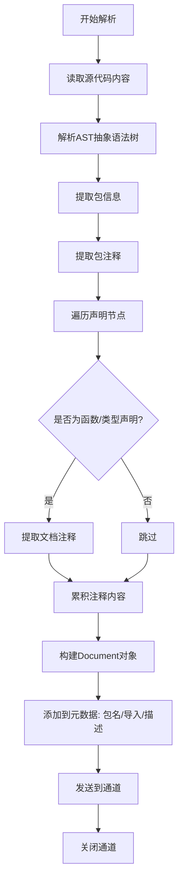

# 代码文件解析器

代码文件解析需要提取注释、文档字符串和代码结构信息。支持 Go、Python、Java、TypeScript、JavaScript 等语言。

> 📋 完整 Metadata 规范：[代码文件 Metadata 提取规范](../parser-metadata.md#代码文件-metadata-gopythonjavatypescriptjavascript)

## 代码文件解析流程（以 Go 为例）

## 元数据提取策略

- 提取包名（package name）
- 提取包注释作为文档描述
- 提取导入的包列表
- 提取函数和类型的文档注释（doc comments）

## 实现要点

### 1. Go 代码解析

- 使用 `go/parser` 和 `go/ast` 解析 AST
- 提取包名：`f.Name.Name`
- 提取导入：遍历 `f.Imports`
- 提取函数：遍历 `f.Decls` 中的 `*ast.FuncDecl`
- 提取文档注释：`f.Doc.Text()` 和 `fn.Doc.Text()`
- 计算注释占比：注释行数 / 总行数

### 2. Python 代码解析

- 使用 `go-python` 或正则表达式
- 提取模块级 docstring
- 提取函数/类的 docstring
- 统计 import 语句

### 3. Java/TypeScript/JavaScript 解析

- 使用相应的 AST 解析器
- 提取 JSDoc/TSDoc/Javadoc 注释
- 统计类、函数、接口数量
- 保留类型信息（TypeScript）

### 4. 注释提取

- 提取文件头注释
- 提取函数/类/方法注释
- 提取内联注释（可选）
- 保持注释的格式和结构
