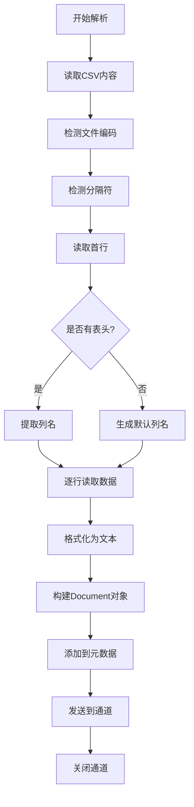

# CSV 解析器

CSV 文档包含表格数据，解析重点在于处理分隔符、编码和表头。

> 📋 完整 Metadata 规范：[CSV/TSV Metadata 提取规范](../parser-metadata.md#通用-csvtsv-metadata)

## 解析挑战

| 挑战         | 说明              | 处理方法              |
| ------------ | ----------------- | --------------------- |
| **分隔符**   | 逗号、制表符、分号 | 自动检测或配置指定    |
| **编码**     | UTF-8, GBK 等     | 编码检测和转换        |
| **引号处理** | 字段包含分隔符    | 遵循 RFC 4180 标准    |
| **表头**     | 是否有表头行      | 首行检测或配置指定    |

## CSV 解析流程

## 实现要点

### 1. 编码检测

- 使用 `golang.org/x/text/encoding` 检测编码
- 优先 UTF-8，降级 GBK、GB2312 等
- 转换为目标编码（UTF-8）

### 2. 分隔符检测

- 尝试常见分隔符：`,` `\t` `;` `|`
- 统计出现频率
- 选择最可能的分隔符

### 3. 表格处理

- 使用 `encoding/csv` 解析
- 处理引号字段（`"field,with,commas"`）
- 处理转义字符

### 4. 文本格式化

- 表头行：`Column1 | Column2 | Column3`
- 数据行：`Value1  | Value2  | Value3`
- 每行添加行号作为元数据
- 可选：每行生成独立 Document

### 5. 大文件处理

- 流式读取，避免加载全部到内存
- 分批处理（如每 100 行一个 Document）
- 统计总行数和列数
