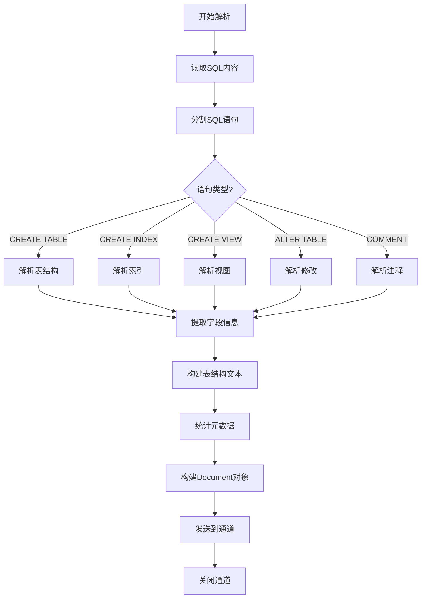

# 数据库 Schema 解析器

数据库 Schema 文档 (.sql) 包含 DDL 语句，解析重点在于提取表结构、字段和约束信息。

> 📋 完整 Metadata 规范：[数据库 Schema Metadata 提取规范](../parser-metadata.md#数据库-schema-metadata)

## 解析内容

| 内容           | 说明              | 提取方式            |
| -------------- | ----------------- | ------------------- |
| **表定义**     | CREATE TABLE 语句 | 解析表名和字段      |
| **字段信息**   | 列名、类型、约束  | 解析列定义          |
| **索引**       | CREATE INDEX      | 提取索引字段        |
| **外键**       | FOREIGN KEY       | 提取关联关系        |
| **视图**       | CREATE VIEW       | 提取视图定义        |

## Schema 解析流程



## 实现要点

### 1. SQL 语句分割

- 按分号 `;` 分割语句
- 处理字符串中的分号（引号内）
- 去除注释行（`--`, `/* */`）

### 2. CREATE TABLE 解析

- 提取表名
- 解析字段定义：
  - 字段名
  - 数据类型
  - 约束（NOT NULL, UNIQUE, DEFAULT）
  - 主键（PRIMARY KEY）
- 提取表级约束

### 3. 外键关系

- 解析 FOREIGN KEY 定义
- 提取引用表和字段
- 构建表关系图（可选）

### 4. 索引提取

- 提取索引名称
- 索引字段列表
- 索引类型（UNIQUE, FULLTEXT）

### 5. 文本格式化

```sql
Table: users
├── id: INT PRIMARY KEY
├── username: VARCHAR(50) NOT NULL UNIQUE
├── email: VARCHAR(100) NOT NULL
├── created_at: TIMESTAMP DEFAULT CURRENT_TIMESTAMP
└── INDEX idx_email (email)
```

### 6. 元数据提取

- 统计表数量
- 提取所有表名列表
- 检测是否有外键约束
- 检测是否有索引
- 检测是否有视图
