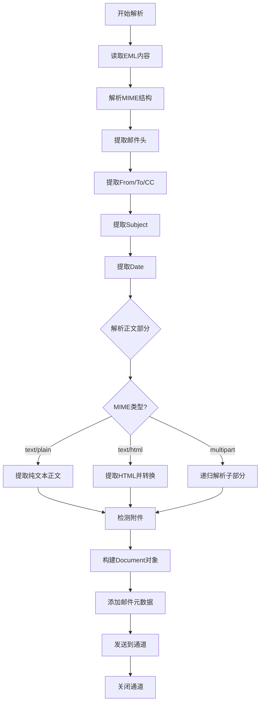

# 邮件解析器

邮件文档 (.eml) 包含 MIME 结构，解析重点在于提取邮件头、正文和附件信息。

> 📋 完整 Metadata 规范：[邮件 Metadata 提取规范](../parser-metadata.md#邮件-metadata)

## 邮件结构

| 部分         | 说明              | 提取内容            |
| ------------ | ----------------- | ------------------- |
| **邮件头**   | From, To, Subject | 发件人、收件人、主题 |
| **正文**     | text/plain 或 text/html | 邮件内容    |
| **附件**     | multipart 结构    | 附件元数据          |
| **抄送/密送** | CC, BCC          | 抄送列表            |

## 邮件解析流程

## 实现要点

### 1. MIME 解析

- 使用 `net/mail` 解析邮件头
- 使用 `mime/multipart` 解析多部分结构
- 处理嵌套的 multipart

### 2. 邮件头提取

- From, To, CC, BCC 地址列表
- Subject 主题（处理编码）
- Date 发送时间
- Message-ID 邮件唯一标识

### 3. 正文处理

- 优先提取 text/plain
- 若无 text/plain，提取 text/html 并转换为纯文本
- 处理字符编码（Content-Transfer-Encoding）

### 4. 附件处理

- 检测 `Content-Disposition: attachment`
- 提取附件文件名和类型
- 记录附件数量到 Metadata
- 可选：提取附件内容

### 5. 地址解析

- 解析 `Name <email@example.com>` 格式
- 提取显示名称和邮箱地址
- 处理多个收件人（逗号分隔）
