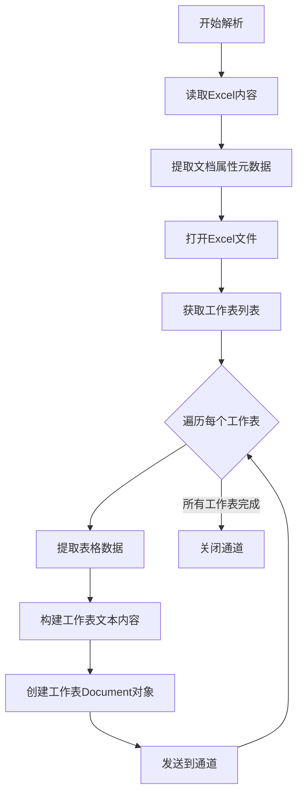

# Excel 解析器

Excel 文档主要包含表格数据，解析重点在于提取工作表内容和保持数据结构。

> 📋 完整 Metadata 规范：[Excel Metadata 提取规范](../parser-metadata.md#excel-metadata)

## Excel 解析流程

## 元数据提取策略

- 从文档属性中提取标题、作者、创建/修改日期
- 提取工作表列表和工作表数量
- 为每个工作表创建独立的 Document 对象，包含工作表名称元数据

## 实现要点

### 1. 工作表遍历

- 获取所有工作表名称
- 逐个打开工作表进行解析
- 为每个工作表生成独立的 Document

### 2. 表格数据提取

- 检测表头行（通常为首行）
- 逐行读取单元格内容
- 处理合并单元格
- 保留数值格式（日期、货币等）

### 3. 结构化输出

- 将表格数据转换为结构化文本
- 可选：保持 CSV 格式输出
- 为每行数据添加工作表名称作为上下文

### 4. 公式处理

- 检测单元格是否包含公式
- 可选：提取公式或提取计算结果
- 标记公式单元格以便后续处理
