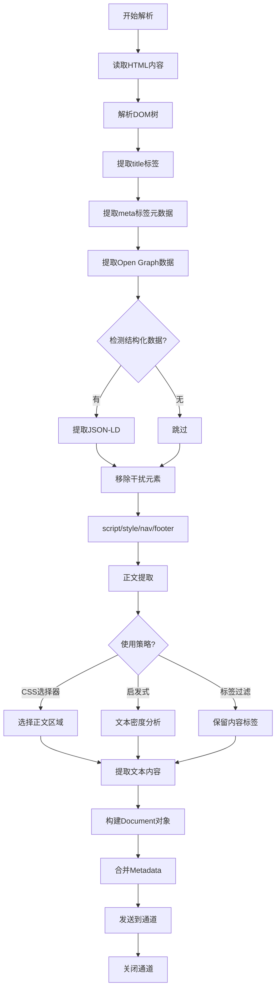

# HTML 解析器

HTML 文档的解析重点在于提取正文，去除导航栏、广告等干扰内容。

> 📋 完整 Metadata 规范：[HTML Metadata 提取规范](../parser-metadata.md#html-metadata)

## 提取的 Metadata

**标准 Metadata**：

- `title`: 文档标题
- `author`: 作者（从 meta 标签）
- `created_at`: 创建时间（article:published_time）
- `modified_at`: 修改时间（article:modified_time）
- `source`: URL
- `content_type`: MIME 类型（text/html）

**HTML 特有 Metadata**：

- `canonical_url`: 规范 URL
- `og_title`: Open Graph 标题
- `og_description`: Open Graph 描述
- `og_image`: Open Graph 图片 URL
- `keywords`: 关键词列表（meta keywords）
- `language`: HTML lang 属性
- `has_structured_data`: 是否包含 JSON-LD 结构化数据
- `link_count`: 页面链接数量
- `is_responsive`: 是否响应式（检测 viewport meta）
- `description`: 页面描述（meta description）

## 解析策略

| 策略           | 说明                            | 适用场景     |
| -------------- | ------------------------------- | ------------ |
| **标签过滤**   | 只保留 p, h1-h6, article 等标签 | 简单页面     |
| **CSS 选择器** | 根据 class/id 选择正文区域      | 复杂页面     |
| **基于启发式** | 分析文本密度识别正文            | 通用性要求高 |

## HTML 解析流程



## 元数据提取策略

- 提取 title 标签内容作为文档标题
- 提取 meta 标签中的 description、keywords 等信息
- 提取 Open Graph 协议元数据 (og:title, og:description 等)
- 检测并提取 JSON-LD 结构化数据
- 合并用户传入的自定义元数据

## 实现要点

### 1. 正文提取策略

**CSS 选择器策略**（优先）：

```
常见正文选择器：
- article, main, .post-content, .article-body
- #content, .entry-content, .story-body
- [role="main"]
```

**启发式算法**（降级）：

- 计算每个 div 的文本密度（文本长度 / HTML 长度）
- 选择文本密度最高的节点
- 考虑链接密度（应低于阈值）
- 最小文本长度过滤（< 200 字符跳过）

### 2. 干扰元素清理

- 移除：`<script>`, `<style>`, `<nav>`, `<footer>`
- 移除：class 包含 sidebar, nav, menu, footer 的元素
- 保留：`<article>`, `<main>`, `<section>` 中的内容

### 3. 结构化数据提取

- 查找 `<script type="application/ld+json">` 标签
- 解析 JSON-LD 数据
- 提取 Article, NewsArticle, BlogPosting 等类型
- 补充到 Metadata 中
