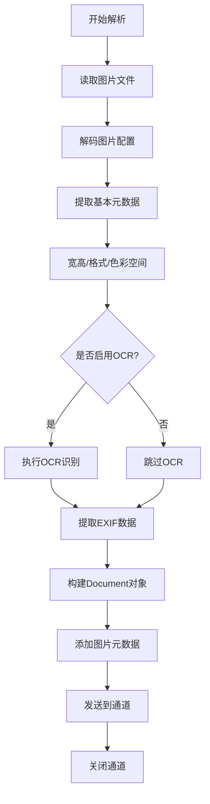

# 图片解析器

图片文档 (.jpg, .png, .gif) 需要提取元数据和可选的 OCR 文本内容。

> 📋 完整 Metadata 规范：[图片 Metadata 提取规范](../parser-metadata.md#图片-metadata)

## 解析策略

| 策略           | 说明                    | 适用场景        |
| -------------- | ----------------------- | --------------- |
| **元数据提取** | EXIF, 宽高, 格式        | 所有图片        |
| **OCR 识别**   | 提取图片中的文字        | 扫描件、截图    |
| **纯元数据**   | 仅提取元数据，无 OCR    | 照片、图表      |

## 图片解析流程

## 实现要点

### 1. 基本元数据提取

- 使用 `image.DecodeConfig` 获取宽高和格式
- 检测色彩空间（RGB, CMYK, Grayscale）
- 读取文件大小

### 2. EXIF 数据提取

- 使用 `github.com/rwcarlsen/goexif/exif` 解析
- 提取相机信息（品牌、型号、镜头）
- 提取拍摄参数（光圈、快门、ISO）
- 提取 GPS 位置（如有）
- 提取拍摄时间

### 3. OCR 处理

- 检测图片是否包含文本
- 集成 Tesseract OCR 引擎
- 或使用云 OCR 服务（Google Vision, AWS Textract）
- 支持多语言识别

### 4. 格式支持

- JPEG (.jpg, .jpeg)
- PNG (.png)
- GIF (.gif)
- BMP (.bmp)
- TIFF (.tiff, .tif)
- WebP (.webp)

### 5. 特殊处理

- 检测是否为截图（包含大量文本）
- 检测是否为图表/图形
- 检测是否为证件照
- 多页 TIFF 处理
