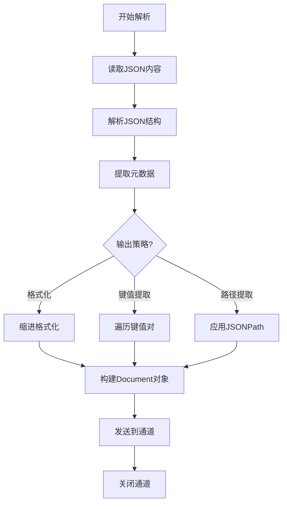

# JSON 解析器

JSON 文档包含结构化数据，解析重点在于格式化为可读文本并提取键值信息。

> 📋 完整 Metadata 规范：[JSON Metadata 提取规范](../parser-metadata.md#json-metadata)

## 解析策略

| 策略           | 说明                    | 适用场景        |
| -------------- | ----------------------- | --------------- |
| **格式化输出** | 将 JSON 转为缩进文本    | 配置文件        |
| **键值提取**   | 提取所有键值对为文本    | 数据文档        |
| **路径提取**   | 使用 JSONPath 提取特定字段 | 结构化数据  |

## JSON 解析流程

## 实现要点

### 1. JSON 解析

- 使用 `encoding/json` 解析 JSON
- 检测 JSON 格式是否有效
- 处理超大 JSON 文件（流式解析）

### 2. 格式化输出

- 使用 `json.MarshalIndent` 格式化
- 保持键的顺序
- 数组元素逐行输出

### 3. 结构化提取

- 递归遍历 JSON 树
- 提取所有叶子节点的键值对
- 使用点分路径表示嵌套结构（如 `user.name`）

### 4. 特殊处理

- 检测 JSON 是否为配置文件（package.json, tsconfig.json 等）
- 提取关键字段（name, version, description 等）
- 忽略二进制数据（base64 编码内容）
