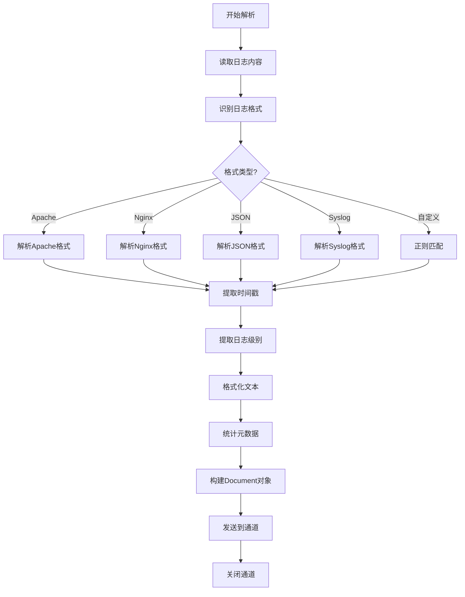

# 日志文件解析器

日志文件包含时间序列数据，解析重点在于识别日志格式和提取结构化信息。

> 📋 完整 Metadata 规范：[日志文件 Metadata 提取规范](../parser-metadata.md#日志文件-metadata)

## 常见日志格式

| 格式              | 示例                                          | 特点              |
| ----------------- | --------------------------------------------- | ----------------- |
| **Apache Common** | `127.0.0.1 - - [10/Oct/2000:13:55:36]`        | 固定格式          |
| **Apache Combined** | 包含 User-Agent 和 Referer                  | 更详细            |
| **Nginx**         | 类似 Apache，自定义字段                       | 可配置            |
| **JSON**          | `{"time":"2024-01-01","level":"INFO"}`        | 结构化            |
| **Syslog**        | `Jan  1 00:00:00 host service[pid]: message`  | 系统日志          |

## 日志解析流程

## 实现要点

### 1. 格式识别

- 读取首行，尝试匹配已知格式
- 使用正则表达式检测时间戳格式
- 检测 JSON 格式（首字符 `{`）

### 2. 时间戳解析

- 支持多种时间格式
- 提取首条和末条日志时间
- 计算日志时间范围

### 3. 日志级别统计

- 统计 ERROR, WARN, INFO, DEBUG 数量
- 检测自定义级别（FATAL, TRACE 等）
- 将统计结果添加到 Metadata

### 4. 文本格式化

- 保持原始日志格式
- 可选：添加结构化字段（`[time] [level] message`）
- 多行日志合并（如 Java 异常堆栈）

### 5. 大文件处理

- 流式读取，逐行处理
- 按时间范围分块（如每天一个 Document）
- 按日志级别分块
