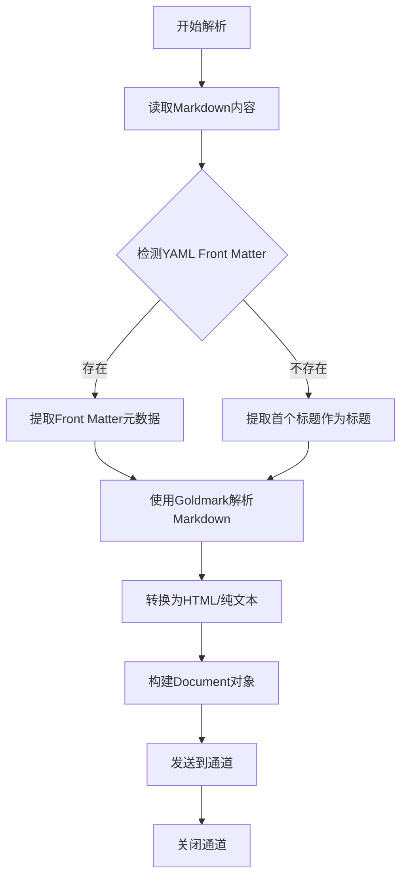

# Markdown 解析器

Markdown 格式简洁，解析相对简单。

> 📋 完整 Metadata 规范：[Markdown Metadata 提取规范](../parser-metadata.md#markdown-metadata)

## 解析要素

| 要素         | 说明          | 示例        |
| ------------ | ------------- | ----------- |
| **标题**     | # 到 ######   | # 标题      |
| **代码块**   | 保留代码内容  | ```python   |
| **链接图片** | 提取 alt text |  |
| **列表**     | 有序/无序     | 1. / -      |

## Markdown 解析流程



## 元数据提取策略

- 优先提取 YAML Front Matter 中的元数据（title、author、date 等）
- 若无 Front Matter，则提取首个一级标题作为文档标题
- 支持合并用户传入的自定义元数据

## 实现要点

### 1. Front Matter 处理

- 检测开头的 `---` 或 `+++` 分隔符
- 使用 YAML 或 TOML 解析器提取元数据
- 提取后从文档内容中移除 Front Matter 部分

### 2. AST 解析

- 使用 Goldmark 库解析为 AST
- 遍历节点提取结构化信息
- 统计标题、代码块、链接、图片数量

### 3. 代码块处理

- 保留代码块的语言标识
- 维护代码块的缩进和格式
- 可选：提取代码块为独立文档
