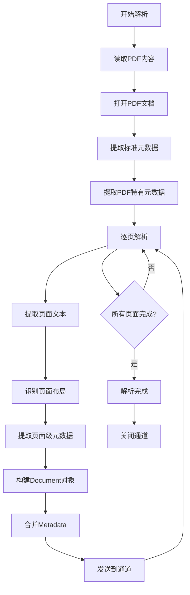

# PDF 解析器

PDF 是企业文档最常见的格式，解析难度最大。

> 📋 完整 Metadata 规范：[PDF Metadata 提取规范](../parser-metadata.md#pdf-metadata)

## 提取的 Metadata

**标准 Metadata**（所有 Parser 必须提供）：

- `title`: 文档标题
- `author`: 作者
- `created_at`: 创建时间
- `modified_at`: 修改时间
- `source`: 文件路径或 URL
- `content_type`: MIME 类型（application/pdf）
- `page_count`: 总页数

**PDF 特有 Metadata**：

- `pdf_version`: PDF 版本（如 1.7, 2.0）
- `producer`: 生成工具（如 Adobe Acrobat, Microsoft Word）
- `creator`: 创建工具
- `is_encrypted`: 是否加密
- `has_form_fields`: 是否包含表单字段
- `has_annotations`: 是否有批注/注释
- `has_bookmarks`: 是否有书签/大纲
- `page_layout`: 页面布局模式（SinglePage, OneColumn, TwoColumnLeft/Right）
- `keywords`: 文档关键词列表

## 解析挑战

| 挑战         | 说明                     | 示例                 |
| ------------ | ------------------------ | -------------------- |
| **文本抽取** | 从渲染后的内容提取文本   | 扫描 PDF 需要 OCR    |
| **版式分析** | 识别标题、正文、页眉页脚 | 多栏排版             |
| **表格提取** | 保持表格结构             | 合并单元格、跨页表格 |
| **图片处理** | 提取图片或保留图片位置   | 图表、签名           |

## Go 生态 PDF 解析工具对比

| 工具                          | 优点                    | 缺点         | 适用场景   |
| ----------------------------- | ----------------------- | ------------ | ---------- |
| **github.com/ledongthuc/pdf** | 纯 Go 实现，无 CGO 依赖 | 表格处理较弱 | 文本提取   |
| **github.com/unidoc/unipdf**  | 功能全面，支持表格提取  | 商业许可     | 企业级应用 |
| **github.com/rsc/pdf**        | 轻量级，简单易用        | 功能有限     | 快速原型   |
| **github.com/jbarham/pdf**    | 支持加密 PDF            | 维护较少     | 加密文档   |

## PDF 解析流程

## 实现要点

### 1. 多栏排版处理

- 基于文本坐标分析栏数
- 按阅读顺序重组文本流
- 检测栏间距阈值（通常 > 2 倍字符宽度）

### 2. 页眉页脚识别

- 基于位置：页面顶部/底部 15% 区域
- 基于内容：重复出现的文本（公司名、页码）
- 基于样式：字体大小、颜色差异

### 3. 表格提取策略

- **基于坐标**：检测线条和单元格边界
- **基于规则**：识别制表符对齐、空格分隔
- **混合策略**：先尝试坐标检测，失败则降级为规则检测

### 4. 扫描 PDF 处理

- 检测是否包含文本层
- 无文本层时触发 OCR 流程
- 集成 Tesseract 或云 OCR 服务
