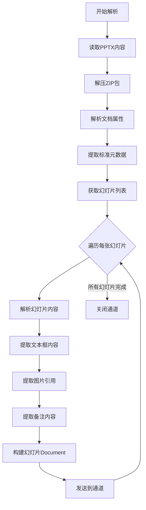

# PowerPoint 解析器

PowerPoint 文档 (.pptx) 包含幻灯片结构，解析重点在于提取每页内容和保持图文关系。

> 📋 完整 Metadata 规范：[PowerPoint Metadata 提取规范](../parser-metadata.md#powerpoint-metadata)

## 解析要点

| 要点         | 说明              | 处理方法            |
| ------------ | ----------------- | ------------------- |
| **幻灯片结构** | 每页独立的内容块  | 遍历 slide 节点     |
| **图文混排** | 文字和图片的位置关系 | 提取形状和文本框    |
| **备注提取** | 演讲者备注内容    | 解析 notes 节点     |
| **动画忽略** | 动画效果对 RAG 无用 | 跳过动画定义        |

## PowerPoint 解析流程

## 元数据提取策略

- 从 docProps 提取标题、作者、创建/修改日期
- 统计幻灯片总数
- 为每张幻灯片创建独立 Document，包含页码元数据
- 提取演讲者备注（如有）

## 实现要点

### 1. 幻灯片遍历

- 打开 `ppt/slides/slideN.xml`
- 按顺序处理每张幻灯片
- 维护幻灯片编号作为上下文

### 2. 文本框提取

- 解析 `p:sp` (Shape) 节点
- 提取 `p:txBody` 中的文本内容
- 保持文本的层级结构（标题、正文）

### 3. 图片处理

- 提取 `p:pic` (Picture) 节点
- 记录图片位置和大小
- 可选：提取图片的 alt text

### 4. 备注提取

- 解析 `ppt/notesSlides/notesSlideN.xml`
- 提取备注文本
- 将备注添加到对应幻灯片的 Metadata 中
