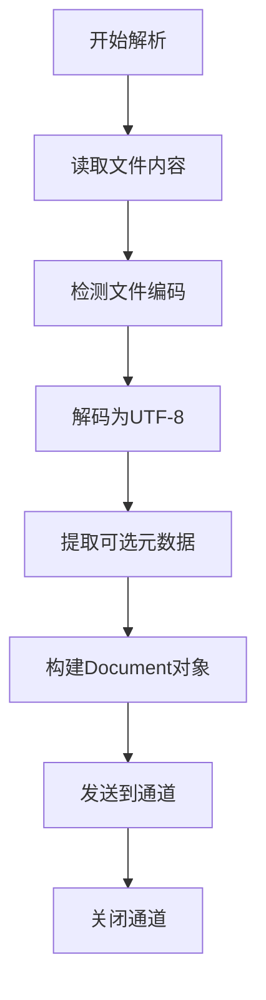

# 纯文本解析器

纯文本 (.txt) 是最简单的文档格式，无结构信息，直接读取内容即可。

## 解析特点

- 无结构信息，直接读取全部内容
- 需要检测文件编码（UTF-8, GBK 等）
- 可选择性提取文件开头的元数据

## 纯文本解析流程

## 实现要点

### 1. 编码检测

- 使用 `golang.org/x/text/encoding` 检测编码
- 优先尝试 UTF-8
- 降级尝试 GBK、ISO-8859-1 等

### 2. 元数据提取

- 无标准元数据字段
- 可选：解析文件开头的注释行（如 `# Title: xxx`）
- 提取文件名作为 title

### 3. 内容处理

- 去除 BOM (Byte Order Mark)
- 标准化换行符（\r\n → \n）
- 可选：去除多余空行
