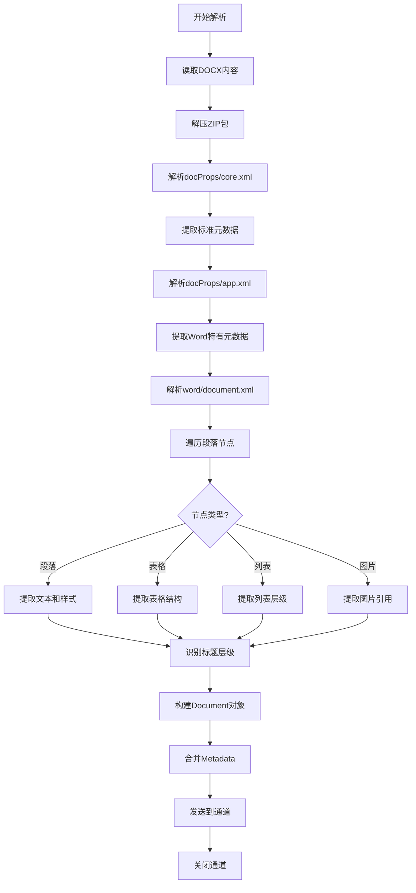

# Word 文档解析器

Word 文档 (.docx) 结构相对清晰，主要解析挑战在于保持文档的结构化信息。

> 📋 完整 Metadata 规范：[Word (DOCX) Metadata 提取规范](../parser-metadata.md#word-docx-metadata)

## 提取的 Metadata

**标准 Metadata**：

- `title`: 文档标题
- `author`: 作者
- `created_at`: 创建时间
- `modified_at`: 修改时间
- `source`: 文件路径
- `content_type`: MIME 类型（application/vnd.openxmlformats-officedocument.wordprocessingml.document）
- `page_count`: 页数（估算）

**Word 特有 Metadata**：

- `word_version`: Word 版本
- `has_track_changes`: 是否有修订标记
- `has_comments`: 是否有批注
- `heading_levels`: 存在的标题层级（如 [1,2,3,4]）
- `list_count`: 列表数量
- `table_count`: 表格数量
- `image_count`: 图片数量
- `section_count`: 分节数量
- `last_modified_by`: 最后修改者
- `revision_number`: 修订版本号
- `total_edit_time`: 总编辑时间（分钟）

## 解析要点

| 要点         | 说明                | 处理方法         |
| ------------ | ------------------- | ---------------- |
| **标题层级** | 识别 h1-h6 对应关系 | 解析 XML 样式    |
| **列表结构** | 有序/无序列表       | 保留缩进和编号   |
| **表格处理** | 保持行列结构        | XML 表格节点解析 |
| **超链接**   | 提取链接文本和 URL  | 解析 rels 关系   |

## Word 解析流程

## 实现要点

### 1. 标题层级映射

- 解析 `w:pStyle` 节点的 `w:val` 属性
- 映射关系：Heading 1 → h1, Heading 2 → h2, ...
- 处理自定义样式：基于字体大小和加粗推断

### 2. 列表结构保留

- 解析 `w:numPr` 节点获取列表编号
- 通过 `w:ilvl` 确定嵌套层级
- 保留有序列表的起始编号（`w:start`）

### 3. 表格结构提取

- 解析 `w:tbl` 节点及其子节点
- 处理合并单元格（`w:gridSpan`, `w:vMerge`）
- 保留表格边框和样式信息（可选）

### 4. 修订标记处理

- 检测 `w:ins`（插入）和 `w:del`（删除）节点
- 根据配置决定：接受所有修订 / 拒绝所有修订 / 保留标记
- 提取批注内容（`w:comment` 节点）

### 5. 超链接提取

- 解析 `w:hyperlink` 节点
- 从 `word/_rels/document.xml.rels` 获取目标 URL
- 保留链接文本和目标地址
