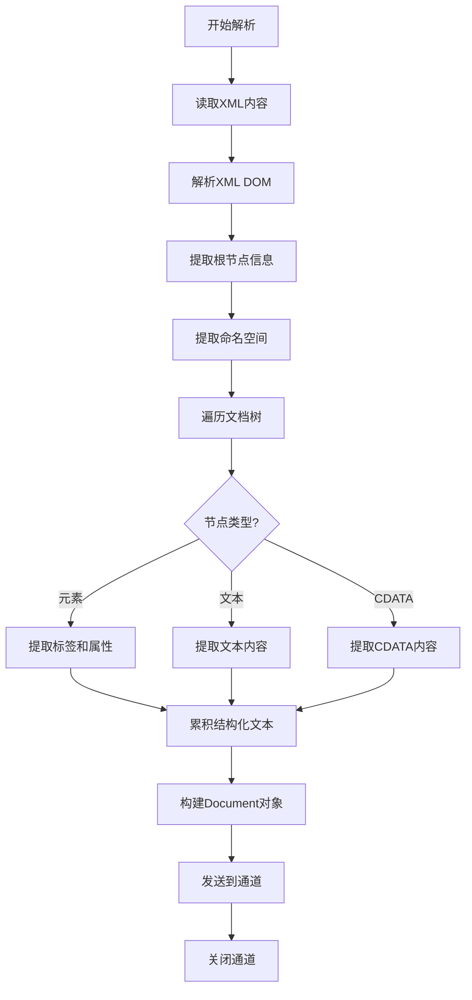

# XML 解析器

XML 文档是标记语言，解析重点在于处理命名空间、提取文本内容和保持结构信息。

> 📋 完整 Metadata 规范：[XML Metadata 提取规范](../parser-metadata.md#yamlxml-metadata)

## 解析挑战

| 挑战           | 说明              | 处理方法              |
| -------------- | ----------------- | --------------------- |
| **命名空间**   | XML namespace 处理 | 提取前缀和 URI        |
| **嵌套结构**   | 深度嵌套的节点    | 递归遍历或 XPath      |
| **CDATA**      | CDATA 区块内容    | 提取原始文本          |
| **属性提取**   | 元素的属性值      | 作为元数据或内联文本  |

## XML 解析流程

## 实现要点

### 1. XML 解析

- 使用 `encoding/xml` 解析
- 处理 XML 声明和编码
- 支持命名空间前缀

### 2. 文本提取

- 递归遍历所有元素节点
- 提取 `#text` 节点的文本内容
- 保持文本的层级上下文

### 3. 结构化输出

- 使用缩进表示层级
- 格式：`<tag> text content`
- 属性作为元数据或内联：`<tag attr="value">`

### 4. 特殊处理

- 检测是否为 HTML（`<html>` 根节点）
- 检测是否为 SVG（`<svg>` 根节点）
- 检测是否为配置文件（web.xml, pom.xml 等）
- 提取 CDATA 区块的原始内容
