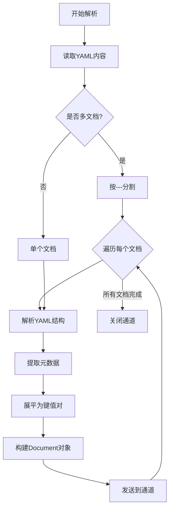

# YAML 解析器

YAML 文档常用于配置文件，解析重点在于保持层级结构和提取键值对。

> 📋 完整 Metadata 规范：[YAML Metadata 提取规范](../parser-metadata.md#yaml-metadata)

## 解析要点

| 要点         | 说明              | 处理方法              |
| ------------ | ----------------- | --------------------- |
| **层级结构** | 缩进表示嵌套      | 递归解析              |
| **多文档**   | 一个文件多个文档  | 按 `---` 分隔符分割   |
| **锚点引用** | YAML 锚点和别名   | 解析时展开引用        |
| **数据类型** | 字符串、数字、布尔 | 保持原始类型或转字符串 |

## YAML 解析流程

## 实现要点

### 1. YAML 解析

- 使用 `gopkg.in/yaml.v3` 解析
- 处理多文档 YAML（`---` 分隔符）
- 展开锚点引用（`&anchor`, `*alias`）

### 2. 结构展平

- 递归遍历 YAML 节点
- 使用点分路径表示嵌套（如 `database.host`）
- 数组使用索引（如 `servers.0.name`）

### 3. 元数据提取

- 提取顶层常见字段：title, name, version, description
- 统计键值对数量
- 计算最大嵌套深度

### 4. 特殊处理

- 检测是否为 Kubernetes 配置（apiVersion, kind）
- 检测是否为 Docker Compose（version, services）
- 检测是否为 CI/CD 配置（stages, jobs）
