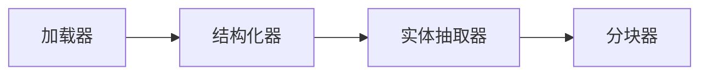
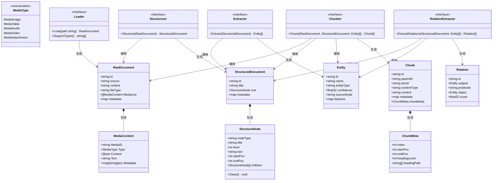

# 解析层

Parser Layer（解析层）是文档处理流水线的核心模块，承接 Loader 加载的原始文件，完成「数据清洗→结构解析→实体抽取」的全流程预处理，为后续 Chunker 分块提供干净、结构化、带实体特征的输入，是连接原始文件与最终可索引 Chunk 的关键桥梁。



核心目标：将多格式原始文件（文本/图片/PDF/视频等）转化为标准化、可复用的结构化数据+实体特征，不侵入后续分块、索引逻辑，保证链路解耦与可扩展性。

## 设计原则

- 职责单一：每个组件只做一件事，杜绝“上帝类”（Loader 只加载、Structurizer 只结构化+清洗、Extractor 只抽实体）；
- 分层解耦：组件间单向依赖、层层递进，无循环依赖，可独立替换（如替换 EntityExtractor 不影响 Structurizer）；
- 多模态支持：兼容二进制原始文件（文本/PDF/图片/视频），统一输入输出格式；
- 可扩展：预留关系抽取扩展接口，不强制依赖高阶功能（如知识图谱相关）；
- 数据干净：结构化后的数据均为清洗完成的纯文本，后续环节无需再处理脏数据。

## 核心实体结构

### 原始文件载体

用于统一承载所有格式的原始文件，存储二进制内容与基础文件元数据，不做任何业务处理。

```go
// RawDocument 统一原始文件载体，支持文本、PDF、图片、视频等多模态文件
type RawDocument struct {
	ID       string                 `json:"id"`       // 原始文档唯一ID，用于与 StructuredDocument、Entity、Relation 关联
	Source   string                 `json:"source"`   // 文件来源（路径/URL/URI）
	Content  string                 `json:"content"`  // 文件的纯文本内容（核心）
	FileType string                 `json:"fileType"` // 文件类型（text/pdf/image/video/html 等）
	MediaList []*MediaContent       `json:"mediaList"` // 非文本内容
  Metadata map[string]any         `json:"metadata"` // 基础文件元数据（文件名、大小、修改时间、所有者等）
}

// 媒体内容类型（图文音视频）
type MediaType string

const (
    MediaImage    MediaType = "image"    // 图片
    MediaTable    MediaType = "table"    // 表格
    MediaAudio    MediaType = "audio"    // 音频
    MediaVideo    MediaType = "video"    // 视频
    MediaAttachment MediaType = "attachment"
)

type MediaContent struct {
    MediaID   string      // 唯一ID
    Type      MediaType   // 类型
    Content   []byte      // 原始二进制
    Text      string      // OCR/识别后的文本（可选）
    Metadata  map[string]any // 页码、坐标、宽高、格式等
}
```

### 结构化文档相关

用于存储清洗后的结构化数据，以树形结构组织文档的标题、段落、章节，所有文本均为清洗后纯文本。

```go
// StructureNode 文档结构节点，对应文档中的标题、段落、列表、表格等单元
type StructureNode struct {
	NodeType  string          `json:"nodeType"`  // 节点类型（heading/paragraph/table/list 等）
	Title     string          `json:"title"`     // 节点标题（仅 heading 类型有效）
	Level     int             `json:"level"`     // 标题层级（仅 heading 类型有效，H1=1、H2=2...）
	Text      string          `json:"text"`      // 清洗后的纯文本内容（核心，无任何格式垃圾）
	StartPos  int             `json:"startPos"`  // 文本在原始清洗后内容中的起始位置（用于分块定位）
	EndPos    int             `json:"endPos"`    // 文本在原始清洗后内容中的结束位置（用于分块定位）
	Children  []*StructureNode `json:"children"` // 子节点（如 H1 下的 H2、段落下的列表）
}

// Clean 清洗当前节点的 Text 和 Title 字段，并递归清洗所有子节点
func (n *StructureNode) Clean() {
	// 清洗 Title 字段（仅对 heading 类型有效）
	if n.NodeType == "heading" && n.Title != "" {
		n.Title = CleanText(n.Title)
	}
	
	// 清洗 Text 字段
	if n.Text != "" {
		n.Text = CleanText(n.Text)
	}
	
	// 递归清洗子节点
	for _, child := range n.Children {
		child.Clean()
	}
}

// CleanText 按默认顺序应用所有清洗函数
func CleanText(text string) string {
	text = CleanNoise(text)
	text = RemoveLinks(text)
	text = NormalizeParagraphs(text)
	text = FullwidthToHalfwidth(text)
	text = NormalizeChinese(text)
	text = RemoveWatermarks(text)
	text = RemoveLineNumbers(text)
	return text
}

// StructuredDocument 结构化文档，以树形结构呈现整个文档的层级关系
type StructuredDocument struct {
	ID       string                 `json:"id"`       // 结构化文档唯一ID，与 RawDocument.ID 关联
	Title    string                 `json:"title"`    // 文档总标题（清洗后）
	Root     *StructureNode         `json:"root"`     // 文档结构根节点（顶层节点）
	Metadata map[string]any `json:"metadata"` // 结构化过程中新增的元数据（如章节数、段落数）
}
```

### 实体结构

用于存储从结构化文档中抽取的实体信息，包含唯一标识、类型、置信度等核心特征，支撑后续检索、分块优化。

```go
// Entity 实体结构，统一承载所有类型实体（人名、机构、术语、商品等）
type Entity struct {
	ID          string                 `json:"id"`          // 实体全局唯一ID（如 UUID）
	Name        string                 `json:"name"`        // 实体名称（清洗后的纯文本）
	EntityType  string                 `json:"entityType"`  // 实体类型（PERSON/ORG/TERM/SKU/OBJECT 等）
	Confidence  float32                `json:"confidence"`  // 实体抽取置信度（0~1，来自抽取模型/规则）
	SourceNode  string                 `json:"sourceNode"`  // 实体来源的 StructureNode ID（追溯实体位置）
	Features    map[string]any `json:"features"`    // 实体扩展特征（如实体长度、出现次数、语义向量等）
}
```

### 关系结构

用于后续知识图谱场景扩展，独立于实体抽取，不影响当前核心流程。

```go
// Relation 实体关系结构（预留扩展，用于知识图谱）
type Relation struct {
	ID        string  `json:"id"`         // 关系唯一ID
	Subject   *Entity `json:"subject"`    // 主体实体（关系发起方）
	Predicate string  `json:"predicate"`  // 关系类型（如“就职于”“属于”“包含”）
	Object    *Entity `json:"object"`     // 客体实体（关系接收方）
	Score     float32 `json:"score"`      // 关系抽取置信度（0~1）
}
```

## 核心接口设计

### Loader 接口

职责：仅负责读取各类文件，转化为 RawDocument 结构，不做任何清洗、解析处理。

```go
// Loader 加载器接口，统一读取各类文件，输出原始二进制文档
type Loader interface {
	// Load 读取指定路径/URL的文件，返回原始文档
	Load(path string) (*RawDocument, error)
  SupportTypes() []string // 返回支持的文件类型列表
}
```

### Structurizer 接口

职责：接收 RawDocument，先执行数据清洗，再将干净文本解析为树形结构（StructuredDocument），是数据清洗的唯一载体。

```go
// Structurizer 结构化接口，负责数据清洗与文档结构解析
type Structurizer interface {
	// Structure 接收原始文档，先清洗再结构化，输出结构化文档
	// 内部流程：RawDocument（脏）→ 数据清洗 → 结构化解析 → StructuredDocument（干净）
	Structure(raw *RawDocument) (*StructuredDocument, error)
}
```

核心说明：数据清洗通过 `StructureNode.Clean()` 方法实现，在解析生成结构化文档后调用根节点的 `Clean()` 方法进行整体清洗，包括：去HTML标签、去水印、去页眉页脚、去多余换行/空格、去乱码、统一编码等，确保所有文本均为干净的纯文本。

### Extractor 接口

职责：接收清洗后的结构化文档，仅抽取实体信息，不修改结构化数据，不处理脏数据。

```go
// Extractor 实体抽取接口，从结构化文档中抽取实体
type Extractor interface {
	// Extract 接收结构化文档，抽取实体列表，返回实体集合
	Extract(structured *StructuredDocument) ([]*Entity, error)
}
```

置信度来源说明：根据抽取方式自动赋值，无需外部传入：

1. 模型抽取（NER/LLM/OCR）：直接使用模型输出的 score；
2. 规则抽取（正则/关键词）：固定赋值（如 0.7）；
3. 相似度匹配：使用匹配分数作为置信度。

### RelationExtractor 接口

职责：独立于实体抽取，接收结构化文档与实体列表，抽取实体间关系，用于知识图谱场景，不影响核心流程。

```go
// RelationExtractor 关系抽取接口（预留扩展）
type RelationExtractor interface {
	// ExtractRelations 接收结构化文档与实体列表，抽取实体间关系
	ExtractRelations(structured *StructuredDocument, entities []*Entity) ([]*Relation, error)
}
```

## Chunker 接口

职责：负责分块，衔接解析层与索引层，接收解析层输出的三类核心数据（RawDocument+StructuredDocument+Entity），生成最终可索引的 Chunk，是解析层的输出终点。


```go
// ChunkMeta Chunk 固定元数据（分块相关位置、层级信息）
type ChunkMeta struct {
	Index        int      `json:"index"`         // 分块在文档中的序号（0,1,2...）
	StartPos     int      `json:"start_pos"`     // 分块在原始清洗后文本中的起始位置
	EndPos       int      `json:"end_pos"`       // 分块在原始清洗后文本中的结束位置
	HeadingLevel int      `json:"heading_level"` // 分块对应的标题层级（来自 StructureNode）
	HeadingPath  []string `json:"heading_path"`  // 分块对应的标题路径（如 ["第一章","1.1节"]）
}

// Chunk 最终可索引单元，由 Chunker 生成，承接解析层所有信息
type Chunk struct {
	ID          string                 `json:"id"`          // Chunk 唯一ID
	ParentID    string                 `json:"parent_id"`   // 父Chunk/父文档ID（来自 RawDocument.Source）
	DocID       string                 `json:"doc_id"`      // 原始文档ID（来自 RawDocument.ID）
	ContentType string                 `json:"content_type"`// 内容类型（text/entity/graph 等）
	Content     string                 `json:"content"`     // 分块内容（清洗后纯文本，JSON格式）
	Metadata    map[string]any `json:"metadata"`    // 扩展元数据（来自 RawDocument.Metadata）
	ChunkMeta   ChunkMeta              `json:"chunk_meta"`  // 分块固定元数据
}

// Chunker 分块接口，接收解析层输出，生成最终可索引 Chunk
type Chunker interface {
	// Chunk 接收原始文档、结构化文档、实体列表，生成 Chunk 集合
	// 核心逻辑：结合结构边界（StructuredDocument）+ 实体完整性（Entity）做分块
	Chunk(
		raw *RawDocument,
		structured *StructuredDocument,
		entities []*Entity,
	) ([]*Chunk, error)
}
```

## 模块流程链路

解析层内部流程为单向递进，无反向依赖，每个步骤输出作为下一个步骤的输入，完整链路如下：

1. Loader 加载：读取文件 → 生成 RawDocument（二进制+基础元数据，脏数据）；
2. Structurizer 处理：接收 RawDocument → 解析生成 StructuredDocument → 调用 StructureNode.Clean() 进行清洗 → 生成干净的 StructuredDocument；
3. Extractor 处理：接收 StructuredDocument → 抽取实体 → 生成 []Entity（实体列表，带置信度）；
4. （可选）RelationExtractor 处理：接收 StructuredDocument + []Entity → 抽取关系 → 生成 []Relation；
5. Chunker 处理：接收 RawDocument（元数据）+ StructuredDocument（结构）+ []Entity（实体）→ 生成 []Chunk → 输出到索引层。
核心链路：Loader → Structurizer（清洗+结构化）→ Extractor（实体）→ Chunker（分块），所有环节均为干净数据，位置信息、元数据全程可追溯。

### UML 类图（完整模块结构）



## 模块扩展说明

- 文件格式扩展：新增文件类型（如PPT/Excel），仅需实现新的 Loader 接口，不修改其他组件；
- 清洗规则扩展：修改 Structurizer 内部清洗逻辑，不影响 Loader、Extractor、Chunker；
- 实体抽取扩展：替换 Extractor 实现（如从规则抽取改为 LLM 抽取），不影响结构化流程；
- 知识图谱扩展：启用 RelationExtractor 接口，新增关系抽取逻辑，不侵入核心链路；
- 分块策略扩展：替换 Chunker 实现（如按语义分块改为按实体分块），不修改解析层其他组件。

## 核心注意事项

- 数据清洗通过 StructureNode.Clean() 方法执行，在 Structurizer 中调用根节点的 Clean() 方法进行整体清洗，后续所有组件（Extractor、Chunker）均直接使用干净数据，不重复清洗；
- RawDocument 的 Content 为二进制，仅用于存储原始文件，不参与任何业务处理（清洗、结构化均基于其解析后的文本）；
- Entity 的 SourceNode 必须与 StructureNode 关联，确保实体可追溯到原始文档位置；
- Relation 为可选扩展，不启用时不影响核心流程，启用时需保证实体列表已抽取完成；
- Chunker 必须接收 RawDocument，用于获取 DocID（来自 RawDocument.ID）、ParentID（来自 RawDocument.Source）等核心信息，否则无法生成合法的 Chunk。


## 解释层需要支持文件格式


| 文件格式                | Loader类名（建议） | 核心实现要点                                                                                                                                                        | 依赖说明（Go生态）                                                                            | 适配备注                                                                  |
| ----------------------- | ------------------ | ------------------------------------------------------------------------------------------------------------------------------------------------------------------- | --------------------------------------------------------------------------------------------- | ------------------------------------------------------------------------- |
| TXT / 纯文本（.txt）    | TxtLoader          | 1.  读取文本文件二进制内容；<br/>2.  元数据补充编码格式（默认UTF-8）；<br/>3.  FileType设为"text/txt"以及大量常用的纯文件西式。                                     | 无需额外依赖，使用Go标准库os.ReadFile即可                                                     | 最基础格式，优先实现，适配所有纯文本场景                                  |
| PDF（.pdf）             | PdfLoader          | 1.  读取PDF二进制内容；<br/>2.  元数据补充页数、作者（若有）；<br/>3.  FileType设为"application/pdf"；<br/>4.  不解析PDF内容，仅保留原始二进制。                    | 依赖：github.com/unidoc/unipdf 或 github.com/pdfcpu/pdfcpu（轻量推荐后者）                    | 企业级高频格式，需兼容扫描件PDF（二进制保留，后续由Structurizer+OCR处理） |
| Word（.docx）           | DocxLoader         | 1.  读取docx二进制内容；<br/>2.  元数据补充文档标题、修改人；<br/>3.  FileType设为"application/vnd.openxmlformats-officedocument.wordprocessingml.document"。       | 依赖：github.com/360EntSecGroup-Skylar/excelize（支持docx读取）或 github.com/unidoc/unioffice | 不支持旧版.doc格式（需单独实现DocLoader，见下方）                         |
| Excel（.xlsx）          | XlsxLoader         | 1.  读取xlsx二进制内容；<br/>2.  元数据补充工作表数量、表头信息（可选）；<br/>3.  FileType设为"application/vnd.openxmlformats-officedocument.spreadsheetml.sheet"。 | 依赖：github.com/360EntSecGroup-Skylar/excelize（主流、轻量）                                 | 适配表格类数据，二进制保留，后续由Structurizer解析表格结构                |
| 图片（.jpg/.png/.jpeg） | ImageLoader        | 1.  读取图片二进制内容；<br/>2.  元数据补充图片尺寸、格式（jpg/png）；<br/>3.  FileType设为"image/jpeg"或"image/png"；<br/>4.  不做OCR识别，仅保留原始二进制。      | 依赖：github.com/nfnt/resize（可选，用于获取图片尺寸）                                        | 多模态场景必备，后续由Structurizer+OCR解析图片中的文本                    |
| 旧版Word（.doc）        | DocLoader          | 1.  读取doc二进制内容；<br/>2.  元数据补充文档基本信息；<br/>3.  FileType设为"application/msword"。                                                                 | 依赖：github.com/go-ole/go-ole（Windows环境）或 github.com/jmhodges/docconv（跨平台，推荐）   | 兼容旧版文档，非高频需求，可按需实现                                      |
| PowerPoint（.pptx）     | PptxLoader         | 1.  读取pptx二进制内容；<br/>2.  元数据补充幻灯片页数；<br/>3.  FileType设为"application/vnd.openxmlformats-officedocument.presentationml.presentation"。           | 依赖：github.com/unidoc/unioffice 或 github.com/360EntSecGroup-Skylar/excelize（部分支持）    | 演示文档场景，后续Structurizer可解析幻灯片文本、标题                      |
