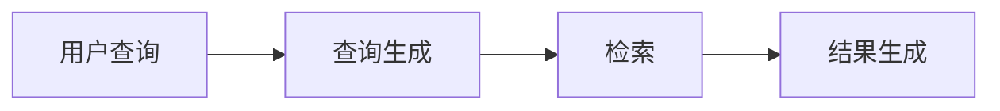
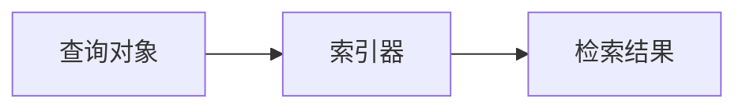
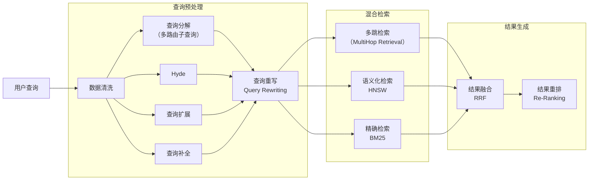

# 检索概述


我们可以将RAG检索简化为以下的简单过程：



从第一性原理来分解检索过程的话可以简单地理解为: 



RAG的系统理论与研究中，查询处理有非常多的方式，但其核心目标都是为了向执行查询的“检索器”输入更好的查询参数。为了让开发人员具有最高自由度，用户只需要向索引器提交一个公共的查询对象，而这个对象可以通过用GoRAG提供的方法进行处理，那么开发人员就能对这个`Query`对象进行任意的处理，根据Go的使用方式，GoRAG提供了一个默认的Query对象实现。


```go
 idx := indexing.Default()
 query := idx.Query("GoRAG 有什么特色？")
 result := idx.Search(query)
```

## 查询生成

RAG 的查询处理过程有非常多的选项，

## 检索


## 结果生成





---


# RAG 查询预处理核心步骤（按执行顺序）

## 1. 基础清洗（Query Cleaning）

- 去除多余空格、换行、特殊符号
- 过滤无意义语气词、语气助词、脏话、敏感词
- 统一大小写（英文场景）
- 修正明显错别字（简单纠错）

## 2. 意图识别（Intent Classification）

判断用户问题属于哪类：

- 事实问答
- 总结类
- 对比类
- 推理类
- 闲聊/无关问题
- 多跳复杂问题

作用：决定后续要不要走检索、要不要多轮拆解。

## 3. 查询改写 / 优化（Query Rewriting / Expansion）

这是 RAG 最关键的一步，直接影响召回率。

- 把口语化问题 → 标准化查询
- 补充省略主语、上下文指代
- 生成**多条相似查询**（query expansion）
- 多跳问题拆成多个子问题
- 关键词强化：提取核心实体、动词、限定条件
- 去除冗余修饰，保留检索有效信息

示例：
原：“我昨天问的那个模型怎么部署？”
改写：“大模型本地部署方法 Ollama GGUF”

## 4. 指代消解 & 上下文补全（Coreference Resolution）

处理多轮对话：

- 它、这个、那个、前者 → 替换成具体实体
- 结合历史对话补全问题
- 解决上下文依赖问题

## 5. 关键词/实体抽取（Key Entity Extraction）

- 抽取人名、地名、产品名、术语、专业名词
- 抽取时间、范围、条件（如“2025年”“北京”“仅限企业”）
- 用于：
  - 精确检索
  - 过滤无关文档
  - 构建结构化检索条件

## 6. 查询分类与路由（Query Routing）

- 判断是否需要检索
- 判断应该走：向量检索 / 关键词检索 / 图检索 / 混合检索
- 判断是否需要调用工具（如查数据库、API）
- 判断是否直接 LLM 回答即可（无需检索）

## 7. 结构化查询生成（Structured Query）

适合专业/企业知识库：

- 生成关键词布尔查询：`(A OR B) AND C NOT D`
- 生成过滤条件：metadata 过滤、时间过滤、权限过滤
- 生成图查询（Cypher/SPARQL）：实体关系查询

## 8. 向量生成（Embedding）

- 对最终优化后的查询生成向量
- 统一向量模型（与知识库向量一致）
- 可选：对关键词单独生成向量做混合检索

## 9. 安全与合规检查（Safety & Guardrails）

- 敏感问题拦截
- 越权查询拦截
- 恶意查询检测
- 长度截断（超长查询会影响向量质量）

## 10. 查询重排前的精简（Optional）

- 超长查询截断
- 保留最核心 20～80 个 token
- 避免向量噪声

---

# 典型流水线（工业界标准）

1. 清洗
2. 意图识别
3. 指代消解
4. 实体/关键词抽取
5. 查询改写
6. 结构化条件生成
7. 生成 embedding
8. 安全检查
9. 送入检索器

---

如果你需要，我可以进一步给你：

- 每种步骤对应的**常用算法/模型**
- 一套**可直接落地的 Go/Python 代码模板**
- 针对企业知识库/客服/政务场景的**专用查询预处理策略**