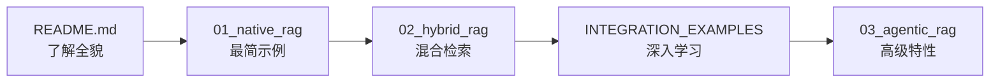

# GoRAG 集成示例 - 用户友好指南

欢迎使用 GoRAG！本指南将帮助你快速上手，学会如何组合使用新的 Steps 构建强大的 RAG 应用。

## 🎯 你将学到什么

通过本指南，你将掌握：

1. ✅ **基础概念**: 理解 Pipeline 和 Steps 的工作原理
2. ✅ **实战技能**: 从零开始构建完整的 RAG 系统
3. ✅ **高级技巧**: 运用混合检索、Agent 决策等高级技术
4. ✅ **最佳实践**: 避免常见陷阱，写出优雅的代码

## 📖 目录结构

```
examples/
├── README.md                      # 总览和快速开始（从这里开始！）
├── INTEGRATION_EXAMPLES.md        # 详细的使用指南
├── 01_native_rag/                 # 基础示例：Native RAG
│   ├── README.md                  # 详细说明
│   └── main.go                    # 可运行代码
├── 02_hybrid_rag/                 # 进阶示例：Hybrid RAG
│   ├── README.md
│   ├── main.go
│   └── EXAMPLE.md                 # 分步教程
├── 03_agentic_rag/                # 高级示例：Agentic RAG
│   ├── README.md
│   ├── main.go
│   └── EXAMPLE.md
└── ... (更多示例)
```

## 🚀 学习路线推荐

### 路线 A: 循序渐进（推荐初学者）



**预计时间**: 2-3 小时

**适合人群**: 
- 第一次接触 RAG
- 想了解 GoRAG 的基本用法
- 喜欢从简单到复杂的学习方式

### 路线 B: 目标导向（有明确需求）

```
我想实现... → 查找对应场景 → 直接运行示例 → 修改适配
```

**场景速查**:

| 我想... | 查看这里 |
|---------|---------|
| 快速搭建一个简单的问答系统 | [01_native_rag](./01_native_rag/) |
| 提高检索准确率 | [02_hybrid_rag](./02_hybrid_rag/) |
| 让 AI 自主决定检索策略 | [03_agentic_rag](./03_agentic_rag/) |
| 利用知识图谱进行推理 | [04_graph_rag](./04_graph_rag/) |
| 构建多 Agent 协作系统 | [05_multiagent_rag](./05_multiagent_rag/) |

**预计时间**: 30 分钟 - 1 小时

**适合人群**:
- 有明确的业务需求
- 已经了解 RAG 基本概念
- 需要快速验证想法

### 路线 C: 查阅参考（解决问题）

```
遇到问题 → 查找 Patterns → 参考代码片段 → 应用到项目
```

**常用参考**:
- [Steps 速查表](./README.md#steps-速查表)
- [常见 Patterns](./README.md#常见-patterns)
- [最佳实践](./README.md#最佳实践)

## 📝 如何使用示例代码

### Step 1: 克隆项目

```bash
git clone https://github.com/DotNetAge/gorag.git
cd gorag/examples
```

### Step 2: 选择示例

根据你的需求和学习路线选择合适的示例：

```bash
# 初学者建议从这里开始
cd 01_native_rag

# 或者跳转到感兴趣的示例
cd 02_hybrid_rag
```

### Step 3: 安装依赖

```bash
go mod download
```

### Step 4: 阅读说明

每个示例都有详细的 README：

```bash
cat README.md
cat EXAMPLE.md  # 如果有
```

### Step 5: 运行代码

```bash
go run main.go
```

### Step 6: 修改实验

```bash
# 编辑 main.go
# 尝试修改参数、添加功能等

# 重新运行
go run main.go
```

## 💡 学习建议

### ✅ 推荐做法

1. **从运行开始**: 先让代码跑起来，建立直观感受
2. **逐步修改**: 每次只改一个参数，观察效果变化
3. **阅读日志**: 启用 DEBUG 日志，理解内部流程
4. **动手实验**: 不要只看，要亲自写代码
5. **对比学习**: 对比不同示例，理解差异

### ❌ 避免做法

1. **一次性读所有代码**: 容易迷失细节
2. **只看不练**: 编程是实践出来的
3. **跳过基础**: Native RAG 是理解一切的基础
4. **忽视文档**: README 包含重要信息
5. **害怕犯错**: 大胆尝试，错误是最好的老师

## 🎓 示例代码解析

### 示例 1: Native RAG（最简版本）

**文件**: `01_native_rag/main.go`

**核心代码**:
```go
// 1. 初始化组件
embedder := embedding.WithBEG("bge-small-zh-v1.5", "")
llm := &MockLLM{}
vectorStore := initVectorStore()

// 2. 构建 Searcher
searcher := native.New(
    native.WithEmbedding(embedder),
    native.WithVectorStore(vectorStore),
    native.WithGenerator(llm),
    native.WithTopK(5),
)

// 3. 执行查询
answer, _ := searcher.Search(ctx, query)
```

**学到的内容**:
- 最基本的 RAG 流程
- Searcher 的初始化方法
- 如何执行查询

**下一步实验**:
- 修改 `TopK` 的值，观察结果变化
- 替换 MockLLM 为真实的 LLM
- 添加自己的文档数据

---

### 示例 2: Hybrid RAG（进阶版本）

**文件**: `02_hybrid_rag/main.go`

**核心代码**:
```go
// 1. 初始化增强组件
filterExtractor := enhancer.NewFilterExtractor(llm)
stepBackGen := enhancer.NewStepBackGenerator(llm)
hydeGen := enhancer.NewHyDEGenerator(llm)

// 2. 初始化工具组件
fusionEngine := retrieval.NewRRFEngine(60)

// 3. 构建复杂的 Searcher
searcher := hybrid.New(
    hybrid.WithEmbedding(embedder),
    hybrid.WithVectorStore(vectorStore),
    hybrid.WithSparseStore(bm25Store),
    hybrid.WithFusionEngine(fusionEngine),
    hybrid.WithGenerator(llm),
    hybrid.WithReranker(reranker),
    
    // 启用高级功能
    hybrid.WithFilterExtractor(filterExtractor),
    hybrid.WithStepBackGen(stepBackGen),
    hybrid.WithHyDEGen(hydeGen),
)
```

**学到的内容**:
- 多种检索技术的组合
- 预检索和后检索优化
- 参数配置技巧

**下一步实验**:
- 启用/禁用某个增强功能，对比效果
- 调整 RRF 的 k 值
- 添加自定义的过滤器

---

### 示例 3: Agentic RAG（高级版本）

**文件**: `03_agentic_rag/main.go`

**核心代码**:
```go
// 构建 Agent 循环体
loop := pipeline.New[*entity.PipelineState]()

// Step 1: 推理
loop.AddStep(agenticstep.NewReasoningStep(reasoner, logger))

// Step 2: 行动选择
loop.AddStep(agenticstep.NewActionSelectionStep(selector, 5, logger))

// Step 3: 终止检查
loop.AddStep(agenticstep.NewTerminationCheckStep(logger))

// Step 4: 检索
loop.AddStep(retrievalstep.NewVectorSearchStep(embedder, vectorStore, 5))

// Step 5: 观察
loop.AddStep(agenticstep.NewObservationStep(logger))
```

**学到的内容**:
- Agent 循环的工作原理
- 自主决策机制
- 多轮检索策略

**下一步实验**:
- 调整最大迭代次数
- 修改终止条件
- 添加自定义的 Reasoning 逻辑

## 🔧 常见问题

### Q1: 我应该从哪里开始？

**A**: 如果你是 RAG 新手，从 [01_native_rag](./01_native_rag/) 开始。如果你已经有 RAG 经验，可以直接看 [02_hybrid_rag](./02_hybrid_rag/)。

### Q2: 运行示例需要 API Key 吗？

**A**: 大部分示例使用 Mock 实现，不需要 API Key。但如果要用于生产，需要配置 LLM 和 Embedding 的 API。

### Q3: 如何调试代码？

**A**: 
```bash
# 启用详细日志
export GORAG_LOG_LEVEL=debug

# 运行并查看详细输出
go run -v main.go
```

### Q4: 代码报错怎么办？

**A**: 
1. 检查是否安装了正确的 Go 版本（1.21+）
2. 运行 `go mod tidy` 更新依赖
3. 查看错误信息，对照 README 排查
4. 在 GitHub Issues 中提问

### Q5: 如何应用到自己的项目？

**A**:
1. 先运行示例，确保理解工作原理
2. 复制示例代码到自己的项目
3. 替换 Mock 实现为真实的服务
4. 根据业务需求调整参数和逻辑
5. 逐步测试和优化

## 📊 学习进度检查

完成每个阶段后，检查自己是否掌握了以下内容：

### Native RAG 阶段 □
- [ ] 理解基本的 Pipeline 流程
- [ ] 能够运行示例代码
- [ ] 知道如何修改 TopK 参数
- [ ] 理解 QueryRewrite 的作用

### Hybrid RAG 阶段 □
- [ ] 理解混合检索的优势
- [ ] 知道 HyDE 和 StepBack 的区别
- [ ] 了解 RRF 融合算法
- [ ] 能够配置重排序

### Agentic RAG 阶段 □
- [ ] 理解 Agent 循环机制
- [ ] 知道 Reasoning 和 Action 的关系
- [ ] 了解终止条件的设计
- [ ] 能够设计多轮检索策略

## 🎯 下一步

完成基础学习后，你可以：

1. **深入探索**: 阅读 [INTEGRATION_EXAMPLES.md](./INTEGRATION_EXAMPLES.md) 了解更多 Patterns
2. **实战演练**: 尝试 [07_document_qa](./07_document_qa/) 等实战示例
3. **贡献代码**: 提交你自己的示例到项目
4. **学习进阶**: 研究源码，理解实现细节

## 🤝 获取帮助

如果在学习过程中遇到困难：

1. **查看 FAQ**: [常见问题解答](../docs/FAQ.md)
2. **搜索 Issue**: [GitHub Issues](https://github.com/DotNetAge/gorag/issues)
3. **提出新问题**: 在 Issues 中描述你的问题
4. **社区讨论**: 参与 GoRAG 社区讨论

## 📚 相关资源

- **官方文档**: [GoRAG README](../README.md)
- **API 参考**: [pkg.go.dev](https://pkg.go.dev/github.com/DotNetAge/gorag)
- **技术博客**: [GoRAG 设计思想](../docs/architecture.md)
- **视频教程**: （即将发布）

---

**祝你学习愉快！** 🚀

记住：最好的学习方式是**动手实践**。不要害怕犯错，每一行代码都会让你更强大！
